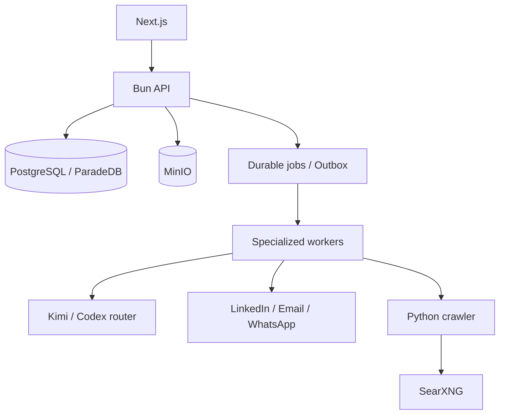

# Noosphere

Noosphere is an open-source growth intelligence platform. It brings ICP research, outbound prospecting, inbound content, multichannel conversations and booked calls into one multi-workspace application.

[Français](README.fr.md) · [Main README](README.md)

## Product promise

The normal experience has three steps:

1. launch an ICP study from your offer;
2. let Noosphere source prospects, run campaigns and publish authorized content;
3. handle LinkedIn, email and WhatsApp replies from one inbox and collect calls.

Technical details remain observable without taking over the product. Exceptions are localized in “Attention”, and deterministic policy governs every external effect.

## Capabilities

### Outbound

- evidence-backed ICP research with resolvable sources;
- campaigns generated from selected ICPs;
- LinkedIn sourcing for LinkedIn and company/web sourcing for email or WhatsApp;
- enrichment, scoring, personalized copy, follow-ups and qualification;
- connected-account delivery with quota, schedule, suppression and idempotency checks;
- durable dry-runs to test a Setter without sending or booking anything.

### LinkedIn inbound

- editorial strategy derived from the offer, ICP and brand kit;
- daily sourced and deduplicated idea discovery;
- `brief → writer → evidence audit → critic` pipeline;
- text posts, images and carousels;
- configurable calendar, durable publishing and provider reconciliation;
- reaction, comment and reply ingestion for attribution.

Other social channels and long-video-to-short generation are future extensions, not advertised as production-ready features.

### Prospect 360 and conversations

- durable central memory per prospect;
- sourced needs, objections, commitments, covered topics and do-not-repeat items;
- context rebuilt for every job from PostgreSQL;
- no singleton agent or CLI process owns business memory;
- LinkedIn, email and WhatsApp inbox with campaign/outside-campaign, channel and date filters;
- AI draft improvement without implicit sending;
- call preparation and inbound, outbound, mixed or unknown attribution.

## Architecture

Noosphere is a TypeScript/Bun modular monolith with an autonomous Python crawler:

| Area | Responsibility |
|---|---|
| `packages/domain` | business invariants and states |
| `packages/application` | use cases and ports |
| `packages/infrastructure` | PostgreSQL/Drizzle, providers, queue and storage |
| `packages/interface` | HTTP contracts and permissions |
| `apps/api` | Bun API composition root |
| `apps/worker` | durable workers with leases and heartbeats |
| `apps/web` | Next.js 16 and React 19 |
| `apps/crawler` | FastAPI, Crawl4AI, Playwright and SearXNG |

Standard primitives are PostgreSQL/ParadeDB, S3-compatible MinIO, PostgreSQL jobs/outbox, Bun, Next.js and Docker Compose. Docling is not required by the standard deployment; the lightweight extractor handles text, Markdown, HTML and text PDFs.



The model proposes; policy authorizes. Before every effect, the runtime rechecks workspace, account health, quotas, sending window, suppression and idempotency. A command is considered sent only when its durable state is `sent` and a provider identifier has been recorded.

## Local setup

Requirements:

- Bun 1.3 or newer;
- Docker and Docker Compose;
- `uv` for crawler development and tests;
- provider credentials only for the integrations you choose to enable.

```bash
cp .env.example .env
bun install
bun run dev:setup
bun run dev
```

`dev:setup` starts infrastructure, applies migrations and creates the owner configured in `.env`. Open [http://localhost:3000](http://localhost:3000).

To run processes separately:

```bash
bun run db:migrate
bun run bootstrap:owner
bun run api
bun run worker:general
bun run worker:decision
bun run worker:setter
bun run worker:memory
bun run web
```

## Configuration

Copy `.env.example` and configure PostgreSQL, Better Auth, MinIO and the owner credentials at minimum. AI providers are routed by workspace and use case: Kimi and Codex can be selected as primary or fallback models when their runtimes are configured.

Never commit `.env`, API keys, LinkedIn cookies, OAuth tokens or webhook secrets.

## Tests and evidence

```bash
# Types, architecture, unit/HTTP tests, crawler and builds
bun run check

# Real PostgreSQL and isolated migration replay
bun run test:integration

# Browser E2E after bootstrap
bun run test:e2e
```

Prospect 360 also ships effect-free validation commands:

```bash
bun run prepare:prospect-memory-benchmark
bun run benchmark:capacity
bun run evaluate:prospect-memory-shadow
bun run evaluate:prospect-memory-setter
bun run evaluate:prospect-memory-operator
```

A green suite is not a live proof. Read the [Prospect 360 validation report](docs/performance/2026-08-23-prospect-360-memory-validation-report.md) for executed measurements, missed thresholds and open production gates.

## VPS deployment

The standard deployment uses `compose.infrastructure.yml` and `compose.production.yml` for the API, web app, crawler, PostgreSQL, MinIO and specialized workers. Follow the [VPS production runbook](docs/runbooks/vps-production.md) for TLS, migrations, backups, restores and canaries.

Do not run a real LinkedIn, email or WhatsApp canary without explicit authorization bounded to the relevant account, workspace and content.

## Documentation

- [Architecture](docs/architecture/ARCHITECTURE.md)
- [Noosphere product architecture](docs/architecture/NOOSPHERE_PRODUCT_ARCHITECTURE.md)
- [Domain model](docs/architecture/DOMAIN.md)
- [Architecture contract](docs/architecture/ARCHITECTURE_CONTRACT.md)
- [OpenAPI contract](packages/contracts/openapi/product-research-v1.json)
- [AI boundary](docs/product/AI_BOUNDARY.md)
- [Product backlog](docs/product/NOOSPHERE_BACKLOG.md)
- [Production runbook](docs/runbooks/vps-production.md)
- [Prospect 360 context design](docs/architecture/2026-08-23-prospect-360-memory-context-engineering.md)

## Contributing and security

Contributions are welcome. Before opening a pull request, run `bun run check` and `bun run test:integration`, document migrations and preserve workspace isolation. Never include real prospect data in fixtures or reports.

For a vulnerability, do not immediately open a public issue containing a credential, personal data or exploitation steps. Contact the maintainers through the private channel provided by the IgnitionAI GitHub organization first.

## License

Noosphere is licensed under the [GNU Affero General Public License v3.0 only](LICENSE). A modified version offered to users over a network must offer them its corresponding source code as required by the AGPL.
