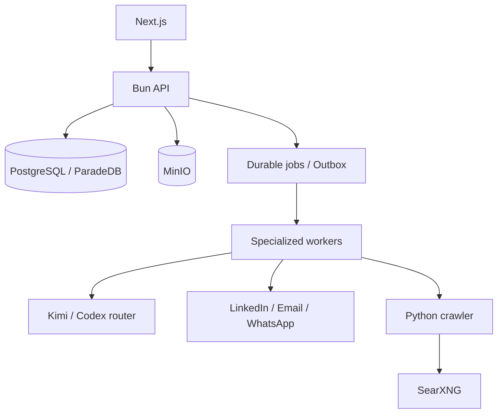

# Noosphere

Noosphere is an open-source growth intelligence platform. It brings ICP research, outbound prospecting, inbound content, multichannel conversations and booked calls into one multi-workspace application.

[Français](README.fr.md) · [Main README](README.md)

## Product promise

The normal experience has three steps:

1. launch an ICP study from your offer;
2. let Noosphere source prospects, run campaigns and publish authorized content;
3. handle LinkedIn, email and WhatsApp replies from one inbox and collect calls.

Technical details remain observable without taking over the product. Exceptions are localized in “Attention”, and deterministic policy governs every external effect.

## Verified status on 23 August 2026

| Gate | Result | Actual scope |
|---|---|---|
| Prospect 360 shadow | passed | 1,000 IgnitionAI workspace contexts, zero effect-capable context |
| Setter corpus | automatic gate passed | 100/100 Codex Luna dry-runs, resolvable receipts, no sends |
| Human editorial review | open | the review artifact exists but is not auto-labelled |
| 2-vCPU / 8-GiB VPS | below the concurrent SLO | zero errors, memory-view p95 above target |
| Light deployment | Netcup RS 2000 G12, 8 dedicated cores / 16 GiB | acceptable minimum for a canary or one lightly loaded workspace |
| Recommended production | Netcup RS 4000 G12, 12 dedicated cores / 32 GiB | target for concurrent research, crawling, TEI and campaigns |
| Real provider canary | not executed | requires explicit, bounded authorization |

See the [Prospect 360 validation report](docs/performance/2026-08-23-prospect-360-memory-validation-report.md) for exact evidence. A shadow or dry-run result is never presented as proof of a real send.

## Capabilities

### Outbound

- evidence-backed ICP research with resolvable sources;
- campaigns generated from selected ICPs;
- LinkedIn sourcing for LinkedIn and company/web sourcing for email or WhatsApp;
- enrichment, scoring, personalized copy, follow-ups and qualification;
- connected-account delivery with quota, schedule, suppression and idempotency checks;
- durable dry-runs to test a Setter without sending or booking anything.

### LinkedIn inbound

- editorial strategy derived from the offer, ICP and brand kit;
- daily sourced and deduplicated idea discovery;
- `brief → writer → evidence audit → critic` pipeline;
- text posts, images and carousels;
- configurable calendar, durable publishing and provider reconciliation;
- reaction, comment and reply ingestion for attribution.

Other social channels and long-video-to-short generation are future extensions, not advertised as production-ready features.

### Prospect 360 and conversations

- durable central memory per prospect;
- sourced needs, objections, commitments, covered topics and do-not-repeat items;
- context rebuilt for every job from PostgreSQL;
- no singleton agent or CLI process owns business memory;
- LinkedIn, email and WhatsApp inbox with campaign/outside-campaign, channel and date filters;
- AI draft improvement without implicit sending;
- call preparation and inbound, outbound, mixed or unknown attribution.

## Architecture

Noosphere is a TypeScript/Bun modular monolith with an autonomous Python crawler:

| Area | Responsibility |
|---|---|
| `packages/domain` | business invariants and states |
| `packages/application` | use cases and ports |
| `packages/infrastructure` | PostgreSQL/Drizzle, providers, queue and storage |
| `packages/interface` | HTTP contracts and permissions |
| `apps/api` | Bun API composition root |
| `apps/worker` | durable workers with leases and heartbeats |
| `apps/web` | Next.js 16 and React 19 |
| `apps/crawler` | FastAPI, Crawl4AI, Playwright and SearXNG |

Standard primitives are PostgreSQL/ParadeDB, S3-compatible MinIO, PostgreSQL jobs/outbox, Bun, Next.js and Docker Compose. The local router extracts text PDFs, DOCX, PPTX, XLSX, HTML, Markdown and text; scans are reported without OCR.



The model proposes; policy authorizes. Before every effect, the runtime rechecks workspace, account health, quotas, sending window, suppression and idempotency. A command is considered sent only when its durable state is `sent` and a provider identifier has been recorded.

### Agent and context lifetimes

- repositories, PostgreSQL pools and model routers are reusable and hold no business memory;
- every job rebuilds its tenant-scoped context from PostgreSQL;
- every Codex invocation starts an isolated `codex exec --ephemeral` process and temporary directory;
- output, model, prompt, `ai_run`, memory receipt and decision are persisted;
- closing a page or drawer stops browser polling only and never cancels the server job.

There is no singleton “agent with memory”. Durable memory belongs to Prospect 360, not to a model process.

## Local setup

Requirements:

- Bun 1.3 or newer;
- Docker and Docker Compose;
- `uv` for crawler development and tests;
- provider credentials only for the integrations you choose to enable.

```bash
cp .env.example .env
bun install
bun run dev:setup
bun run dev
```

`dev:setup` starts infrastructure, applies migrations and creates the owner configured in `.env`. Open [http://localhost:3000](http://localhost:3000).

To run processes separately:

```bash
bun run db:migrate
bun run bootstrap:owner
bun run api
bun run worker:general
bun run worker:decision
bun run worker:setter
bun run worker:memory
bun run web
```

## Configuration

Copy `.env.example` and configure PostgreSQL, Better Auth, MinIO and the owner credentials at minimum. AI providers are routed by workspace and use case: Kimi and Codex can be selected as primary or fallback models when their runtimes are configured.

Never commit `.env`, API keys, LinkedIn cookies, OAuth tokens or webhook secrets.

| Block | Main variables | Required |
|---|---|---|
| PostgreSQL | `DATABASE_URL` or `POSTGRES_*` | yes |
| Auth | `BETTER_AUTH_URL`, `BETTER_AUTH_SECRET`, trusted origins | yes |
| Storage | `S3_ENDPOINT`, bucket and credentials | yes |
| Crawler | `CRAWLER_SERVICE_URL`, `CRAWLER_API_KEY` | yes |
| AI | `AI_PROVIDER` and the selected Kimi, Codex or OpenAI runtime | yes |
| Search | `TEI_EMBEDDING_*`, `TEI_RERANKER_*` | for knowledge search |
| Channels | Unipile credentials and healthy account IDs | only for enabled channels |
| Documents | S3 storage, TEI Qwen and ParadeDB | for knowledge |

For Codex, initialize the private Docker authentication volume as documented in the [provider runbook](docs/runbooks/provider-configuration.md). Models and fallbacks can then be selected per workspace and capability in the UI.

## Tests and evidence

```bash
# Types, architecture, unit/HTTP tests, crawler and builds
bun run check

# Real PostgreSQL and isolated migration replay
bun run test:integration

# Browser E2E after bootstrap
bun run test:e2e
```

Prospect 360 also ships effect-free validation commands:

```bash
bun run prepare:prospect-memory-benchmark
bun run benchmark:capacity
bun run evaluate:prospect-memory-shadow
bun run evaluate:prospect-memory-setter
bun run evaluate:prospect-memory-operator

# Reproducible corpus with no real prospect data
bun run run:prospect-memory-setter-corpus

# Tenant-scoped shadow: run only on an explicitly selected workspace
bun run run:prospect-memory-shadow-corpus
```

A green suite is not a live proof. Read the [Prospect 360 validation report](docs/performance/2026-08-23-prospect-360-memory-validation-report.md) for executed measurements, missed thresholds and open production gates.

## VPS deployment

The standard deployment uses `compose.infrastructure.yml` and `compose.production.yml` for the API, web app, crawler, PostgreSQL, MinIO and specialized workers. Follow the [VPS production runbook](docs/runbooks/vps-production.md) for TLS, migrations, backups, restores and canaries.

### Choose the server

Deploy Noosphere on an **x86_64/AMD64 machine with NVMe storage**. No GPU is required: Qwen3 Embedding and the BGE reranker run locally through CPU-based TEI. Dedicated cores are preferable to shared vCPUs because PostgreSQL, Chromium and TEI can become CPU-bound at the same time.

| Usage | Netcup machine | Resources | Recommendation |
|---|---|---|---|
| Remote development or short canary | VPS 2000 G12 | 8 shared vCPUs, 16 GiB, 512 GB NVMe | acceptable for deployment validation, not as the durable target |
| Light usage | **RS 2000 G12** | **8 dedicated cores, 16 GiB, 512 GB NVMe** | acceptable minimum for one lightly loaded workspace |
| Recommended production | **RS 4000 G12** | **12 dedicated cores, 32 GiB, 1 TB NVMe** | recommended target for the complete platform |

The **RS 2000 G12** fits when all the following conditions remain true:

- one active workspace;
- few concurrent users;
- no more than four concurrent crawls;
- heavy document indexing and campaign workloads do not run concurrently;
- moderate growth of documents, conversations and evidence.

This profile is not a multi-workspace capacity guarantee. Benchmarks showed PostgreSQL using about eight cores during an aggressive scenario before accounting for Qwen, reranker and crawler CPU. On 16 GiB, monitor memory, swap, job lag and p95 latency. Upgrade to the RS 4000 when sustained memory exceeds 12 GiB, swap remains active, CPU exceeds 70% for 15 minutes or multiple workspaces must run concurrently.

The **RS 4000 G12** is the production recommendation. Its headroom keeps both TEI models resident while crawls, workers, PostgreSQL, MinIO and backups operate together instead of sizing the platform for idle conditions.

### When embeddings are actually used

The TEI services stay running and keep their models resident to avoid cold starts lasting several dozen seconds. Resident memory does not mean continuous CPU usage: Qwen computes embeddings only in the following cases:

- when an eligible document, offer, proof or knowledge item is imported or changed;
- during hybrid knowledge search, to embed the query;
- during a full reindex or a future model migration.

The reconciler checks content hashes before calling TEI, so unchanged content is not embedded again on every worker pass. The BGE reranker runs only after hybrid retrieval, on a small candidate set. Message synchronization, prospect sourcing, post writing, sends and the Setter's normal execution do not currently invoke Qwen Embedding.

For one lightly used workspace, embedding load is therefore **occasional**; the permanent cost is mainly the RAM reserved for warm models. The truly intensive case is importing a large corpus or running a full reindex. This is why the RS 2000 is appropriate for one workspace, while the RS 4000 mainly provides headroom for multi-workspace concurrency and simultaneous heavy operations.

Public prices checked on 24 August 2026 and subject to VAT and contract changes: RS 2000 G12 from **€21.43/month including VAT** and RS 4000 G12 from **€39.92/month including VAT**. See [Netcup Root Server G12](https://www.netcup.com/en/server/root-server) for current specifications. The local measurement protocol and its limitations are recorded in the [capacity report](docs/performance/2026-08-21-noosphere-standard-stack-capacity.md).

Recommended system configuration: Debian 12 x86_64, 8 GiB emergency swap with `vm.swappiness=10`, off-server PostgreSQL and MinIO backups, and public exposure restricted to HTTP(S) and restricted SSH. PostgreSQL, MinIO and TEI remain on the private Docker network.

```bash
cp deploy/.env.production.example .env
chmod 600 .env
ENV_FILE=.env bash deploy/validate-production-env.sh
docker compose --env-file .env \
  -f compose.infrastructure.yml -f compose.production.yml up -d
```

The deployment starts no external document extractor. Each extraction runs in a transient Bun process and remains durably driven by PostgreSQL jobs.

Do not run a real LinkedIn, email or WhatsApp canary without explicit authorization bounded to the relevant account, workspace and content.

## Documentation

- [Architecture](docs/architecture/ARCHITECTURE.md)
- [Noosphere product architecture](docs/architecture/NOOSPHERE_PRODUCT_ARCHITECTURE.md)
- [Domain model](docs/architecture/DOMAIN.md)
- [Architecture contract](docs/architecture/ARCHITECTURE_CONTRACT.md)
- [OpenAPI contract](packages/contracts/openapi/product-research-v1.json)
- [AI boundary](docs/product/AI_BOUNDARY.md)
- [Product backlog](docs/product/NOOSPHERE_BACKLOG.md)
- [Production runbook](docs/runbooks/vps-production.md)
- [Prospect 360 context design](docs/architecture/2026-08-23-prospect-360-memory-context-engineering.md)

## Contributing and security

Contributions are welcome. Before opening a pull request, run `bun run check` and `bun run test:integration`, document migrations and preserve workspace isolation. Never include real prospect data in fixtures or reports.

For a vulnerability, do not immediately open a public issue containing a credential, personal data or exploitation steps. Contact the maintainers through the private channel provided by the IgnitionAI GitHub organization first.

## License

Noosphere is licensed under the [GNU Affero General Public License v3.0 only](LICENSE). A modified version offered to users over a network must offer them its corresponding source code as required by the AGPL.
