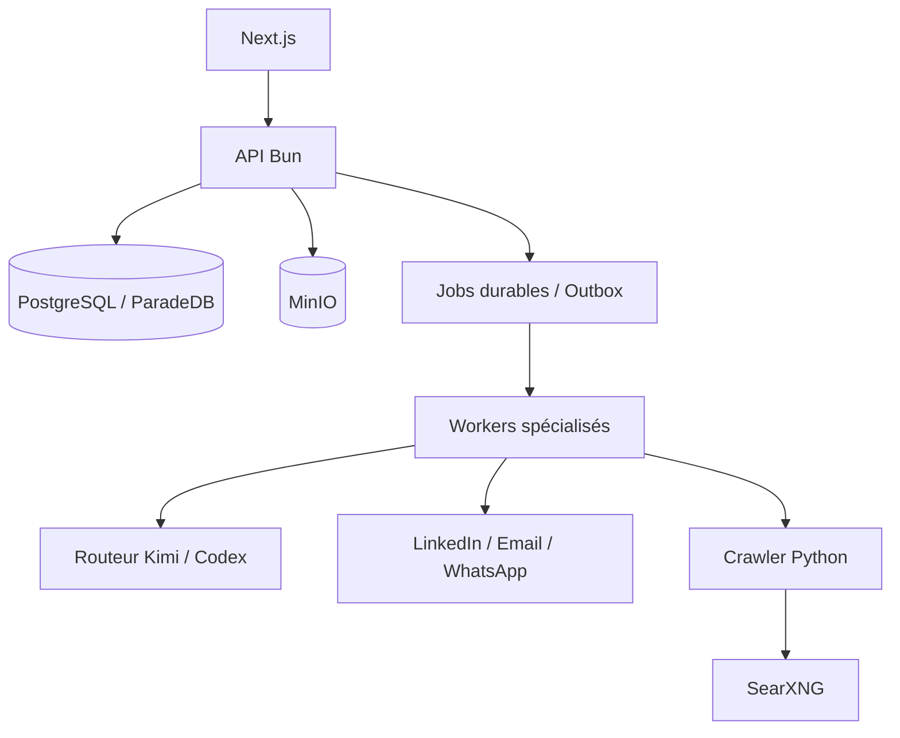

# Noosphere

Noosphere est une plateforme open source d’intelligence de croissance. Elle réunit recherche ICP, prospection Outbound, contenu Inbound, conversations multicanales et rendez-vous dans une seule application multi-workspace.

[English](README.en.md) · [README principal](README.md)

## La promesse produit

L’expérience normale tient en trois étapes :

1. vous lancez une étude ICP à partir de votre offre ;
2. Noosphere source les prospects, exécute les campagnes et publie le contenu autorisé ;
3. vous retrouvez les réponses LinkedIn, email et WhatsApp dans une inbox unique et récoltez les appels.

Les détails techniques restent observables sans envahir l’expérience. Les exceptions sont localisées dans « À traiter » et chaque effet externe reste gouverné par une policy déterministe.

## État vérifié au 23 août 2026

| Gate | Résultat | Portée réelle |
|---|---|---|
| Shadow Prospect 360 | atteint | 1 000 contextes du workspace IgnitionAI, 0 effet automatique |
| Corpus Setter | gate automatique atteint | 100/100 dry-runs Codex Luna, receipts résolubles, aucun envoi |
| Revue éditoriale humaine | ouverte | le fichier de revue existe, mais n’est pas auto-étiqueté |
| VPS 2 vCPU / 8 Gio | insuffisant pour le SLO concurrent | fonctionnement sans erreur, p95 mémoire hors cible |
| VPS recommandé | 4 vCPU / 16 Gio minimum | mesure finale encore à rejouer sur ce profil |
| Canary provider réel | non exécuté | exige une autorisation explicite et bornée |

Le détail et les fichiers de preuve sont dans le [rapport de validation Prospect 360](docs/performance/2026-08-23-prospect-360-memory-validation-report.md). Une preuve shadow ou dry-run ne constitue jamais une preuve d’envoi réel.

## Capacités

### Outbound

- recherche ICP sourcée avec preuves résolubles ;
- campagnes créées depuis les ICP retenus ;
- sourcing LinkedIn pour LinkedIn et sourcing entreprise/web pour email ou WhatsApp ;
- enrichissement, scoring, rédaction personnalisée, relances et qualification ;
- envoi via les comptes connectés, avec quotas, fenêtres horaires, suppression et idempotence ;
- dry-run durable pour tester un Setter sans envoyer ni réserver.

### Inbound LinkedIn

- stratégie éditoriale dérivée de l’offre, de l’ICP et du brand kit ;
- recherche quotidienne d’idées sourcées et dédupliquées ;
- pipeline `brief → rédaction → audit des preuves → critique` ;
- posts texte, images et carrousels ;
- calendrier réglable, publication durable et réconciliation provider ;
- ingestion des réactions, commentaires et réponses pour alimenter l’attribution.

Les autres canaux sociaux et la génération de shorts restent des extensions futures, pas des capacités déclarées comme prêtes.

### Prospect 360 et conversations

- mémoire centrale durable par prospect ;
- faits, objections, engagements, sujets déjà traités et éléments à ne pas répéter ;
- contexte reconstruit pour chaque job à partir de PostgreSQL ;
- aucun agent ou client CLI singleton ne conserve l’état métier ;
- inbox LinkedIn, email et WhatsApp, filtrable par campagne/hors campagne, canal et période ;
- amélioration IA d’un brouillon sans envoi implicite ;
- préparation d’appel et attribution Inbound, Outbound, mixte ou inconnue.

## Architecture

Noosphere est un monolithe modulaire TypeScript/Bun avec un crawler Python autonome :

| Zone | Responsabilité |
|---|---|
| `packages/domain` | invariants métier et états |
| `packages/application` | cas d’usage et ports |
| `packages/infrastructure` | PostgreSQL/Drizzle, providers, queue et stockage |
| `packages/interface` | contrats HTTP et permissions |
| `apps/api` | composition root et API Bun |
| `apps/worker` | workers durables avec leases et heartbeats |
| `apps/web` | Next.js 16 et React 19 |
| `apps/crawler` | FastAPI, Crawl4AI, Playwright et SearXNG |

Primitives standard : PostgreSQL/ParadeDB, MinIO compatible S3, queue/outbox PostgreSQL, Bun, Next.js et Docker Compose. Docling n’est pas requis dans le déploiement standard ; l’extracteur léger gère texte, Markdown, HTML et PDF texte.



Le modèle propose ; la policy autorise. Avant chaque effet, le runtime revérifie workspace, compte, quota, horaire, suppression et idempotence. Une commande n’est considérée envoyée que lorsque son état durable est `sent` et qu’un identifiant provider est enregistré.

### Durée de vie des agents et du contexte

- les repositories, pools PostgreSQL et routeurs de modèles sont réutilisables et sans état métier ;
- chaque job relit son contexte depuis PostgreSQL et reçoit un bundle tenant-scoped ;
- chaque appel Codex utilise un processus `codex exec --ephemeral` et un répertoire temporaire isolé ;
- le résultat, le modèle, le prompt, l’`ai_run`, le receipt mémoire et la décision sont persistés ;
- fermer une page ou un drawer arrête seulement le polling du navigateur, jamais le job serveur.

Il n’existe donc aucun singleton « agent avec mémoire ». La mémoire durable appartient au Prospect 360, pas au processus modèle.

## Installation locale

Prérequis :

- Bun 1.3 ou plus récent ;
- Docker et Docker Compose ;
- `uv` pour développer/tester le crawler ;
- des identifiants provider uniquement pour les intégrations que vous souhaitez activer.

```bash
cp .env.example .env
bun install
bun run dev:setup
bun run dev
```

`dev:setup` démarre l’infrastructure, applique les migrations et crée le propriétaire configuré dans `.env`. L’application est ensuite disponible sur [http://localhost:3000](http://localhost:3000).

Pour démarrer les processus séparément :

```bash
bun run db:migrate
bun run bootstrap:owner
bun run api
bun run worker:general
bun run worker:decision
bun run worker:setter
bun run worker:memory
bun run web
```

## Configuration

Copiez `.env.example` et configurez au minimum PostgreSQL, Better Auth, MinIO et les identifiants du propriétaire. Les providers IA sont routés par workspace et par cas d’usage : Kimi et Codex peuvent être sélectionnés comme modèle principal ou fallback lorsque leur runtime est configuré.

Ne commitez jamais `.env`, clés API, cookies LinkedIn, jetons OAuth ou secrets de webhook.

| Bloc | Variables principales | Obligatoire |
|---|---|---|
| PostgreSQL | `DATABASE_URL` ou `POSTGRES_*` | oui |
| Auth | `BETTER_AUTH_URL`, `BETTER_AUTH_SECRET`, origines | oui |
| Stockage | `S3_ENDPOINT`, bucket et identifiants | oui |
| Crawler | `CRAWLER_SERVICE_URL`, `CRAWLER_API_KEY` | oui |
| IA | `AI_PROVIDER` puis Kimi, Codex ou OpenAI selon la route | oui |
| Embeddings | `OPENAI_API_KEY`, `OPENAI_EMBEDDING_MODEL` | pour la connaissance |
| Canaux | Unipile et IDs de comptes sains | seulement pour les canaux activés |
| Documents | `DOCUMENT_EXTRACTOR=lightweight` | valeur standard |
| Docling | URL et clé du profil `documents-advanced` | non |

Pour Codex, exécutez l’authentification dans le volume privé décrit par le [runbook providers](docs/runbooks/provider-configuration.md). Les modèles et fallbacks se choisissent ensuite par workspace et par capacité dans l’interface.

## Tests et preuves

```bash
# Types, architecture, unités/HTTP, crawler et builds
bun run check

# PostgreSQL réel et migrations isolées
bun run test:integration

# E2E navigateur après bootstrap
bun run test:e2e
```

Prospect 360 fournit aussi des commandes sans effet provider :

```bash
bun run prepare:prospect-memory-benchmark
bun run benchmark:capacity
bun run evaluate:prospect-memory-shadow
bun run evaluate:prospect-memory-setter
bun run evaluate:prospect-memory-operator

# Corpus reproductible et sans donnée prospect réelle
bun run run:prospect-memory-setter-corpus

# Shadow tenant-scoped : à exécuter seulement sur un workspace explicitement choisi
bun run run:prospect-memory-shadow-corpus
```

Une suite verte ne remplace pas une preuve live. Consultez le [rapport de validation Prospect 360](docs/performance/2026-08-23-prospect-360-memory-validation-report.md) pour connaître les mesures réellement exécutées, les seuils non atteints et les gates encore ouverts.

## Déploiement VPS

Le déploiement standard utilise `compose.infrastructure.yml` et `compose.production.yml`. Il comprend API, web, crawler, PostgreSQL, MinIO et workers spécialisés. Suivez le [runbook VPS](docs/runbooks/vps-production.md) pour TLS, migrations, sauvegardes, restauration et canary.

Profil recommandé à ce stade : **x86_64, 4 vCPU, 16 Gio de RAM, SSD/NVMe 100 Gio ou plus**. Le benchmark isolé 2 vCPU / 8 Gio a terminé sans erreur, mais a dépassé les seuils p95 sous 100 assemblages Prospect 360 concurrents ; ce profil n’est donc pas recommandé pour l’ensemble de la plateforme.

```bash
cp deploy/.env.production.example .env
chmod 600 .env
ENV_FILE=.env bash deploy/validate-production-env.sh
docker compose --env-file .env \
  -f compose.infrastructure.yml -f compose.production.yml up -d
```

Le déploiement standard ne démarre pas Docling. Le profil `documents-advanced` est optionnel.

Ne lancez pas de canary LinkedIn, email ou WhatsApp réel sans autorisation explicite et bornée au compte, au workspace et au contenu concernés.

## Documentation

- [Architecture](docs/architecture/ARCHITECTURE.md)
- [Architecture produit Noosphere](docs/architecture/NOOSPHERE_PRODUCT_ARCHITECTURE.md)
- [Modèle de domaine](docs/architecture/DOMAIN.md)
- [Contrat d’architecture](docs/architecture/ARCHITECTURE_CONTRACT.md)
- [Contrat OpenAPI](packages/contracts/openapi/product-research-v1.json)
- [Frontière IA](docs/product/AI_BOUNDARY.md)
- [Backlog produit](docs/product/NOOSPHERE_BACKLOG.md)
- [Runbook production](docs/runbooks/vps-production.md)
- [Prospect 360 — design de contexte](docs/architecture/2026-08-23-prospect-360-memory-context-engineering.md)

## Contribuer et sécurité

Les contributions sont bienvenues. Avant une pull request, lancez `bun run check` et `bun run test:integration`, documentez les migrations et conservez l’isolation workspace. N’incluez jamais de données prospect réelles dans les fixtures ou rapports.

Pour une vulnérabilité, n’ouvrez pas immédiatement une issue publique contenant une clé, une donnée personnelle ou une procédure d’exploitation. Contactez d’abord les mainteneurs via le canal privé indiqué par l’organisation GitHub IgnitionAI.

## Licence

Noosphere est distribué sous [GNU AGPL v3.0 uniquement](LICENSE). Toute version modifiée proposée à des utilisateurs via un réseau doit leur offrir le code source correspondant conformément à l’AGPL.
