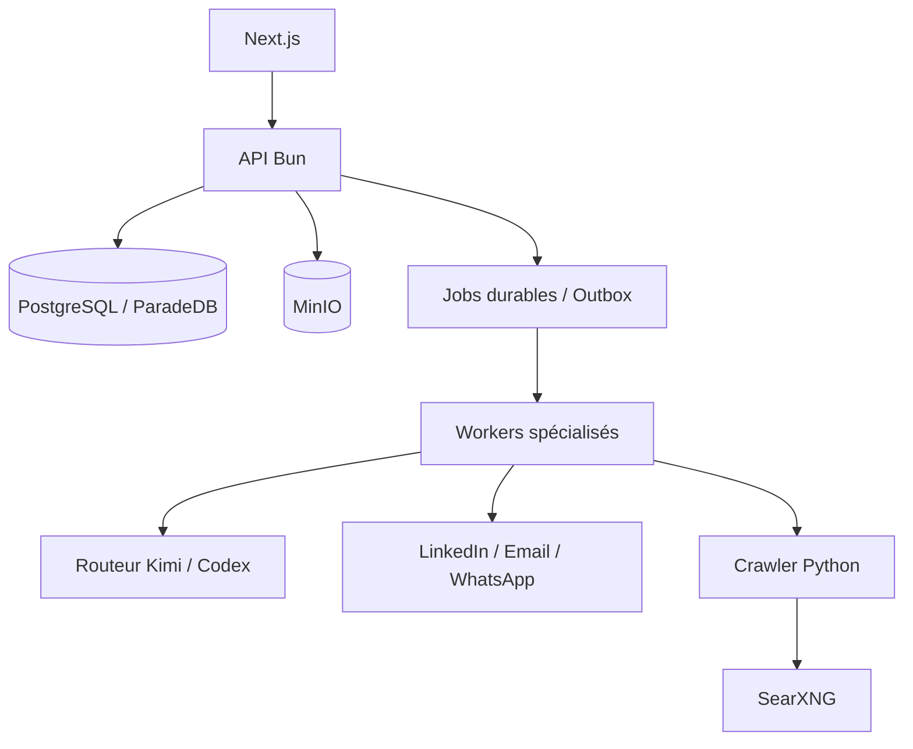

# Noosphere

Noosphere est une plateforme open source d’intelligence de croissance. Elle réunit recherche ICP, prospection Outbound, contenu Inbound, conversations multicanales et rendez-vous dans une seule application multi-workspace.

[English](README.en.md) · [README principal](README.md) · [Abonnements requis](docs/runbooks/required-subscriptions.md)

## La promesse produit

L’expérience normale tient en trois étapes :

1. vous lancez une étude ICP à partir de votre offre ;
2. Noosphere source les prospects, exécute les campagnes et publie le contenu autorisé ;
3. vous retrouvez les réponses LinkedIn, email et WhatsApp dans une inbox unique et récoltez les appels.

Les détails techniques restent observables sans envahir l’expérience. Les exceptions sont localisées dans « À traiter » et chaque effet externe reste gouverné par une policy déterministe.

## État vérifié au 23 août 2026

| Gate | Résultat | Portée réelle |
|---|---|---|
| Shadow Prospect 360 | atteint | 1 000 contextes du workspace IgnitionAI, 0 effet automatique |
| Corpus Setter | gate automatique atteint | 100/100 dry-runs Codex Luna, receipts résolubles, aucun envoi |
| Revue éditoriale humaine | ouverte | le fichier de revue existe, mais n’est pas auto-étiqueté |
| VPS 2 vCPU / 8 Gio | insuffisant pour le SLO concurrent | fonctionnement sans erreur, p95 mémoire hors cible |
| Déploiement léger | Netcup RS 2000 G12, 8 cœurs dédiés / 16 Gio | minimum acceptable pour un canary ou un seul workspace peu chargé |
| Production recommandée | Netcup RS 4000 G12, 12 cœurs dédiés / 32 Gio | cible pour faire tourner simultanément recherche, crawling, TEI et campagnes |
| Canary provider réel | non exécuté | exige une autorisation explicite et bornée |

Le détail et les fichiers de preuve sont dans le [rapport de validation Prospect 360](docs/performance/2026-08-23-prospect-360-memory-validation-report.md). Une preuve shadow ou dry-run ne constitue jamais une preuve d’envoi réel.

## Capacités

### Outbound

- recherche ICP sourcée avec preuves résolubles ;
- campagnes créées depuis les ICP retenus ;
- sourcing LinkedIn pour LinkedIn et sourcing entreprise/web pour email ou WhatsApp ;
- enrichissement, scoring, rédaction personnalisée, relances et qualification ;
- envoi via les comptes connectés, avec quotas, fenêtres horaires, suppression et idempotence ;
- dry-run durable pour tester un Setter sans envoyer ni réserver.

### Inbound LinkedIn

- stratégie éditoriale dérivée de l’offre, de l’ICP et du brand kit ;
- recherche quotidienne d’idées sourcées et dédupliquées ;
- pipeline `brief → rédaction → audit des preuves → critique` ;
- posts texte, images et carrousels ;
- calendrier réglable, publication durable et réconciliation provider ;
- ingestion des réactions, commentaires et réponses pour alimenter l’attribution.

Les autres canaux sociaux et la génération de shorts restent des extensions futures, pas des capacités déclarées comme prêtes.

### Prospect 360 et conversations

- mémoire centrale durable par prospect ;
- faits, objections, engagements, sujets déjà traités et éléments à ne pas répéter ;
- contexte reconstruit pour chaque job à partir de PostgreSQL ;
- aucun agent ou client CLI singleton ne conserve l’état métier ;
- inbox LinkedIn, email et WhatsApp, filtrable par campagne/hors campagne, canal et période ;
- amélioration IA d’un brouillon sans envoi implicite ;
- préparation d’appel et attribution Inbound, Outbound, mixte ou inconnue.

## Architecture

Noosphere est un monolithe modulaire TypeScript/Bun avec un crawler Python autonome :

| Zone | Responsabilité |
|---|---|
| `packages/domain` | invariants métier et états |
| `packages/application` | cas d’usage et ports |
| `packages/infrastructure` | PostgreSQL/Drizzle, providers, queue et stockage |
| `packages/interface` | contrats HTTP et permissions |
| `apps/api` | composition root et API Bun |
| `apps/worker` | workers durables avec leases et heartbeats |
| `apps/web` | Next.js 16 et React 19 |
| `apps/crawler` | FastAPI, Crawl4AI, Playwright et SearXNG |

Primitives standard : PostgreSQL/ParadeDB, MinIO compatible S3, queue/outbox PostgreSQL, Bun, Next.js et Docker Compose. Le routeur local extrait PDF texte, DOCX, PPTX, XLSX, HTML, Markdown et texte ; les scans sont signalés sans OCR.



Le modèle propose ; la policy autorise. Avant chaque effet, le runtime revérifie workspace, compte, quota, horaire, suppression et idempotence. Une commande n’est considérée envoyée que lorsque son état durable est `sent` et qu’un identifiant provider est enregistré.

### Durée de vie des agents et du contexte

- les repositories, pools PostgreSQL et routeurs de modèles sont réutilisables et sans état métier ;
- chaque job relit son contexte depuis PostgreSQL et reçoit un bundle tenant-scoped ;
- chaque appel Codex utilise un processus `codex exec --ephemeral` et un répertoire temporaire isolé ;
- le résultat, le modèle, le prompt, l’`ai_run`, le receipt mémoire et la décision sont persistés ;
- fermer une page ou un drawer arrête seulement le polling du navigateur, jamais le job serveur.

Il n’existe donc aucun singleton « agent avec mémoire ». La mémoire durable appartient au Prospect 360, pas au processus modèle.

## Installation locale

Prérequis :

- Bun 1.3 ou plus récent ;
- Docker et Docker Compose ;
- `uv` pour développer/tester le crawler ;
- des identifiants provider uniquement pour les intégrations que vous souhaitez activer.

```bash
cp .env.example .env
bun install
bun run dev:setup
bun run dev
```

`dev:setup` démarre l’infrastructure, applique les migrations et crée le propriétaire configuré dans `.env`. L’application est ensuite disponible sur [http://localhost:3000](http://localhost:3000).

Pour démarrer les processus séparément :

```bash
bun run db:migrate
bun run bootstrap:owner
bun run api
bun run worker:general
bun run worker:decision
bun run worker:setter
bun run worker:memory
bun run web
```

## Configuration

Copiez `.env.example` et configurez au minimum PostgreSQL, Better Auth, MinIO et les identifiants du propriétaire. Les providers IA sont routés par workspace et par cas d’usage : Kimi et Codex peuvent être sélectionnés comme modèle principal ou fallback lorsque leur runtime est configuré.

Ne commitez jamais `.env`, clés API, cookies LinkedIn, jetons OAuth ou secrets de webhook.

| Bloc | Variables principales | Obligatoire |
|---|---|---|
| PostgreSQL | `DATABASE_URL` ou `POSTGRES_*` | oui |
| Auth | `BETTER_AUTH_URL`, `BETTER_AUTH_SECRET`, origines | oui |
| Stockage | `S3_ENDPOINT`, bucket et identifiants | oui |
| Crawler | `CRAWLER_SERVICE_URL`, `CRAWLER_API_KEY` | oui |
| IA | `AI_PROVIDER` puis Kimi, Codex ou OpenAI selon la route | oui |
| Recherche | `TEI_EMBEDDING_*`, `TEI_RERANKER_*` | pour la connaissance |
| Canaux | Unipile et IDs de comptes sains | seulement pour les canaux activés |
| Documents | stockage S3, TEI Qwen et ParadeDB | pour la connaissance |

Pour Codex, exécutez l’authentification dans le volume privé décrit par le [runbook providers](docs/runbooks/provider-configuration.md). Les modèles et fallbacks se choisissent ensuite par workspace et par capacité dans l’interface.

## Tests et preuves

```bash
# Types, architecture, unités/HTTP, crawler et builds
bun run check

# PostgreSQL réel et migrations isolées
bun run test:integration

# E2E navigateur après bootstrap
bun run test:e2e
```

Prospect 360 fournit aussi des commandes sans effet provider :

```bash
bun run prepare:prospect-memory-benchmark
bun run benchmark:capacity
bun run evaluate:prospect-memory-shadow
bun run evaluate:prospect-memory-setter
bun run evaluate:prospect-memory-operator

# Corpus reproductible et sans donnée prospect réelle
bun run run:prospect-memory-setter-corpus

# Shadow tenant-scoped : à exécuter seulement sur un workspace explicitement choisi
bun run run:prospect-memory-shadow-corpus
```

Une suite verte ne remplace pas une preuve live. Consultez le [rapport de validation Prospect 360](docs/performance/2026-08-23-prospect-360-memory-validation-report.md) pour connaître les mesures réellement exécutées, les seuils non atteints et les gates encore ouverts.

## Déploiement VPS

Le déploiement standard utilise `compose.infrastructure.yml` et `compose.production.yml`. Il comprend API, web, crawler, PostgreSQL, MinIO et workers spécialisés. Suivez le [runbook VPS](docs/runbooks/vps-production.md) pour TLS, migrations, sauvegardes, restauration et canary.

### Choisir la machine

Noosphere doit être déployé sur une machine **x86_64/AMD64 avec stockage NVMe**. Aucun GPU n’est requis : Qwen3 Embedding et le reranker BGE sont servis localement par TEI en mode CPU. Les cœurs dédiés sont préférables aux vCPU partagés, car PostgreSQL, Chromium et TEI peuvent solliciter le CPU au même moment.

| Usage | Machine Netcup | Ressources | Recommandation |
|---|---|---|---|
| Développement distant ou canary court | VPS 2000 G12 | 8 vCPU partagés, 16 Gio, 512 Go NVMe | acceptable pour valider le déploiement, pas comme cible durable |
| Usage léger | **RS 2000 G12** | **8 cœurs dédiés, 16 Gio, 512 Go NVMe** | minimum acceptable pour un seul workspace peu chargé |
| Production recommandée | **RS 4000 G12** | **12 cœurs dédiés, 32 Gio, 1 To NVMe** | cible recommandée pour la plateforme complète |

Le **RS 2000 G12** convient lorsque toutes les conditions suivantes sont vraies :

- un seul workspace actif ;
- peu d’utilisateurs simultanés ;
- au plus quatre crawls concurrents ;
- indexations documentaires et campagnes lourdes non lancées en parallèle ;
- croissance modérée des documents, conversations et preuves.

Ce profil ne doit pas être confondu avec une garantie de capacité multi-workspace. Les tests ont montré que PostgreSQL pouvait déjà mobiliser environ huit cœurs pendant un scénario agressif, avant d’ajouter le coût CPU de Qwen, du reranker et du crawler. Sur 16 Gio, surveillez la mémoire, le swap, le lag des jobs et la latence p95. Passez au RS 4000 si la mémoire reste au-dessus de 12 Gio, si le swap est utilisé durablement, si le CPU dépasse 70 % pendant 15 minutes ou si plusieurs workspaces doivent travailler simultanément.

Le **RS 4000 G12** est notre choix de production : sa marge permet de conserver simultanément les deux modèles TEI en mémoire, d’exécuter les crawls, les workers, PostgreSQL, MinIO et les sauvegardes sans dimensionner la plateforme sur son fonctionnement au repos.

### Quand les embeddings sont réellement utilisés

Les services TEI restent démarrés et gardent leurs modèles en mémoire pour éviter un démarrage à froid de plusieurs dizaines de secondes. Cette mémoire résidente ne signifie pas que le CPU travaille en permanence : Qwen calcule un embedding seulement dans les cas suivants :

- à l'import ou à la modification d'un document, d'une offre, d'une preuve ou d'une connaissance éligible ;
- lors d'une recherche hybride dans la connaissance, pour vectoriser la requête ;
- pendant une réindexation complète ou une future migration de modèle.

Le réconciliateur vérifie les hashes avant l'appel TEI : un contenu inchangé n'est pas ré-embeddé à chaque passage du worker. Le reranker BGE n'intervient qu'après la recherche hybride, sur un petit ensemble de candidats. La synchronisation des messages, le sourcing de prospects, la rédaction des posts, les envois et le fonctionnement courant du Setter n'appellent pas actuellement Qwen Embedding.

En pratique, pour un workspace léger, la charge d'embedding est donc **ponctuelle** ; le coût permanent est surtout la RAM réservée aux modèles chauds. Le pic réellement intensif correspond à l'import d'un corpus important ou à une réindexation complète. C'est pourquoi le RS 2000 est cohérent pour un seul workspace, tandis que le RS 4000 apporte surtout de la marge pour la concurrence multi-workspace et les opérations lourdes simultanées.

Prix publics relevés le 24 août 2026, susceptibles d’évoluer selon TVA et durée d’engagement : RS 2000 G12 à partir de **21,43 € TTC/mois** et RS 4000 G12 à partir de **39,92 € TTC/mois**. Consultez les [Root Servers G12 Netcup](https://www.netcup.com/en/server/root-server) pour les caractéristiques actuelles. Le protocole et les limites de la mesure locale sont documentés dans le [rapport de capacité](docs/performance/2026-08-21-noosphere-standard-stack-capacity.md).

Configuration système conseillée : Debian 12 x86_64, 8 Gio de swap de secours avec `vm.swappiness=10`, sauvegardes PostgreSQL et MinIO hors du serveur, et exposition publique limitée à HTTP(S) et SSH restreint. PostgreSQL, MinIO et les services TEI restent sur le réseau Docker privé.

```bash
cp deploy/.env.production.example .env
chmod 600 .env
ENV_FILE=.env bash deploy/validate-production-env.sh
docker compose --env-file .env \
  -f compose.infrastructure.yml -f compose.production.yml up -d
```

Le déploiement ne démarre aucun extracteur externe. Chaque extraction utilise un processus Bun transitoire et durablement piloté par les jobs PostgreSQL.

Ne lancez pas de canary LinkedIn, email ou WhatsApp réel sans autorisation explicite et bornée au compte, au workspace et au contenu concernés.

## Documentation

- [Architecture](docs/architecture/ARCHITECTURE.md)
- [Architecture produit Noosphere](docs/architecture/NOOSPHERE_PRODUCT_ARCHITECTURE.md)
- [Modèle de domaine](docs/architecture/DOMAIN.md)
- [Contrat d’architecture](docs/architecture/ARCHITECTURE_CONTRACT.md)
- [Contrat OpenAPI](packages/contracts/openapi/product-research-v1.json)
- [Frontière IA](docs/product/AI_BOUNDARY.md)
- [Backlog produit](docs/product/NOOSPHERE_BACKLOG.md)
- [Runbook production](docs/runbooks/vps-production.md)
- [Prospect 360 — design de contexte](docs/architecture/2026-08-23-prospect-360-memory-context-engineering.md)

## Contribuer et sécurité

Les contributions sont bienvenues. Avant une pull request, lancez `bun run check` et `bun run test:integration`, documentez les migrations et conservez l’isolation workspace. N’incluez jamais de données prospect réelles dans les fixtures ou rapports.

Pour une vulnérabilité, n’ouvrez pas immédiatement une issue publique contenant une clé, une donnée personnelle ou une procédure d’exploitation. Contactez d’abord les mainteneurs via le canal privé indiqué par l’organisation GitHub IgnitionAI.

## Licence

Noosphere est distribué sous [GNU AGPL v3.0 uniquement](LICENSE). Toute version modifiée proposée à des utilisateurs via un réseau doit leur offrir le code source correspondant conformément à l’AGPL.
