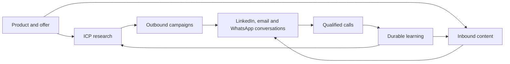

# Noosphere

**Open-source growth intelligence: discover the right market, run outbound, publish inbound content, and turn conversations into calls.**

[Français](README.fr.md) · [English](README.en.md) · [Architecture](docs/architecture/ARCHITECTURE.md) · [Production runbook](docs/runbooks/vps-production.md)

Noosphere brings the GTM loop into one multi-workspace application:



The normal experience stays intentionally simple:

1. launch an ICP study;
2. let campaigns and LinkedIn content run within deterministic policies;
3. answer from the unified inbox and collect calls.

The AI never owns provider state. PostgreSQL, durable jobs, leases, idempotency keys and outbox events remain authoritative. Closing a page or drawer stops browser polling only; it does not cancel the work.

## Quick start

Requirements: Bun 1.3+, Docker with Compose, and `uv` for crawler development.

```bash
cp .env.example .env
bun install
bun run dev:setup
bun run dev
```

Open [http://localhost:3000](http://localhost:3000). The production-like Compose stack and VPS procedure are documented in the [production runbook](docs/runbooks/vps-production.md).

## Verification

```bash
bun run check
bun run test:integration
```

The repository also contains effect-free capacity, shadow, Setter-quality and operator-comprehension gates. Their current evidence and remaining production gates are recorded in the [Prospect 360 validation report](docs/performance/2026-08-23-prospect-360-memory-validation-report.md).

## License

Noosphere is licensed under the [GNU Affero General Public License v3.0 only](LICENSE). If you modify and operate it over a network, the AGPL requires offering the corresponding source to its users.
