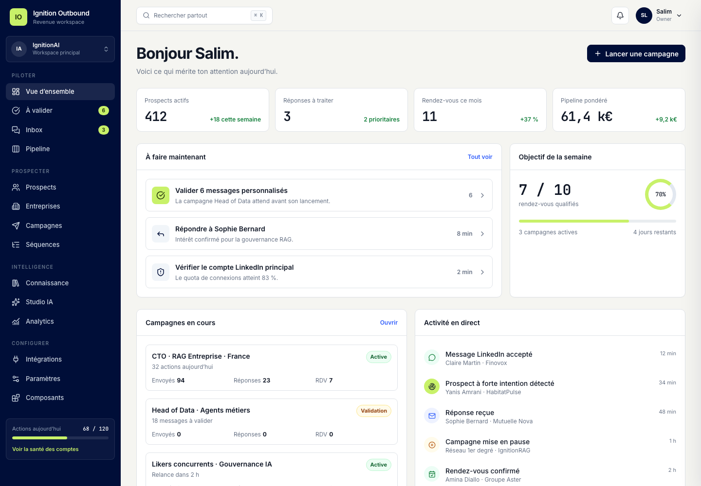

# Ignition Outbound

Ignition Outbound est une application interne de prospection multicanale conçue
pour IgnitionAI, avec une architecture permettant une évolution ultérieure vers
un produit SaaS multi-workspace.

Ce dépôt contient les spécifications d’architecture, un prototype frontend
HTML/Tailwind navigable et le premier socle backend Bun/PostgreSQL de la mission
de recherche ICP F-009. L’application Next.js et l’adaptateur de modèles IA ne
sont pas encore implémentés.



## Démarrer le prototype

```bash
bun run prototype
```

Puis ouvrir [http://localhost:4173](http://localhost:4173).

Vérifier l’intégrité des pages, des types, de l’architecture, des routes et des
builds Bun :

```bash
bun run check
```

Le contrôle couvre aussi les types, les dépendances d’architecture et les tests
unitaires du domaine, de la file de jobs et de l’orchestrateur.

## Backend F-009

Le socle est organisé selon le monolithe modulaire :

- `packages/domain` : agrégat et invariants de recherche ;
- `packages/contracts` : contrats Zod des rôles d’agents ;
- `packages/application` : cas d’usage, ports et orchestrateur ;
- `packages/infrastructure` : Drizzle, PostgreSQL, queue et adapters de test ;
- `packages/interface` : transport HTTP Web standard et contrôle des rôles ;
- `apps/api` : serveur Bun et composition root HTTP ;
- `apps/worker` : consommateur Bun à lease.

Voir le [runbook F-009](docs/architecture/F009_BACKEND_RUNBOOK.md) pour migrer
PostgreSQL, brancher les adaptateurs, lancer l’API et le worker. Le contrat
machine des sept routes est
[`product-research-v1.json`](packages/contracts/openapi/product-research-v1.json).

## Documents

- [Préparation produit et catalogue des features](docs/product/README.md)
- [Plan de livraison des features](docs/product/DELIVERY_PLAN.md)
- [Frontière IA](docs/product/AI_BOUNDARY.md)
- [Spécification d’architecture](docs/architecture/ARCHITECTURE.md)
- [Modèle de domaine](docs/architecture/DOMAIN.md)
- [Modèle de données et ERD](docs/architecture/DATA_MODEL.md)
- [Flux critiques](docs/architecture/FLOWS.md)
- [Contrat API](docs/architecture/API_CONTRACT.md)
- [Contrat d’architecture](docs/architecture/ARCHITECTURE_CONTRACT.md)
- [Checklist Guardian](docs/architecture/GUARDIAN_CHECKLIST.md)
- [Roadmap d’implémentation](docs/architecture/ROADMAP.md)
- [Guide d’intégration frontend](docs/frontend/FRONTEND_INTEGRATION.md)
- [Runbook backend F-009](docs/architecture/F009_BACKEND_RUNBOOK.md)
- [Architecture Decision Records](docs/architecture/adr/)
- [Prototype frontend](prototype/dashboard.html)

## Statut

Architecture V1, prototype frontend, socle backend et routes HTTP F-009 validés
le 24 juillet 2026. L’adaptateur Better Auth, l’application Next.js et
l’adaptateur de modèles IA restent à implémenter.
