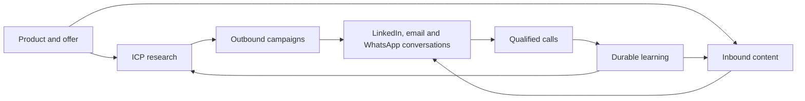

# Noosphere

**Open-source growth intelligence: discover the right market, run outbound, publish inbound content, and turn conversations into calls.**

[Documentation française](README.fr.md) · [English documentation](README.en.md) · [Architecture](docs/architecture/ARCHITECTURE.md) · [Production runbook](docs/runbooks/vps-production.md) · [Required subscriptions](docs/runbooks/required-subscriptions.md)

Noosphere brings the GTM loop into one multi-workspace application:



The normal experience stays intentionally simple:

1. launch an ICP study;
2. let campaigns and LinkedIn content run within deterministic policies;
3. answer from the unified inbox and collect calls.

The AI never owns provider state. PostgreSQL, durable jobs, leases, idempotency keys and outbox events remain authoritative. Closing a page or drawer stops browser polling only; it does not cancel the work.

## Quick start

Requirements: Bun 1.3+, Docker with Compose, and `uv` for crawler development.

```bash
cp .env.example .env
bun install
bun run dev:setup
bun run dev
```

Open [http://localhost:3000](http://localhost:3000). The production-like Compose stack and VPS procedure are documented in the [production runbook](docs/runbooks/vps-production.md).

For production, start from the tracked, secret-free template:

```bash
cp deploy/.env.production.example .env
ENV_FILE=.env bash deploy/validate-production-env.sh
```

## Verification

```bash
bun run check
bun run test:integration
```

The repository also contains effect-free capacity, shadow, Setter-quality and operator-comprehension gates. Their current evidence and remaining production gates are recorded in the [Prospect 360 validation report](docs/performance/2026-08-23-prospect-360-memory-validation-report.md).

Measured on 23 August 2026: the real-data shadow gate passed on 1,000 IgnitionAI contexts; 100/100 synthetic Codex Setter dry-runs were generated with zero provider effects and resolvable memory receipts. An isolated 2-vCPU/8-GiB VPS remained functional but missed the concurrent-memory p95 target.

## Production sizing

- **Light usage, one workspace:** Netcup **RS 2000 G12**, with 8 dedicated cores, 16 GiB RAM and 512 GB NVMe. This is the acceptable minimum for a canary or one lightly loaded workspace, provided heavy crawling, indexing and campaigns are not run concurrently.
- **Recommended production:** Netcup **RS 4000 G12**, with 12 dedicated cores, 32 GiB RAM and 1 TB NVMe. This is the recommended target for the full platform, including PostgreSQL/ParadeDB, MinIO, Chromium crawling, workers, Qwen embedding and BGE reranking.

TEI keeps Qwen and BGE resident in RAM to avoid cold starts, but this is not continuous compute. Embeddings are generated only for new or changed knowledge, hybrid-search queries, and full reindexing; unchanged content is skipped by hash. Message synchronization, prospect sourcing, post writing, sends and normal Setter execution do not currently use Qwen Embedding. See the localized deployment guides below for the complete workload explanation.

Use x86_64/AMD64 and NVMe storage. A GPU is not required. Shared-vCPU plans are suitable for short preproduction tests but are not the preferred production target. See the [French deployment guide](README.fr.md#déploiement-vps), [English deployment guide](README.en.md#vps-deployment) and [capacity report](docs/performance/2026-08-21-noosphere-standard-stack-capacity.md) for assumptions, upgrade thresholds and operational configuration.

## License

Noosphere is licensed under the [GNU Affero General Public License v3.0 only](LICENSE). If you modify and operate it over a network, the AGPL requires offering the corresponding source to its users.
