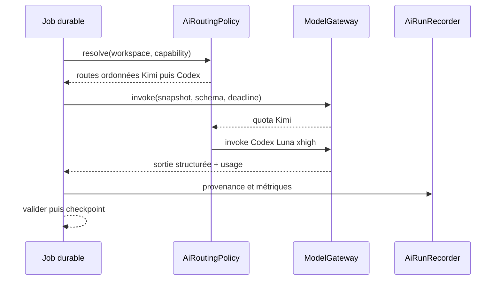

# Noosphere AI Runtime V2 — routage Kimi, Codex et OpenAI

## Statut

Implémenté et validé localement le 2026-08-22. Le déploiement VPS et le canary
produit complet restent à réaliser.

Cette spécification prépare le remplacement du couplage actuel à Kimi par un
runtime d'inférence interchangeable. Elle ne modifie ni les règles métier, ni
les outils des agents, ni les adaptateurs d'envoi.

## Décisions verrouillées

1. Une capacité Noosphere dépend d'un port `ModelGateway`, jamais de
   `ChatOpenAI`, de Kimi ou du processus Codex directement.
2. Kimi reste disponible avec son catalogue complet. Lorsque le profil Kimi est
   choisi sans override, tous les rôles utilisent `k3`.
3. Codex devient un transport expérimental sélectionnable avec
   `gpt-5.6-luna` et `reasoning_effort=xhigh`.
4. Le mode simple permet d'appliquer en une action un provider, un modèle et un
   effort de raisonnement à tous les usages.
5. Une matrice par use case permet ensuite de choisir librement n'importe quel
   modèle accessible chez Kimi ou Codex, sans redéploiement.
6. Un quota épuisé ouvre immédiatement le circuit du provider. Le même appel
   n'est jamais relancé quatre fois sur le provider en échec.
7. Les effets externes restent hors du modèle. Un fallback d'inférence ne peut
   ni publier, ni envoyer, ni réserver un rendez-vous.
8. « Sans quota » n'est pas un invariant. Le runtime mesure les limites réelles
   de Codex et Kimi et restitue un résultat partiel lorsqu'aucun provider n'est
   disponible.

## Preuves de faisabilité collectées

### Catalogue Kimi

Le `GET /models` du compte configuré a répondu `200` le 2026-08-22 et a exposé :

- `kimi-for-coding` ;
- `kimi-for-coding-highspeed` ;
- `k3` ;
- `k3-256k`.

Le catalogue applicatif ne doit donc plus être un enum limité à `k3` et
`k3-256k`. Une liste statique ne sert que de fallback lorsque la découverte est
indisponible.

### Codex Luna

Un smoke test local a exécuté avec succès :

```text
provider: openai
transport: codex-cli
model: gpt-5.6-luna
reasoning effort: xhigh
mode: ephemeral, read-only, approval never
```

La sortie JSON attendue a été obtenue. Cette requête triviale a néanmoins
rapporté 18 623 tokens car le client a chargé du contexte utilisateur. Le
transport serveur doit donc posséder un `CODEX_HOME` minimal et dédié, sans
skills, plugins, mémoire personnelle, MCP ni instructions de dépôt.

## État actuel

Le runtime possède déjà une première distinction `kimi-code | openai` dans le
moteur ICP, mais elle n'est pas une abstraction générale :

- onze adaptateurs LangChain construisent directement `ChatOpenAI` ;
- `ActiveAiConfiguration.provider` vaut littéralement `kimi-code` ;
- l'API d'évaluation et le client web refusent tout autre provider ;
- `WorkspaceAiModelPolicy` ne stocke que deux listes de modèles sans provider ;
- la page Configuration ne connaît que K3 et K3 256k ;
- `useResponsesApi: false` est appliqué aussi au chemin OpenAI ;
- les jobs génériques peuvent répéter une erreur de quota jusqu'à épuiser leurs
  tentatives.

## Modèle cible

### Valeurs métier

```text
AiProviderId = kimi-code | codex-cli | openai-api
AiTransport = chat-completions | responses-api | codex-process
AiReasoningEffort = low | medium | high | xhigh | max | ultra
AiRoutingMode = auto | fixed
AiCapability =
  icp_research | content_strategy | content_idea | content_brief |
  content_writer | content_audit | content_critic | brand_direction |
  channel_strategy | prospect_decision | message_generation | setter | evaluation
```

Le modèle est un identifiant opaque validé par le catalogue du provider. Le
domaine ne contient aucun enum de noms commerciaux. Toute combinaison
`capability + provider + model + reasoningEffort` est configurable ; un probe
structuré signale sa compatibilité réelle avant activation.

### Ports applicatifs implémentés

| Port | Responsabilité |
|---|---|
| `ModelGateway` | Exécuter une invocation structurée bornée, sans effet externe |
| `ModelCatalog` | Lister les modèles accessibles et leurs capacités observées |
| `AiRoutingPolicy` | Résoudre une route ordonnée depuis workspace, capacité et santé |
| `AiRunRecorder` | Persister la provenance, la latence et la sortie métier |

Le catalogue expose l'état observé lors de sa lecture. Un circuit breaker partagé
et persistant n'est pas encore implémenté : le routeur arrête néanmoins
immédiatement le provider courant sur quota, authentification, modèle absent ou
timeout, puis essaie au plus une fois chaque fallback configuré.

Contrat conceptuel de `ModelGateway` :

```text
invoke({
  workspaceId,
  capability,
  requestKey,
  model,
  reasoningEffort,
  systemPrompt,
  input,
  outputSchema,
  deadlineAt,
  abortSignal
}) -> {
  output,
  provider,
  transport,
  model,
  reasoningEffort,
  usage,
  latencyMs
}
```

Le port ne reçoit ni URL arbitraire, ni chemin de workspace, ni outil système.

### Adaptateurs

#### `KimiChatModelGateway`

- OpenAI-compatible Chat Completions ;
- `useResponsesApi=false` ;
- découverte du catalogue par `/models`, cache court et fallback statique ;
- sorties structurées par function calling ;
- reasoning Kimi configuré selon la capacité ;
- erreur de quota normalisée en `AI_PROVIDER_QUOTA_EXHAUSTED` non retryable sur
  ce provider.

#### `CodexCliModelGateway`

- processus `codex exec` non interactif ;
- `--ephemeral`, `--ignore-user-config`, `--skip-git-repo-check` ;
- `--sandbox read-only`, approbation `never` ;
- `--output-schema` construit depuis le schéma attendu ;
- répertoire courant temporaire vide ;
- `CODEX_HOME` de service dédié, writable uniquement par l'utilisateur non-root
  du conteneur afin que Codex puisse renouveler son authentification ;
- aucun MCP, plugin, skill, mémoire ou `AGENTS.md` ;
- stdout/stderr bornés, timeout dur et destruction du groupe de processus ;
- concurrence initiale : un appel, configurable après benchmark ;
- aucun accès au dépôt Noosphere, au bucket ou aux secrets applicatifs ;
- healthcheck d'authentification au démarrage sans effectuer une génération.

Le JSONL de Codex sert à la télémétrie technique. Seule la dernière sortie
validée par le schéma devient une réponse métier.

#### `OpenAiResponsesModelGateway`

- option API conventionnelle pour un déploiement avec SLA ;
- Responses API et clé de service ;
- aucun réemploi des tokens ChatGPT personnels ;
- modèle configuré par environnement ou workspace ;
- désactivé tant qu'aucune clé API serveur n'est fournie.

## Sélection globale et par use case

Le choix global sert uniquement de raccourci :

```text
Appliquer à tous les usages

Provider     [Codex ▾]
Modèle       [gpt-5.6-luna ▾]
Raisonnement [xhigh ▾]

[Appliquer partout]
```

Il ne verrouille jamais les usages. Chaque ligne reste modifiable :

| Use case | Provider | Modèle | Raisonnement |
|---|---|---|---|
| Recherche ICP | Kimi ou Codex | catalogue dynamique | choix compatible |
| Stratégie éditoriale | Kimi ou Codex | catalogue dynamique | choix compatible |
| Recherche d'idées | Kimi ou Codex | catalogue dynamique | choix compatible |
| Brief | Kimi ou Codex | catalogue dynamique | choix compatible |
| Rédaction | Kimi ou Codex | catalogue dynamique | choix compatible |
| Audit des preuves | Kimi ou Codex | catalogue dynamique | choix compatible |
| Critique éditoriale | Kimi ou Codex | catalogue dynamique | choix compatible |
| Direction de marque | Kimi ou Codex | catalogue dynamique | choix compatible |
| Stratégie de sourcing | Kimi ou Codex | catalogue dynamique | choix compatible |
| Décision prospect | Kimi ou Codex | catalogue dynamique | choix compatible |
| Message / amélioration | Kimi ou Codex | catalogue dynamique | choix compatible |
| Setter | Kimi ou Codex | catalogue dynamique | choix compatible |
| Évaluation | Kimi ou Codex | catalogue dynamique | choix compatible |

Le catalogue Kimi vient de `/models`. Le catalogue Codex vient du client Codex
authentifié. Aucun nom de modèle n'est codé dans le formulaire, hormis une liste
de secours si la découverte est temporairement indisponible.

Un modèle nouvellement découvert est immédiatement sélectionnable. La page
affiche la santé du catalogue ; la compatibilité de sortie structurée est
revérifiée lors de l'invocation et produit une erreur explicite sans déclencher
d'effet externe.

Le fallback est autorisé uniquement avant qu'une sortie métier ait été
acceptée. Il ne reprend jamais un agent à mi-tour avec un état raisonné propre à
un autre provider : le stage borné est rejoué depuis son snapshot immuable.

## Circuit breaker et budgets

| Erreur | Même provider | Provider suivant | Job |
|---|---|---|---|
| quota / usage limit | jamais | immédiatement | continue si route disponible |
| auth invalide | jamais | immédiatement | exception de configuration |
| modèle indisponible | jamais | immédiatement | continue si route disponible |
| timeout transitoire | jamais | immédiatement | résultat partiel possible |
| sortie invalide | une réparation bornée | ensuite | échec explicite |
| policy / suppression | jamais | jamais | arrêt métier |

La persistance d'un circuit partagé entre workers est un durcissement ultérieur.
En V2, chaque invocation possède une liste ordonnée de trois routes maximum et
un provider n'est tenté qu'une fois.

Budgets minimums par invocation : deadline absolue, tailles maximales de prompt
et de sortie, nombre de tours, nombre de providers tentés et coût API maximal.

## Données

### `workspace_ai_settings.model_routing`

La migration `0084_provider_neutral_ai_routing.sql` ajoute un document JSONB
tenant-scoped à la table existante. Il contient `defaultRoutes` et
`capabilityRoutes`. Ce choix conserve les anciens champs recherche/synthèse
pendant la transition et évite une seconde table tant que le volume ne le
justifie pas.

Les anciennes listes `researchModels` et `synthesisModels` restent lisibles
pendant une release puis sont migrées vers des routes par capacité.

### `ai_runs`

Les enregistreurs existants conservent actuellement `provider`, `model`,
`purpose`, `prompt_version`, `cost` et `latency_ms`. Le résultat du routeur
contient aussi `transport`, `reasoningEffort`, `providerAttempt`,
`fallbackReason` et l'usage normalisé ; leur projection complète dans toutes les
lignes historiques `ai_runs` reste un durcissement d'observabilité ultérieur.

Les secrets, tokens d'authentification et chemins de `CODEX_HOME` ne sont jamais
persistés.

## API

### `GET /api/v1/ai/models`

Retour tenant-safe :

```json
{
  "providers": [
    {
      "provider": "kimi-code",
      "status": "healthy",
      "models": [{
        "id": "k3",
        "displayName": "k3",
        "reasoningEfforts": ["low", "max"],
        "structuredOutput": "supported"
      }],
      "observedAt": "2026-08-22T00:00:00.000Z",
      "errorCode": null
    },
    {
      "provider": "codex-cli",
      "status": "healthy",
      "models": [{
        "id": "gpt-5.6-luna",
        "displayName": "GPT-5.6 Luna",
        "reasoningEfforts": ["low", "medium", "high", "xhigh", "max"],
        "structuredOutput": "supported"
      }],
      "observedAt": "2026-08-22T00:00:00.000Z",
      "errorCode": null
    }
  ]
}
```

Cette route n'expose ni quota exact privé, ni secret, ni détails du compte.

### `GET /api/v1/workspace-ai-settings`

Retourne le profil simple, les routes effectives et les capacités avancées.

### `PUT /api/v1/workspace-ai-settings`

Le formulaire transforme le raccourci global en route par défaut :

```json
{
  "defaultRoutes": [{
    "provider": "codex-cli",
    "model": "gpt-5.6-luna",
    "reasoningEffort": "xhigh"
  }],
  "capabilityRoutes": {}
}
```

Les routes par usage utilisent la même enveloppe :

```json
{
  "defaultRoutes": [{
    "provider": "kimi-code",
    "model": "k3",
    "reasoningEffort": "max"
  }],
  "capabilityRoutes": {
    "content_writer": [{
      "provider": "kimi-code",
      "model": "k3",
      "reasoningEffort": "max"
    }],
    "content_audit": [{
      "provider": "codex-cli",
      "model": "gpt-5.6-luna",
      "reasoningEffort": "xhigh"
    }]
  }
}
```

Workspace et utilisateur sont toujours dérivés de la session. L'opération est
transactionnelle et valide la forme de chaque route. La compatibilité réelle du
modèle est contrôlée lors de l'invocation structurée.

## Expérience utilisateur

L'écran normal ne montre pas la topologie agentique, mais conserve la liberté
de configuration demandée.

```text
Moteur IA

[Appliquer partout]
Provider [Codex ▾]  Modèle [gpt-5.6-luna ▾]  Effort [xhigh ▾]

État : Codex disponible · Kimi quota épuisé

[Personnaliser par usage]
```

`Personnaliser par usage` ouvre la matrice complète. Les lignes modifiées sont
visuellement distinctes et un bouton `Réinitialiser sur le réglage global`
supprime l'override. Aucun utilisateur n'a à configurer cette matrice pour
lancer une campagne ou un post.

## Séquence d'inférence



## Product Truth Contract

### Parcours P0

- **État initial** : workspace configuré, Codex authentifié sur le VPS, Kimi
  indisponible.
- **Déclencheur** : lancement d'un dry-run de post ou d'une étape ICP.
- **Résultat observable** : le stage se termine avec une sortie structurée et
  un `ai_run` portant `provider=codex-cli`, `model=gpt-5.6-luna`,
  `reasoning_effort=xhigh`.
- **Continuation** : le stage suivant consomme le checkpoint durable sans
  dépendre de la session Codex précédente.

### Topologie requise

- worker Bun ;
- route IA workspace ;
- PostgreSQL et queue existante ;
- binaire Codex versionné ;
- `CODEX_HOME` de service et authentification valide ;
- répertoire temporaire vide ;
- enregistreur `ai_runs` ;
- route de fallback bornée.

### Substituts interdits

- mock Codex présenté comme preuve réelle ;
- exécution depuis le dépôt Noosphere ;
- réemploi du `CODEX_HOME` personnel de Salim en production ;
- parsing d'une sortie libre sans JSON Schema ;
- retry silencieux après quota ;
- succès HTTP sans preuve d'un `ai_run` et d'un checkpoint consommable.

### Test E2E prévu

1. ouvrir artificiellement le circuit Kimi ;
2. appliquer Codex Luna xhigh à tous les usages ;
3. observer un appel Codex Luna xhigh ;
4. valider le schéma de sortie ;
5. vérifier provenance et usage en base ;
6. redémarrer le worker ;
7. vérifier que le stage suivant reprend depuis le checkpoint ;
8. confirmer qu'aucune publication ou aucun message n'a été envoyé.

## État de la migration verticale

1. **Contrats, gateways Kimi/Codex, catalogue et routage** — implémentés.
2. **Usages migrés** — ICP, stratégie de canal, contenu, marque, décision
   prospect, messages, Setter et évaluation.
3. **UI** — réglage global, fallbacks et overrides par usage implémentés dans
   `/w/:workspace/settings/ai`.
4. **Runtime** — image Docker avec Codex CLI versionné et volume d'auth dédié
   validée localement.
5. **Canary transport** — Luna xhigh a produit une sortie structurée réelle.
6. **Restant avant production** — 20 dry-runs comparatifs, canary workspace
   IgnitionAI et observation des limites réelles sous concurrence.

## Références externes vérifiées

- [Unrolling the Codex agent loop](https://openai.com/index/unrolling-the-codex-agent-loop/) — distingue le endpoint Responses avec clé API du endpoint utilisé par une connexion ChatGPT.
- [Using Codex with your ChatGPT plan](https://help.openai.com/en/articles/11369540-using-codex-with-your-chatgpt-plan) — confirme l'existence de limites et d'un allowance agentique partagé.
- [Responses API](https://developers.openai.com/api/reference/cli/resources/responses/methods/create) — contrat officiel pour les sorties structurées et les tools côté API.

## Critères d'acceptation de l'implémentation

- les quatre modèles Kimi du catalogue live sont visibles sans déploiement ;
- le réglage global applique réellement la même route à tous les use cases ;
- chaque use case accepte indépendamment tout provider et modèle découvert ;
- K3 est le modèle par défaut de chaque capacité lorsque Kimi est appliqué
  globalement ;
- Luna xhigh produit une sortie Zod/JSON Schema réelle depuis le worker ;
- un 403 Kimi ne déclenche aucun retry Kimi ;
- Auto bascule sur Codex au prochain stage borné ;
- quitter l'UI ou redémarrer un worker ne perd aucun job ;
- aucun modèle n'accède aux providers d'envoi ;
- les sorties routées exposent provider, transport, modèle, effort et fallback,
  tandis que `ai_runs` persiste au minimum provider, modèle et latence ;
- le choix global tient sur une ligne et la matrice détaillée reste optionnelle.
