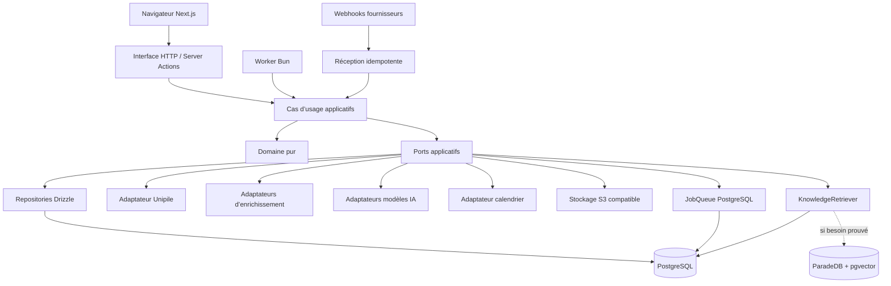
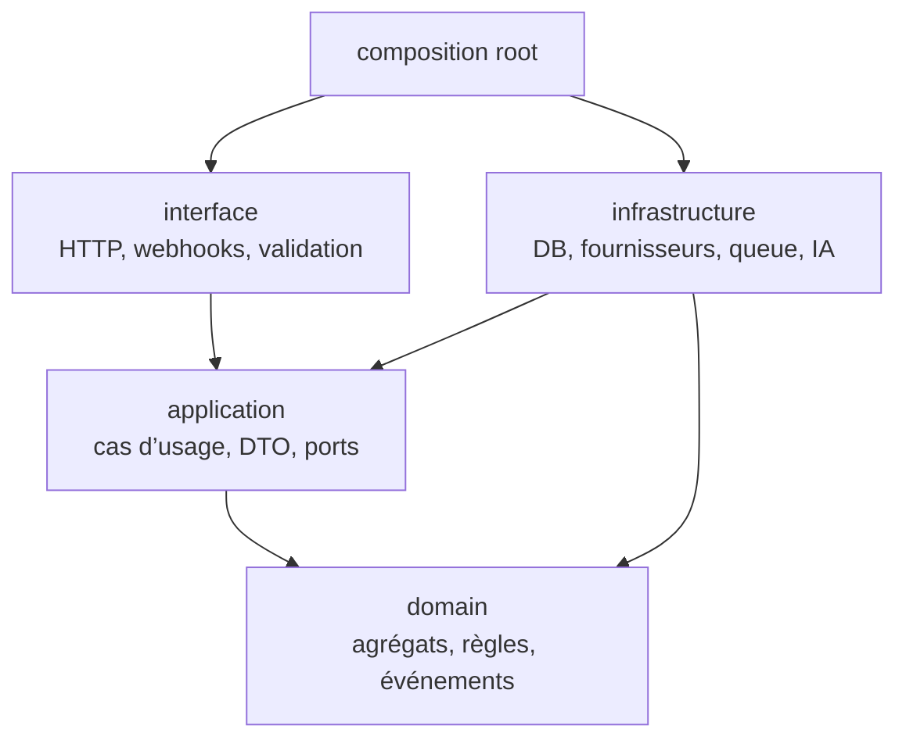

# Spécification d’architecture — Ignition Outbound

## 1. Vue d’ensemble

- **Produit** : Ignition Outbound
- **Type** : application web et pipeline asynchrone
- **Objectif** : rechercher, enrichir, prioriser et contacter des prospects
  B2B sur LinkedIn, email et WhatsApp, puis suivre les conversations et les
  opportunités jusqu’au revenu.
- **Usage initial** : interne à IgnitionAI, un workspace actif, un utilisateur
  principal.
- **Cible structurelle** : produit SaaS multi-workspace sans refonte du domaine.
- **Statut** : architecture approuvée, implémentation non commencée.

La cible commerciale initiale d’IgnitionAI est le CTO ou Head of Data d’une
entreprise française de 500 à 5 000 salariés. Cette hypothèse métier reste
configurable par `ICPVersion` et ne doit jamais être codée en dur.
Source canonique :
`knowledge/business/offers/ignitionai-offers-and-icp.md@5cd6218191351ecd7480514ec6edb4c2f82f4f54`.

## 2. Résultat produit attendu

Le premier parcours critique est :

1. décrire une offre et son ICP ;
2. rechercher des entreprises et personnes ;
3. enrichir et dédupliquer les identités ;
4. expliquer et valider le score de chaque prospect ;
5. générer une séquence multicanale personnalisée ;
6. approuver la séquence une seule fois ;
7. exécuter les relances jusqu’à un signal d’arrêt ;
8. centraliser les réponses dans une inbox ;
9. laisser l’autopilote répondre dans les bornes de la politique, avec
   exceptions humaines ;
10. qualifier, réserver un rendez-vous et suivre l’opportunité jusqu’au revenu.

## 3. Contraintes de capacité V1

| Dimension | Cible initiale |
|---|---:|
| Workspaces actifs | 1 |
| Utilisateurs par workspace | jusqu’à 5 |
| Comptes expéditeurs par canal | jusqu’à 5 |
| Entreprises | 50 000 |
| Contacts | 100 000 |
| Campagnes actives | 20 |
| Enrichissements quotidiens | 1 000 |
| Actions outbound quotidiennes | 100–300 |
| Évolution prévue | environ 100 workspaces par ajout de workers |

Ces volumes justifient un monolithe modulaire avec workers asynchrones. Ils ne
justifient ni microservices, ni Kafka, ni Redis en V1.

## 4. Architecture logique



## 5. Déploiement physique

```mermaid
flowchart LR
    Internet --> Proxy["Reverse proxy TLS"]
    Proxy --> Web["Conteneur web Next.js / Bun"]
    Proxy --> Hooks["Routes webhook"]
    Web --> DB[("PostgreSQL")]
    Worker1["Conteneur worker Bun"] --> DB
    Worker1 --> Providers["Unipile / IA / Enrichissement"]
    Web --> ObjectStore["S3 compatible"]
    Worker1 --> ObjectStore
    Metrics["Prometheus / logs / traces"] <-- Web
    Metrics <-- Worker1
```

Le même artefact applicatif peut exposer deux points d’entrée : `web` et
`worker`. Ils sont déployés séparément sur le VPS. L’augmentation de capacité
se fait d’abord en ajoutant des workers, sans découper le domaine.

## 6. Stack décidée

| Couche | Choix | Justification |
|---|---|---|
| Langage | TypeScript | même langage sur UI, serveur et workers |
| Runtime et package manager | Bun | préférence explicite, tests et scripts unifiés |
| Web | Next.js App Router | application web full-stack et routes HTTP |
| Authentification | Better Auth, sessions | auto-hébergé, compatible avec une évolution OAuth/2FA |
| Autorisation | RBAC applicatif | workspace et memberships restent dans le domaine |
| Base principale | PostgreSQL | transactions, relations, JSONB et recherche initiale |
| ORM | Drizzle ORM | SQL explicite et typage TypeScript |
| Jobs | port `JobQueue`, adaptateur PostgreSQL | évite Redis en V1 et permet le remplacement |
| Fiabilité événementielle | transactional outbox | état métier et événement enregistrés atomiquement |
| Stockage documentaire | S3 compatible | pièces et sources hors base |
| Recherche/RAG | PostgreSQL, puis pgvector/ParadeDB | activation uniquement sur besoin mesuré |
| Connecteur multicanal | Unipile | LinkedIn, email et WhatsApp derrière un port |
| Enrichissement email | fournisseurs séparés | recherche et vérification ne dépendent pas d’Unipile |
| IA | port multi-fournisseur | modèles, prompts et politiques versionnés |
| Cache | aucun en V1 | ajouter seulement après mesure |
| Déploiement | Docker sur VPS | contrôle des workers et de PostgreSQL |

### Gate de compatibilité Bun

Toute bibliothèque serveur annonçant uniquement Node.js doit passer un spike
d’intégration sous Bun : création d’un job, verrou concurrent, retry,
planification, shutdown propre et reprise après crash. Le domaine ne dépend
jamais de cette bibliothèque ; seul l’adaptateur `JobQueue` change.

## 7. Couches et dépendances



Les dépendances pointent vers le domaine. Next.js, Better Auth, Drizzle,
Unipile et les SDK IA sont interdits dans `domain/`.

## 8. Sécurité et gouvernance

- Toutes les données métier portent un `workspace_id`.
- La portée du workspace est déterminée côté serveur, jamais acceptée telle
  quelle depuis un corps de requête.
- Les credentials fournisseurs sont chiffrés ou stockés dans un secret store ;
  les tables ne conservent qu’une référence.
- Une opposition générale bloque tous les canaux avant planification et juste
  avant envoi.
- Les actions sensibles, approbations, fusions et changements de permissions
  sont audités.
- Les webhooks sont authentifiés, persistés puis traités idempotemment.
- Les documents de connaissance et traces IA sont filtrés par workspace.

## 9. Observabilité

Chaque requête, job et webhook possède un `correlation_id`. Les événements
structurés doivent permettre de distinguer :

- brouillon généré ;
- action planifiée ;
- tentative fournisseur ;
- envoi accepté ;
- livraison ;
- réponse ;
- rendez-vous ;
- opportunité ;
- revenu.

Logs JSON, métriques Prometheus et traces OpenTelemetry sont prévus. Les
payloads contenant des messages ou données personnelles ne sont pas inclus par
défaut dans les logs.

## 10. Risques majeurs

| Risque | Réponse architecturale |
|---|---|
| Restrictions ou évolution des fournisseurs | ports, quotas, circuit breakers, comptes isolés |
| Doublons de prospects | identités canoniques, matching à confiance, fusions auditables |
| Envoi après opposition | suppression vérifiée deux fois et verrou transactionnel |
| Hallucination IA | preuves conservées, claims validés, sorties structurées bornées par la politique |
| Dérive d’une campagne active | versions immuables et snapshots |
| Double traitement de webhook/job | clés d’idempotence et contraintes uniques |
| Mauvaise isolation tenant | workspace obligatoire, repositories scoped, tests dédiés |
| Complexité prématurée | monolithe modulaire, pas de Redis/microservices en V1 |

## 11. Décisions associées

- [ADR-001 — Monolithe modulaire](adr/ADR-001-modular-monolith.md)
- [ADR-002 — Multi-workspace partagé](adr/ADR-002-shared-multitenancy.md)
- [ADR-003 — Versions immuables de campagne](adr/ADR-003-immutable-campaign-snapshots.md)
- [ADR-004 — Outbox et jobs PostgreSQL](adr/ADR-004-postgres-jobs-outbox.md)
- [ADR-005 — Ports fournisseurs](adr/ADR-005-provider-ports.md)
- [ADR-006 — IA supervisée et traçable](adr/ADR-006-supervised-ai.md)
- [ADR-007 — Recherche progressive](adr/ADR-007-progressive-search.md)
- [ADR-008 — Auth séparée du workspace](adr/ADR-008-auth-workspace-separation.md)
