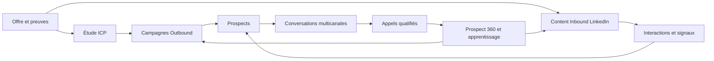
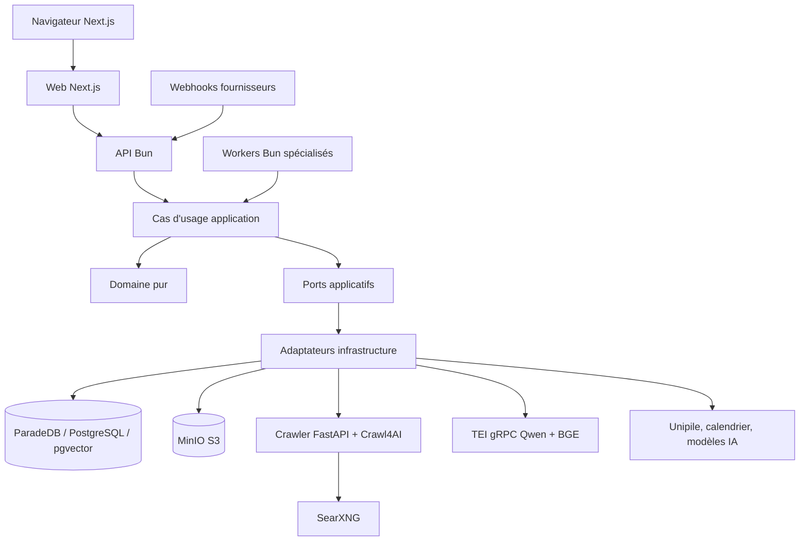

# Architecture canonique de Noosphere

Date de réconciliation : 2026-08-24

Statut : **AS-IS implémenté sur `main`**
Révision de code observée : `358c513e7871410ec95259793ec25574e363554e`

Ce document est la porte d'entrée de l'architecture actuelle. Il décrit le
produit réellement présent dans le dépôt, et non une cible historique. Le
schéma physique est défini par
`packages/infrastructure/src/database/schema.ts`, le contrat HTTP par
`packages/contracts/openapi/product-research-v1.json`, et le déploiement par
les fichiers Compose. Les documents spécialisés et ADR précisent les décisions
sans remplacer ces sources exécutables.

## 1. Promesse et boucle produit

Noosphere est une application multi-workspace d'intelligence de croissance qui
fait converger acquisition Outbound et Content Inbound vers les mêmes
conversations et appels.

Le chemin normal reste volontairement simple :

1. l'utilisateur décrit son offre et lance une étude ICP ;
2. Noosphere source les prospects, exécute les campagnes et publie le contenu
   LinkedIn autorisé ;
3. les messages LinkedIn, email et WhatsApp sont visibles dans une inbox
   unifiée ;
4. Noosphere qualifie les réponses dans les limites de la policy et réserve des
   appels ;
5. les résultats alimentent la mémoire Prospect 360 et l'apprentissage.

Fermer une page ou un drawer ne doit jamais annuler un travail. PostgreSQL, les
jobs, leases, clés d'idempotence et événements outbox sont autoritatifs ; le
navigateur ne fait qu'observer et commander.

Le contrat d'expérience détaillé est dans
[`docs/product/SIMPLE_LOOP.md`](../product/SIMPLE_LOOP.md). Les contrats de
vérité observables sont dans
[`PRODUCT_TRUTH_CONTRACTS.md`](./PRODUCT_TRUTH_CONTRACTS.md).

## 2. Forme architecturale

Noosphere est un **monolithe métier modulaire** TypeScript/Bun. Les mêmes
modules de domaine et d'application sont composés dans plusieurs processus
pour isoler les charges. Les services Python/Rust ne possèdent aucune règle
métier : ils fournissent respectivement la navigation web et l'inférence
d'embeddings/reranking.

### Couches et sens des dépendances

| Couche | Responsabilité | Interdictions essentielles |
|---|---|---|
| `packages/domain` | invariants, décisions pures, agrégats | framework, DB, réseau, SDK fournisseur |
| `packages/application` | cas d'usage, DTO, ports, orchestration | import de l'infrastructure, Drizzle |
| `packages/interface` | HTTP, auth, validation, projection | accès direct Drizzle |
| `packages/infrastructure` | PostgreSQL, queue, providers, IA, documents | décider seule d'une règle métier |
| `apps/api` | composition HTTP et webhooks | état métier en mémoire |
| `apps/worker` | composition des processeurs de jobs | état agent durable en mémoire |
| `apps/web` | expérience Next.js | autoriser un effet externe côté client |
| `apps/crawler` | découverte et lecture web bornées | accès au tenant ou au domaine métier |

Le contrôle automatisé de ces frontières est `scripts/verify-architecture.ts`.

## 3. Contextes bornés actuels

| Contexte | Responsabilité actuelle |
|---|---|
| Workspace & Access | sessions, memberships, rôles, onboarding et paramètres |
| Offer, ICP & Research | vérité produit, preuves, étude ICP et proposition de segments |
| CRM & Sourcing | entreprises, contacts, identités, signaux et enrichissement |
| Campaigns & Outreach | plans, campagnes, séquences, décisions, envois et retries |
| Conversations & Setter | miroir multi-comptes, messages, qualification et commandes |
| Content Inbound | stratégie éditoriale, idées, assets, publication et métriques |
| Symbiosis & Attribution | interactions sociales, signaux, campagnes et origine des appels |
| Prospect 360 | journal durable, snapshots relationnels et context receipts |
| Pipeline & Calls | opportunités, rendez-vous, historique et prochaines actions |
| Knowledge & Documents | extraction, chunks, recherche hybride et preuves autorisées |
| AI Runtime & Evaluation | routage Kimi/Codex, prompts, runs, évaluations et feedback |
| Operations | jobs, outbox, audit, alertes et console opérateur |

Le modèle détaillé et les autorités de décision sont définis dans
[`DOMAIN.md`](./DOMAIN.md).

## 4. Topologie de production

Le compose de production exécute :

| Processus | Rôle | Durée de vie |
|---|---|---|
| `proxy` | TLS et reverse proxy Caddy | long-lived |
| `web` | rendu Next.js et navigation | long-lived, stateless |
| `api` | HTTP, auth, webhooks et commandes | long-lived, stateless |
| `worker` | recherche, sourcing, contenu, documents et maintenance | long-lived, jobs leased |
| `decision-worker` | `prospect.decision.execute` | long-lived, jobs leased |
| `setter-worker` | `conversation.command.execute` | long-lived, jobs leased |
| `memory-worker` | refresh/backfill Prospect 360 | long-lived, jobs leased |
| `database` | ParadeDB/PostgreSQL/pgvector, jobs et outbox | durable |
| `minio` | fichiers sources et médias | durable |
| `crawler` + `searxng` | recherche et lecture web sécurisées | service privé |
| `tei-embedding` | Qwen3 Embedding 0.6B, 1 024 dimensions | service privé |
| `tei-reranker` | BGE reranker v2-m3 | service privé |

`migrate` est un job one-shot avant démarrage. Les profils de backup et
`codex-auth` sont des commandes opérateur, pas des services du chemin normal.
Docling n'existe plus dans la stack standard.

### Durées de vie et agents

La composition root peut partager dans un processus les clients stateless,
repositories, gateways, pools et politiques immuables. Ce partage ne transforme
pas un agent en mémoire vivante.

Pour chaque job ou commande :

1. un lease durable est acquis ;
2. un scope d'exécution tenant-scoped est reconstruit depuis PostgreSQL ;
3. le contexte Prospect 360 et les preuves autorisées sont chargés ;
4. le graphe LangChain/Deep Agent ou le processus Codex est créé/invoqué pour
   ce travail borné ;
5. la sortie structurée, sa provenance et la décision de policy sont persistées ;
6. le scope et le processus CLI sont détruits.

Il est interdit de conserver dans un singleton un transcript, un état prospect,
une décision en cours ou une session CLI d'agent. Un redémarrage doit pouvoir
reconstruire le résultat à partir des données durables. Cette règle est
spécifiée plus finement dans
[`2026-08-23-prospect-360-memory-context-engineering.md`](./2026-08-23-prospect-360-memory-context-engineering.md).

## 5. Données et fiabilité

- Toute donnée métier appartient à un `workspace_id`.
- Les commandes obtiennent le workspace depuis la session serveur, jamais
  depuis une autorité fournie par le modèle.
- Les jobs utilisent lease, heartbeat, retry borné et clé d'idempotence.
- L'état métier et l'événement outbox sont écrits atomiquement.
- Les webhooks sont authentifiés, enregistrés et dédupliqués avant traitement.
- Une policy déterministe revalide suppression, quota, fenêtre horaire, santé
  du compte et autorité juste avant l'effet externe.
- Une tentative provider au résultat inconnu est réconciliée ; elle n'est pas
  répétée aveuglément.
- Les snapshots de campagne et de publication sont immuables.
- Les messages et interactions restent les faits sources ; Prospect 360 est
  une projection versionnée et reconstructible.

Le catalogue logique complet est dans [`DATA_MODEL.md`](./DATA_MODEL.md).

## 6. Knowledge et documents

Le chemin standard est : MinIO → job d'extraction local isolé → sections et
chunks avec provenance → embeddings Qwen → ParadeDB BM25 + pgvector → RRF →
reranking BGE.

- PDF : `unpdf`, pages physiques ; un scan sans texte devient `ocr_required`.
- DOCX : Mammoth vers HTML sémantique puis Markdown.
- PPTX : extraction OpenXML des slides, tableaux et notes.
- XLSX : ExcelJS, feuilles et plages de cellules.
- HTML, Markdown et texte : extraction native.
- Aucun OCR, Docling ou fallback OpenAI n'est présent.
- Un document `ocr_required` ne produit aucun chunk exploitable.

La révision vectorielle active est unique. Une migration future peut faire
cohabiter temporairement deux révisions pour un blue-green, mais une recherche
n'en utilise jamais deux. Voir
[`ADR-013`](./adr/ADR-013-versioned-qwen-knowledge-search.md).

## 7. IA, autorité et contexte

L'IA propose ou rédige ; elle ne détient jamais l'autorité fournisseur.

- `ModelGateway` et le routeur de workspace abstraient Kimi, Codex CLI et un
  éventuel OpenAI API.
- Chaque use case choisit une capacité, une route, un modèle, un effort et des
  fallbacks bornés.
- Les sorties métier sont structurées et validées.
- Le modèle, prompt, policy, coût, latence, sources et `correlationId` sont
  persistés lorsque le use case l'exige.
- Un fallback rejoue un stage depuis son snapshot ; il ne transfère pas un
  raisonnement interne opaque d'un provider à l'autre.
- Les outils de recherche, storage, DB et provider sont exposés uniquement par
  des ports métier bornés.

Prospect 360 compose événements CRM, campagnes, conversations, appels et
interactions sociales. Un `context receipt` prouve exactement quel snapshot et
quel delta ont nourri une décision. La décision durable et la policy restent
autoritatifs ; la mémoire n'est jamais une permission d'envoi.

## 8. Surfaces utilisateur actuelles

La navigation primaire expose **Accueil**, **Messages** et **Appels**. Les
surfaces d'activité Outbound, Inbound, prospects, calendrier éditorial,
configuration et console restent accessibles depuis leur contexte. Le
Noosphere Axis (`inbound | symbiosis | outbound`) est une lentille GET : changer
de lentille ne pause, ne relance et n'annule aucun job.

La galerie canonique est [`design/noosphere/index.html`](../../design/noosphere/index.html).

## 9. État de livraison honnête

| Capacité | État au 2026-08-24 | Preuve restante avant déclaration production |
|---|---|---|
| Monolithe multi-workspace et jobs durables | implémenté et testé localement | canary VPS et restauration backup |
| ICP, sourcing et campagnes Outbound | implémenté | canary borné sur comptes réels |
| Inbox LinkedIn/email/WhatsApp | implémentée | complétude provider et reprise longue durée |
| Setter, décisions et Prospect 360 | implémentés, corpus local validé | canary conversationnel réel contrôlé |
| Content Inbound LinkedIn | implémenté | canary publication/interaction/attribution réel |
| Documents Office/PDF sans Docling | implémentés | benchmark VPS sur corpus réel |
| Qwen/ParadeDB/BGE | implémentés | benchmark qualité bilingue et capacité VPS |
| X, YouTube Shorts et TikTok Shorts | non livré | spécification et tracer bullet futurs |

Un build vert ou un healthcheck ne remplace jamais la preuve fonctionnelle
indiquée dans la dernière colonne.

## 10. Sources de vérité et gouvernance

| Sujet | Source canonique |
|---|---|
| promesse et parcours | `docs/product/SIMPLE_LOOP.md` |
| architecture AS-IS | ce document |
| domaine et autorités | `docs/architecture/DOMAIN.md` |
| schéma physique | `packages/infrastructure/src/database/schema.ts` + migrations |
| API HTTP | OpenAPI + schémas Zod de `packages/contracts` |
| topologie | `compose.infrastructure.yml` + `compose.production.yml` |
| frontières de dépendance | `scripts/verify-architecture.ts` |
| décisions durables | ADR acceptées |
| preuves de validation | `docs/performance` et rapports de canary datés |

La politique anti-dérive est dans
[`DOCUMENTATION_GOVERNANCE.md`](./DOCUMENTATION_GOVERNANCE.md).
