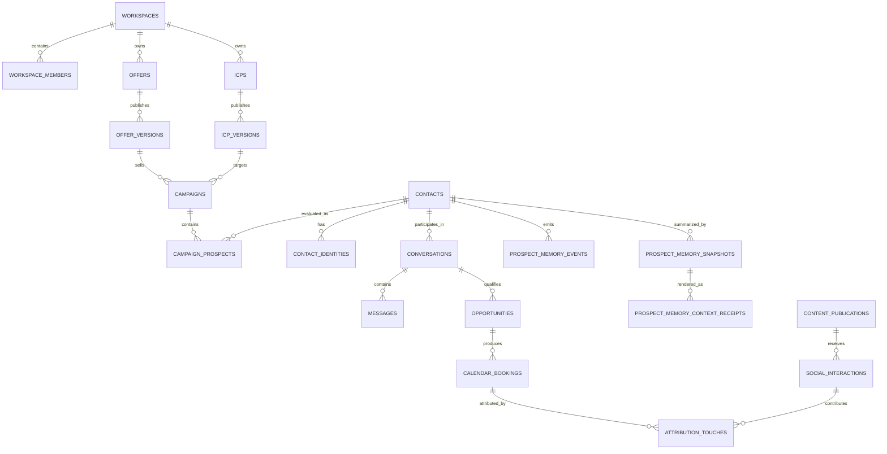
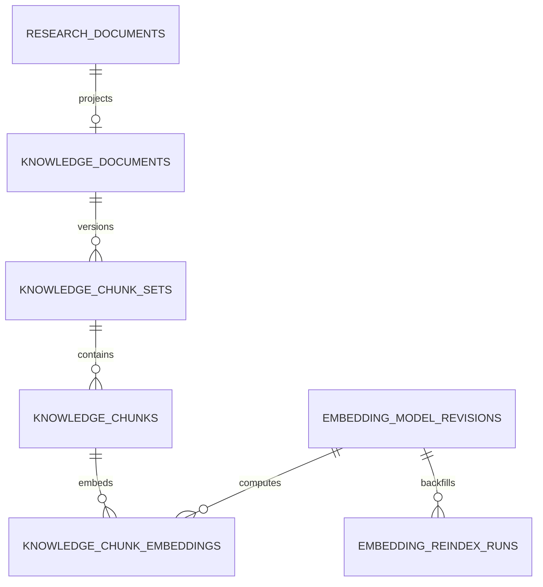

# Catalogue logique des données Noosphere

Date de réconciliation : 2026-08-24
Statut : catalogue logique des **137 tables** déclarées dans le schéma Drizzle.

Ce document explique l'intention et les relations. Il ne recopie pas chaque
colonne, index ou contrainte : la source physique canonique est
`packages/infrastructure/src/database/schema.ts`, complétée par
`packages/infrastructure/migrations`. Une migration et le schéma Drizzle doivent
toujours évoluer ensemble.

## 1. Conventions

- UUID pour les identifiants métier ;
- `timestamptz` pour les instants ;
- `workspace_id` sur toute donnée tenant-scoped ;
- index tenant-first lorsque la requête est tenant-scoped ;
- JSONB pour snapshots, payloads provider et métadonnées variables, pas pour
  masquer une relation stable ;
- version immuable pour stratégie, policy, publication, chunk set et mémoire ;
- clés uniques d'idempotence scoped au workspace ;
- suppression logique ou anonymisation avant purge physique ;
- aucune relation inter-workspace valide.

## 2. Carte de relations critique

## 3. Catalogue complet par contexte

### Authentification, workspace et configuration — 12

| Table | Rôle |
|---|---|
| `auth_users` | identité Better Auth |
| `auth_sessions` | sessions actives |
| `auth_accounts` | méthodes de connexion |
| `auth_verifications` | challenges de vérification |
| `workspaces` | tenant et état principal |
| `workspace_members` | rôles et appartenance |
| `workspace_invitations` | invitations |
| `workspace_ai_settings` | routage modèle par capacité |
| `workspace_data_settings` | rétention et lifecycle |
| `workspace_prospect_memory_settings` | policy Prospect 360 |
| `workspace_onboarding` | checklist de configuration |
| `workspace_exports` | demandes et état d'export |

### Automatisation quotidienne et recherche ICP — 13

| Table | Rôle |
|---|---|
| `daily_prospecting_schedules` | cadence quotidienne par workspace |
| `daily_sourcing_cycles` | occurrence durable d'une recherche |
| `sourcing_frontiers` | pagination/frontière de sourcing |
| `product_research_runs` | étude ICP durable |
| `research_stage_runs` | exécution d'un stage |
| `research_work_items` | fan-out borné et reprenable |
| `research_tool_requests` | requête d'outil idempotente |
| `product_research_run_documents` | documents autorisés pour un run |
| `market_evidence` | preuves publiques collectées |
| `competitor_candidates` | concurrents examinés |
| `research_findings` | affirmations structurées |
| `research_finding_evidence` | liens finding-preuve |
| `icp_proposals` | propositions classées avant publication |

### IA et évaluation — 9

| Table | Rôle |
|---|---|
| `evaluation_datasets` | corpus versionné |
| `evaluation_cases` | cas synthétique et attente |
| `ai_prompt_versions` | prompts immuables |
| `ai_configurations` | configuration provider/modèle/policy |
| `ai_runs` | provenance d'une invocation |
| `evaluation_runs` | exécution d'une évaluation |
| `evaluation_case_results` | résultat par cas |
| `ai_feedbacks` | feedback opérateur |
| `ai_tool_runs` | appel d'outil et résultat borné |

### Documents et recherche versionnée — 8

| Table | Rôle |
|---|---|
| `research_documents` | upload, extraction, statut et métriques |
| `embedding_model_revisions` | modèle, SHA, dimension et lifecycle |
| `knowledge_search_runtime` | unique révision active |
| `knowledge_documents` | projection documentaire unifiée |
| `knowledge_chunk_sets` | version immuable du découpage |
| `knowledge_chunks` | texte stable et provenance |
| `knowledge_chunk_embeddings` | vecteur par chunk et révision |
| `embedding_reindex_runs` | backfill, validation et activation |

`knowledge_chunk_embeddings.embedding` reste un `vector` non dimensionné afin
de préparer une future migration, mais l'index HNSW actif est partiel et casté
vers la dimension de la révision. La première production utilise exclusivement
Qwen 1 024 dimensions. Une recherche ne mélange jamais deux révisions.

### Offre, ICP, messaging et policy — 11

| Table | Rôle |
|---|---|
| `icps` | conteneur ICP |
| `icp_versions` | snapshot publié |
| `icp_criterion` | critères structurés |
| `messaging_strategies` | conteneur de stratégie |
| `messaging_strategy_versions` | stratégie publiée |
| `ai_policies` | conteneur policy |
| `ai_policy_versions` | policy publiée |
| `offers` | conteneur offre |
| `offer_versions` | offre publiée |
| `offer_claims` | claims et preuves autorisées |
| `workspace_channel_accounts` | compte autorisé par workspace/canal |

### Content Inbound et marque — 18

| Table | Rôle |
|---|---|
| `editorial_strategies` | conteneur de stratégie éditoriale |
| `editorial_strategy_versions` | stratégie publiée immuable |
| `editorial_learning_versions` | apprentissage proposé/versionné |
| `content_operation_requests` | commande idempotente de l'autopilote |
| `content_idea_discovery_runs` | recherche quotidienne d'idées |
| `content_ideas` | idée et statut |
| `content_idea_sources` | sources résolubles d'une idée |
| `content_idea_schedules` | cadence de génération |
| `content_brand_kits` | identité, voix et palette réutilisables |
| `content_assets` | identité stable d'un asset |
| `content_generation_runs` | pipeline writer/audit/critic |
| `content_briefs` | brief canonique |
| `content_asset_versions` | texte ou document immuable |
| `content_media_assets` | image/document associé |
| `content_publications` | snapshot planifié/publié |
| `content_publication_attempts` | appel provider et résultat |
| `content_publication_reconciliations` | résolution d'un état inconnu |
| `content_metric_snapshots` | métriques observées à un instant |

### Social sync, interactions et knowledge claims — 8

| Table | Rôle |
|---|---|
| `social_content_sync_states` | curseur de synchronisation des posts |
| `social_content_items` | post interne ou externe observé |
| `social_interaction_sync_states` | curseur des interactions |
| `social_interactions` | réaction, commentaire, réponse ou mention |
| `knowledge_sources` | source validable |
| `knowledge_claims` | claim autorisé ou retiré |
| `knowledge_claim_sources` | provenance d'un claim |
| `attribution_touches` | lien content/outbound/conversation/appel |

### CRM, identités, signaux et enrichissement — 20

| Table | Rôle |
|---|---|
| `companies` | entreprise canonique |
| `company_field_provenance` | source de chaque champ entreprise |
| `contacts` | personne canonique |
| `contact_identities` | LinkedIn, email, téléphone, WhatsApp |
| `contact_employments` | historique d'emploi |
| `contact_suppressions` | opposition canal ou générale |
| `enrichment_jobs` | enrichissement durable |
| `enrichment_observations` | valeur, source, confiance |
| `signal_collection_runs` | collecte de signaux |
| `workspace_signal_settings` | types et cadence autorisés |
| `signals` | signal sourcé |
| `merge_candidates` | rapprochement probable |
| `contact_merges` | fusion réversible et auditée |
| `prospect_discovery_runs` | sourcing par ICP/canal |
| `prospect_discovery_candidates` | candidat avant import |
| `phone_observations` | numéro observé et provenance |
| `whatsapp_reachability_checks` | vérification WhatsApp |
| `import_batches` | import durable |
| `import_rows` | ligne, validation et résultat |
| `contact_channel_assignments` | canal retenu pour un contact |

### Prospect 360 — 3

| Table | Rôle |
|---|---|
| `prospect_memory_events` | journal append-only ordonné |
| `prospect_memory_snapshots` | synthèse versionnée à un watermark |
| `prospect_memory_context_receipts` | contexte exact rendu à un use case |

Le journal est autoritatif pour reconstruire la projection. Le snapshot ne
remplace ni les messages, ni les bookings, ni les décisions. `privacy_epoch`
empêche la publication ou lecture d'un dérivé antérieur à une anonymisation.

### Campagnes, séquences et exécution — 16

| Table | Rôle |
|---|---|
| `sequences` | conteneur de séquence |
| `sequence_steps` | étapes de travail |
| `sequence_versions` | snapshot publié |
| `campaigns` | campagne et références immuables |
| `campaign_prospects` | score et état par contact |
| `campaign_enrollments` | inscription et progression |
| `approval_items` | exceptions ou dry-runs, hors chemin normal |
| `outreach_actions` | intention d'effet externe |
| `outreach_attempts` | tentative provider |
| `prospecting_plans` | plan généré depuis l'ICP |
| `channel_assessments` | pertinence d'un canal pour un ICP |
| `sequence_enrollments` | exécution de la séquence |
| `prospect_decisions` | prochaine action durable et explication |
| `daily_prospecting_schedules` | cadence automatique (référencée plus haut) |
| `daily_sourcing_cycles` | cycle quotidien (référencé plus haut) |
| `sourcing_frontiers` | frontière de reprise (référencée plus haut) |

Les trois dernières tables figurent déjà dans la section recherche ; elles
sont rappelées ici pour montrer le flux, sans augmenter le total de 137.

### Inbox et commandes — 8

| Table | Rôle |
|---|---|
| `integration_events` | événement provider authentifié/dédupliqué |
| `conversations` | thread par compte/canal |
| `inbox_sync_states` | curseur et état du backfill |
| `messages` | message entrant ou sortant |
| `reply_classifications` | intention et décision structurée |
| `automated_replies` | réponse IA proposée/planifiée/envoyée |
| `conversation_commands` | manuel, amélioration ou Setter durable |
| `connected_account_webhooks` | abonnement webhook par compte |

### Pipeline, appels et attribution — 9

| Table | Rôle |
|---|---|
| `opportunities` | opportunité et étape courante |
| `workspace_lost_reasons` | taxonomie de perte |
| `opportunity_stage_history` | transitions auditables |
| `calendar_connections` | connexion agenda |
| `calendar_meeting_types` | type et durée |
| `calendar_bookings` | réservation provider |
| `calendar_booking_history` | transitions de booking |
| `meeting_proposals` | créneaux proposés avant confirmation |
| `attribution_touches` | origine du résultat (référencée plus haut) |

### Queue, audit et comptes providers — 8

| Table | Rôle |
|---|---|
| `jobs` | queue PostgreSQL, lease, heartbeat et retry |
| `outbox_events` | événement écrit avec la transaction métier |
| `audit_logs` | action sensible et acteur |
| `connected_accounts` | compte provider associé |
| `connection_onboardings` | session de connexion durable |
| `account_health_alerts` | état dégradé et action opérateur |
| `connected_account_webhooks` | abonnement provider (référencé plus haut) |
| `workspace_exports` | export workspace (référencé plus haut) |

## 4. Filtres, index et recherche

- Les filtres de sécurité et métier sont appliqués avant BM25 et ANN.
- Les candidats lexicaux viennent de ParadeDB ; les candidats vectoriels de
  pgvector avec l'index HNSW de la révision active.
- La fusion par défaut est RRF, puis BGE reranke les meilleurs candidats.
- La panne du reranker dégrade vers `hybrid` ; la panne de l'embedding de requête
  vers `lexical_degraded`.
- Les locators `page:N`, `slide:N`, `sheet:Nom!A1:D20` ou section permettent de
  résoudre chaque extrait vers sa source.
- Aucun index supplémentaire n'est ajouté sans requête représentative et
  preuve `EXPLAIN (ANALYZE, BUFFERS)`.

## 5. Évolution et migrations

1. Toute évolution commence additive : nouvelle colonne/table/index nullable
   ou backfillable.
2. Les writers mixtes ne démarrent qu'après déploiement des readers compatibles.
3. Le backfill est idempotent, observable et reprenable.
4. Une contrainte forte s'active après validation de couverture.
5. La suppression de l'ancien chemin attend au moins une release compatible.
6. Une nouvelle révision d'embedding suit `registered → backfilling → validating
   → active`, avec rollback temporaire puis purge.
7. Les données de développement peuvent être réindexées ; aucune migration
   silencieuse de données production n'est présumée.
