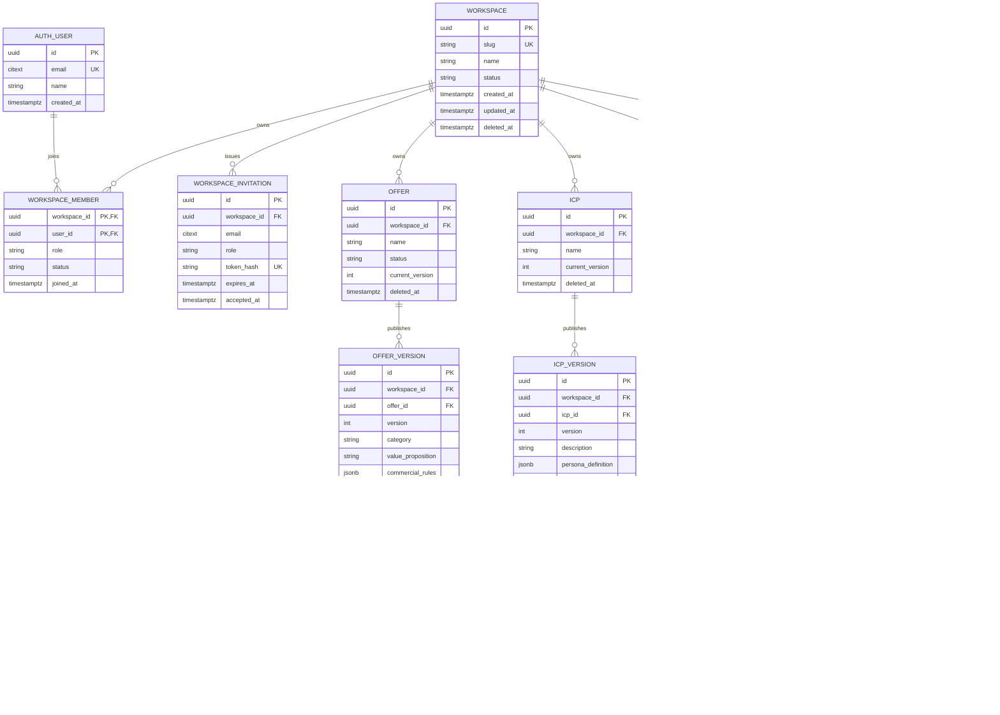
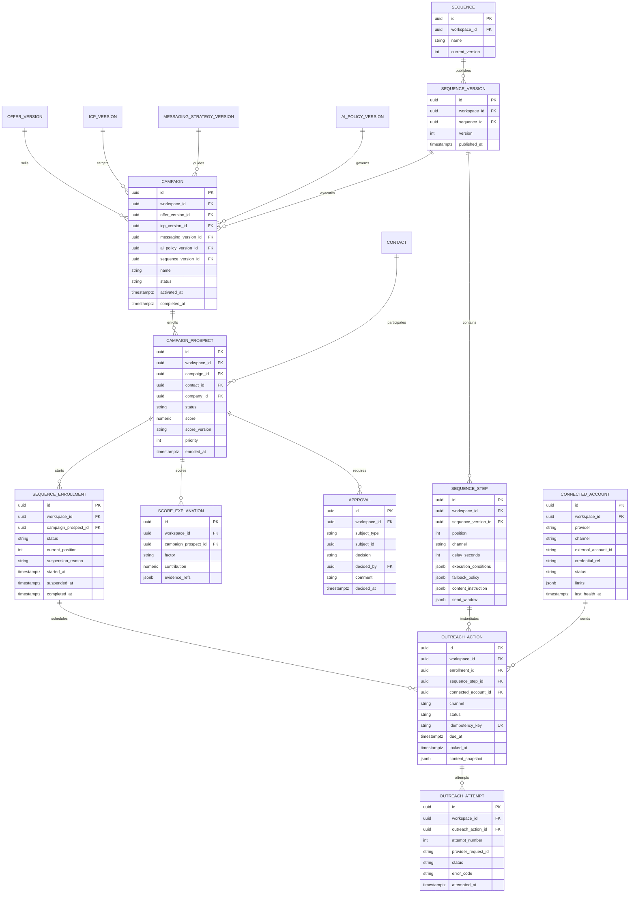
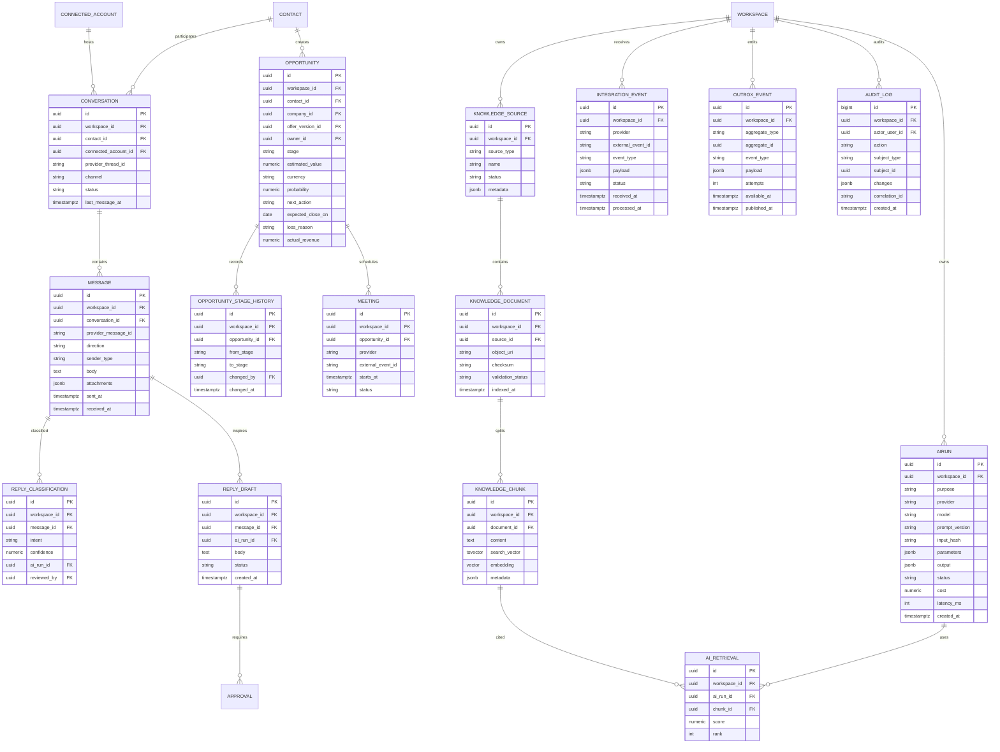

# Modèle de données PostgreSQL

## 1. Conventions

- clés primaires UUID générées côté serveur ou PostgreSQL ;
- `workspace_id` obligatoire sur toutes les tables métier ;
- `created_at`, `updated_at` sur les entités mutables ;
- `deleted_at` pour les suppressions métier récupérables ;
- `timestamptz` pour tous les instants ;
- `jsonb` réservé aux payloads externes, snapshots et critères réellement
  variables, pas aux relations principales ;
- montants en `numeric(19,4)` avec devise ISO séparée ;
- index composites commencent par `workspace_id` ;
- toutes les FK inter-workspace sont protégées par FK composite ou validées
  dans le repository et couvertes par tests d’isolation.

## 2. Workspace et stratégie GTM

Contraintes principales :

- `UNIQUE (offer_id, version)`, `UNIQUE (icp_id, version)` ;
- versions publiées interdites en `UPDATE` et `DELETE` ;
- `UNIQUE (workspace_id, lower(name))` pour les conteneurs actifs ;
- Better Auth peut posséder ses tables techniques ; `AUTH_USER` représente ici
  la projection d’identité référencée par le domaine.

## 3. Prospect Intelligence

```mermaid
erDiagram
    WORKSPACE ||--o{ COMPANY : owns
    COMPANY ||--o{ COMPANY_DOMAIN : identifies
    COMPANY ||--o{ COMPANY_EXTERNAL_ID : identifies
    COMPANY ||--o{ COMPANY_SIGNAL : exhibits
    WORKSPACE ||--o{ CONTACT : owns
    CONTACT ||--o{ CONTACT_IDENTITY : identifies
    CONTACT ||--o{ EMPLOYMENT : has
    COMPANY ||--o{ EMPLOYMENT : employs
    CONTACT ||--o{ CONTACT_SIGNAL : exhibits
    CONTACT ||--o{ ENRICHMENT_OBSERVATION : receives
    COMPANY ||--o{ ENRICHMENT_OBSERVATION : receives
    CONTACT ||--o{ MERGE_CANDIDATE : source
    CONTACT ||--o{ MERGE_CANDIDATE : target
    CONTACT ||--o{ CONTACT_MERGE : merged
    WORKSPACE ||--o{ SUPPRESSION : owns

    COMPANY {
        uuid id PK
        uuid workspace_id FK
        string legal_name
        string display_name
        string country_code
        int employee_count
        string industry
        string linkedin_url
        timestamptz deleted_at
    }
    COMPANY_DOMAIN {
        uuid id PK
        uuid workspace_id FK
        uuid company_id FK
        citext domain
        boolean is_primary
        string verification_status
    }
    COMPANY_EXTERNAL_ID {
        uuid id PK
        uuid workspace_id FK
        uuid company_id FK
        string provider
        string external_id
    }
    COMPANY_SIGNAL {
        uuid id PK
        uuid workspace_id FK
        uuid company_id FK
        string signal_type
        timestamptz occurred_at
        string source_uri
        numeric confidence
        jsonb evidence
    }
    CONTACT {
        uuid id PK
        uuid workspace_id FK
        string first_name
        string last_name
        string display_name
        string locale
        string status
        timestamptz deleted_at
    }
    CONTACT_IDENTITY {
        uuid id PK
        uuid workspace_id FK
        uuid contact_id FK
        string type
        string normalized_value
        string display_value
        string verification_status
        string provider
        numeric confidence
        timestamptz last_observed_at
    }
    EMPLOYMENT {
        uuid id PK
        uuid workspace_id FK
        uuid contact_id FK
        uuid company_id FK
        string title
        string seniority
        date started_on
        date ended_on
        boolean is_current
        numeric confidence
        string source_uri
        timestamptz observed_at
    }
    CONTACT_SIGNAL {
        uuid id PK
        uuid workspace_id FK
        uuid contact_id FK
        string signal_type
        timestamptz occurred_at
        string source_uri
        numeric confidence
        jsonb evidence
    }
    ENRICHMENT_OBSERVATION {
        uuid id PK
        uuid workspace_id FK
        uuid contact_id FK
        uuid company_id FK
        string provider
        string field_name
        jsonb observed_value
        numeric confidence
        string evidence_uri
        timestamptz observed_at
    }
    MERGE_CANDIDATE {
        uuid id PK
        uuid workspace_id FK
        uuid source_contact_id FK
        uuid target_contact_id FK
        numeric confidence
        jsonb reasons
        string status
        uuid reviewed_by FK
    }
    CONTACT_MERGE {
        uuid id PK
        uuid workspace_id FK
        uuid survivor_contact_id FK
        uuid merged_contact_id FK
        jsonb snapshot_before
        uuid merged_by FK
        timestamptz merged_at
        timestamptz reverted_at
    }
    SUPPRESSION {
        uuid id PK
        uuid workspace_id FK
        uuid contact_id FK
        string identity_hash
        string channel
        string scope
        string reason
        string source
        timestamptz created_at
        timestamptz revoked_at
    }
```

Index et contraintes :

- `UNIQUE (workspace_id, domain)` sur `COMPANY_DOMAIN` actif ;
- `UNIQUE (workspace_id, provider, external_id)` ;
- `UNIQUE (workspace_id, type, normalized_value)` pour les identités certaines ;
- un seul emploi courant par couple contact/entreprise, avec index partiel ;
- pas de chevauchement incohérent de périodes après validation ;
- `CHECK (contact_id IS NOT NULL OR company_id IS NOT NULL)` sur observation ;
- `CHECK (contact_id IS NOT NULL OR identity_hash IS NOT NULL)` sur suppression ;
- index sur `(workspace_id, signal_type, occurred_at DESC)`.

## 4. Campagnes et outreach

Contraintes :

- `UNIQUE (campaign_id, contact_id)` ;
- `UNIQUE (sequence_version_id, position)` ;
- index partiel unique sur `(workspace_id, contact_id)` via
  `CampaignProspect`/`SequenceEnrollment` lorsque l’enrollment est actif ;
- campagne active interdite en modification sur ses cinq versions ;
- action en exécution verrouillée par lease avec expiration ;
- relecture des suppressions et limites juste avant transition vers
  `executing`.

## 5. Inbox, pipeline, IA et système

Contraintes et index :

- `UNIQUE (workspace_id, provider_thread_id, connected_account_id)` ;
- `UNIQUE (workspace_id, provider_message_id, connected_account_id)` ;
- `UNIQUE (provider, external_event_id)` ou clé équivalente tenant-aware ;
- GIN sur `search_vector`, index vectoriel seulement après activation pgvector ;
- `AIRun.output` soumis à une politique de rétention distincte des métriques ;
- audit append-only ;
- outbox indexée sur `(published_at, available_at)` ;
- messages entrants persistés avant toute classification IA.

## 6. Recherche produit F-009

La première migration implémente :

- `product_research_runs` pour le brief, l’état et l’étape active ;
- `research_stage_runs` pour les checkpoints, tentatives et verrous humains ;
- `market_evidence`, `competitor_candidates`, `research_findings` et
  `icp_proposals` pour le livrable sourcé ;
- `ai_runs` pour le fournisseur, modèle, prompt, coût et latence ;
- `jobs` pour les leases PostgreSQL, retries et dead letters ;
- `outbox_events` pour les événements enregistrés avec la transition.

Les FK composites `(workspace_id, id)` empêchent une relation de recherche de
pointer vers un autre workspace. Le résultat complet d’une étape reste dans son
checkpoint ; les tables de livrable sont les projections révisables utilisées
par le rapport.

## 7. Vues et projections

Les écrans de recherche et analytics utilisent des vues SQL ou vues
matérialisées, jamais des agrégats transactionnels dénormalisés prématurément :

- `prospect_search_view` ;
- `campaign_performance_view` ;
- `inbox_unread_view` ;
- `pipeline_summary_view` ;
- `sender_account_health_view`.

Les projections sont reconstruisibles depuis les tables sources. Une
incohérence de projection ne doit jamais modifier l’état métier.
