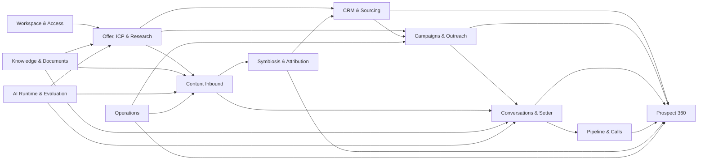

# Modèle de domaine Noosphere

Date de réconciliation : 2026-08-24
Statut : modèle logique **AS-IS**. Le code de `packages/domain/src` et les
contraintes PostgreSQL restent les autorités exécutables.

## 1. Vocabulaire

| Terme | Sens précis |
|---|---|
| Outbound | sourcing, enrichissement, campagne, séquence et message direct |
| Content Inbound | création, publication et mesure de contenu organique |
| Reply Intake | réception d'un message LinkedIn, email ou WhatsApp |
| Social Interaction | commentaire, réponse, réaction ou mention observée |
| Signal | observation datée et sourcée ; jamais permission d'envoi |
| Prospect | contact évalué dans un contexte ICP/campagne |
| Prospect 360 | mémoire relationnelle durable, versionnée et reconstructible |
| Setter | capacité IA de qualification et de réponse, bornée par la policy |
| Appel | réservation calendrier confirmée ou proposition durable |
| Publication | snapshot immuable destiné à un compte et un canal |
| Effet externe | envoi, publication, réservation, annulation ou mutation provider |

Le mot `inbound` appliqué à un message signifie seulement « reçu ». Il ne doit
pas être confondu avec Content Inbound.

## 2. Carte des contextes



## 3. Contextes et autorités

### Workspace & Access

`Workspace` est la frontière de propriété. Better Auth authentifie l'utilisateur ;
`WorkspaceMembership` et le contexte serveur décident de son rôle actif.

Invariants :

- toute lecture ou mutation métier est scoped par workspace ;
- un identifiant de workspace venant d'un body ou d'un modèle n'accorde aucune
  autorité ;
- secrets et tokens sont chiffrés ou référencés, jamais journalisés ;
- paramètres IA, rétention, canaux et onboarding sont propres au workspace.

### Offer, ICP & Research

`Offer`, `ICP`, `MessagingStrategy` et `AIPolicy` sont des conteneurs éditables.
Leurs versions publiées sont immuables. Une étude produit durable passe par des
stages et work items reprenables ; chaque finding non hypothétique doit résoudre
vers une preuve.

Autorités :

- les preuves et findings autorisent les affirmations du rapport ;
- l'ICP publié autorise le ciblage, pas un message ;
- le rapport final est produit automatiquement ; une relance crée une nouvelle
  étude au lieu de modifier rétroactivement l'ancienne.

### CRM & Sourcing

`Company` et `Contact` portent les identités canoniques d'un workspace.
`ContactIdentity` sépare LinkedIn, email, téléphone et WhatsApp ;
`ContactEmployment` historise le poste. Les observations d'enrichissement et
signaux conservent source, date, confiance et provenance.

Règles :

- une identité certaine peut être fusionnée automatiquement ; une correspondance
  probable reste une `MergeCandidate` explicable et réversible ;
- le nom seul n'autorise jamais une fusion ;
- email vérifié, profil LinkedIn et numéro WhatsApp restent des canaux distincts ;
- un like ou une réaction ne déclenche jamais seul un cold message ;
- une suppression générale prime sur chaque canal et survit à l'anonymisation.

### Campaigns & Outreach

Une `Campaign` capture offre, ICP, messaging, policy et séquence publiés. Les
`CampaignProspect`, enrollments, `ProspectDecision`, `OutreachAction` et
`OutreachAttempt` rendent le parcours explicable et reprenable.

La séquence est une stratégie autorisée. L'agent de décision propose une action
parmi `send`, `wait`, `research`, `pause`, `stop`, `handoff`; la policy pure
l'autorise ou la bloque. Une intention `send` ne constitue jamais une preuve
d'envoi.

Avant tout appel provider, le runtime relit : campagne, enrollment, réponse
entrante, suppression, quota, fenêtre, compte et idempotence. L'action et la
tentative distinguent `planned`, `executing`, `accepted`, `delivered`,
`failed`, `cancelled` et résultat provider inconnu.

### Conversations & Setter

Une `Conversation` est un thread provider sur un canal et un compte connecté.
Le miroir Inbox synchronise l'historique et les nouveautés par curseur durable.
Plusieurs threads peuvent être rapprochés du même contact sans perdre leur
identité provider.

Règles :

- une conversation hors campagne reste `outside_campaign` et `human` ;
- aucune réponse autonome implicite n'est créée hors campagne ;
- l'amélioration IA modifie un brouillon, elle n'envoie rien ;
- une commande Setter devient un job durable ; fermer le drawer n'annule pas ce
  job ;
- une réponse humaine ou un sortant inconnu de Noosphere reprend la main et
  invalide les réponses automatiques pendantes ;
- opt-out, bounce, absence, mauvais contact, referral, intérêt et meeting sont
  traités avant ou avec une classification structurée ;
- le modèle rédige, mais la policy et le dispatcher autorisent l'effet.

### Content Inbound

`EditorialStrategyVersion`, `ContentIdea`, `ContentBrief`, `ContentAssetVersion`,
`ContentPublication` et ses tentatives forment le pipeline LinkedIn.

```text
offre + ICP + marque
  → stratégie publiée
  → idée sourcée
  → brief
  → rédaction
  → audit des preuves
  → critique
  → snapshot de publication
  → tentative provider
  → métriques et interactions
```

Les assets texte, image et document/carrousel sont versionnés. La vidéo longue
et les Shorts ne font pas partie du chemin livré. Modifier cadence ou fuseau
recalcule les publications encore planifiées ; un snapshot déjà publié reste
immuable. Les effets de publication ont request key, lease et réconciliation.

### Symbiosis & Attribution

Les contenus synchronisés et `SocialInteraction` produisent des signaux
sourcés. `AttributionTouch` relie, avec niveau de confiance, publication,
interaction, contact, conversation et appel.

L'attribution décrit une origine `inbound`, `outbound`, `mixed` ou `unknown`.
Elle ne remplace pas `Conversation.origin`, qui reste campagne/hors campagne.
Une attribution incertaine reste incertaine ; elle ne justifie pas une action
commerciale seule.

### Prospect 360

Prospect 360 est la mémoire centrale par prospect. Ses faits sources viennent
du CRM, des campagnes, messages, appels et interactions. Son modèle est :

- `ProspectMemoryEvent` : journal ordonné append-only ;
- `ProspectMemorySnapshot` : synthèse versionnée à un watermark ;
- `ProspectMemoryContextReceipt` : preuve du snapshot, delta, renderer et
  policy fournis à un use case.

Un snapshot distingue fait, hypothèse, recommandation et décision. Il conserve
objections, engagements, informations confirmées, sujets couverts, éléments à
ne pas répéter, contradictions et informations manquantes. La prochaine action
reste l'autorité de `ProspectDecision`, jamais celle du résumé.

Il n'existe aucun agent singleton possédant la mémoire. Chaque job reconstruit
un contexte borné depuis le snapshot et les événements récents, puis le receipt
est persisté. L'anonymisation invalide les snapshots et empêche toute
publication issue d'un ancien `privacyEpoch`.

### Pipeline & Calls

`Opportunity` représente la progression commerciale ; `CalendarBooking`,
`MeetingProposal` et leurs historiques représentent la vérité calendrier.

Étapes usuelles :

```text
prospect → conversation → qualifié → rendez-vous → opportunité
         → proposition → gagné | perdu
```

Une proposition de créneau ne vaut pas réservation. Seule la confirmation du
provider fait foi. Annulation, replanification et no-show sont historisés et
réconciliés.

### Knowledge & Documents

`ResearchDocument` décrit l'ingestion. `KnowledgeDocument`,
`KnowledgeChunkSet`, `KnowledgeChunk` et `KnowledgeChunkEmbedding` séparent
contenu stable, découpage et projection vectorielle. `KnowledgeSource`,
`KnowledgeClaim` et leurs liens bornent les preuves autorisées.

Un document `complete` ou `partial` peut être indexé avec avertissements. Un
document `ocr_required` ou échoué ne devient jamais une preuve. Une recherche
est workspace-scoped, applique les filtres avant les candidats lexicaux et
vectoriels, puis fusionne et reranke.

### AI Runtime & Evaluation

`ModelGateway`, `ModelCatalog` et `AiRoutingPolicy` sélectionnent une route
Kimi, Codex CLI ou API compatible selon une capacité de use case. `AIRun`,
prompts, configurations, datasets et évaluations rendent le résultat traçable.

Le modèle ne choisit jamais son workspace, sa capacité, ses outils ni son droit
d'effet. Un stage borné peut être rejoué sur fallback ; un état de raisonnement
opaque ne traverse pas les providers.

### Operations

`Job`, `OutboxEvent`, `IntegrationEvent`, `AuditLog` et `AccountHealthAlert`
portent la durabilité et l'exploitation. Les leases expirés sont récupérables,
les dead letters sont visibles, et une requeue est une commande auditée — pas
une correction manuelle de la donnée métier.

## 4. Invariants transverses

1. Une donnée métier appartient exactement à un workspace.
2. Un effet externe possède une request/idempotency key et une tentative
   durable.
3. Un refresh navigateur n'altère jamais un job, un lease ou une prochaine
   action.
4. Une suppression est vérifiée à la planification et juste avant l'effet.
5. Une réponse entrante invalide les relances incompatibles avant envoi.
6. Les versions publiées et snapshots d'exécution sont immuables.
7. Tout fait IA non marqué hypothèse possède une provenance résoluble.
8. Un contexte modèle est une donnée non fiable, jamais une autorité d'outil.
9. Aucun transcript ou état prospect mutable n'est conservé dans un singleton.
10. Chaque contexte agentique est reconstructible et attesté par un receipt ou
    un run durable lorsque le use case l'exige.
11. Une publication ou un message « accepté » n'est pas assimilé à « livré ».
12. Un résultat provider inconnu est réconcilié avant toute nouvelle tentative.
13. Une conversation hors campagne n'active pas le Setter automatiquement.
14. Un document sans texte exploitable n'entre ni dans le RAG ni dans les
    preuves.
15. Une recherche vectorielle utilise une seule révision active.

## 5. Événements structurants

| Fait durable | Consommateurs principaux |
|---|---|
| étude ICP démarrée / stage terminé | orchestrateur, rapport, UI |
| ICP publié | sourcing, campagne, content strategy |
| prospect découvert / enrichi | CRM, scoring, Prospect 360 |
| décision prospect planifiée | decision-worker, campagne, UI |
| action outreach acceptée / livrée / échouée | analytics, campagne, mémoire |
| message entrant reçu | invalidation, Setter, mémoire, pipeline |
| commande conversation créée | setter-worker, UI |
| stratégie éditoriale publiée | idées et autopilote contenu |
| publication planifiée / réconciliée | content worker, métriques |
| interaction sociale observée | signal, attribution, mémoire |
| réservation confirmée / modifiée | appels, pipeline, attribution, mémoire |
| événement mémoire ajouté / snapshot publié | context renderer, use cases IA |
| document extrait / indexé | knowledge search, études, Setter |

Les noms physiques et payloads sont versionnés dans le code et les migrations ;
ce tableau décrit leur sémantique, pas un second schéma d'événements.
