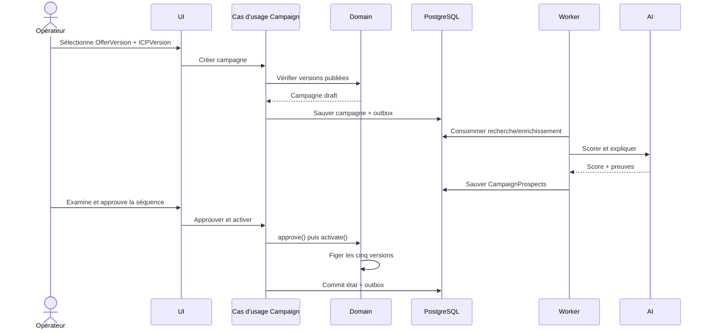
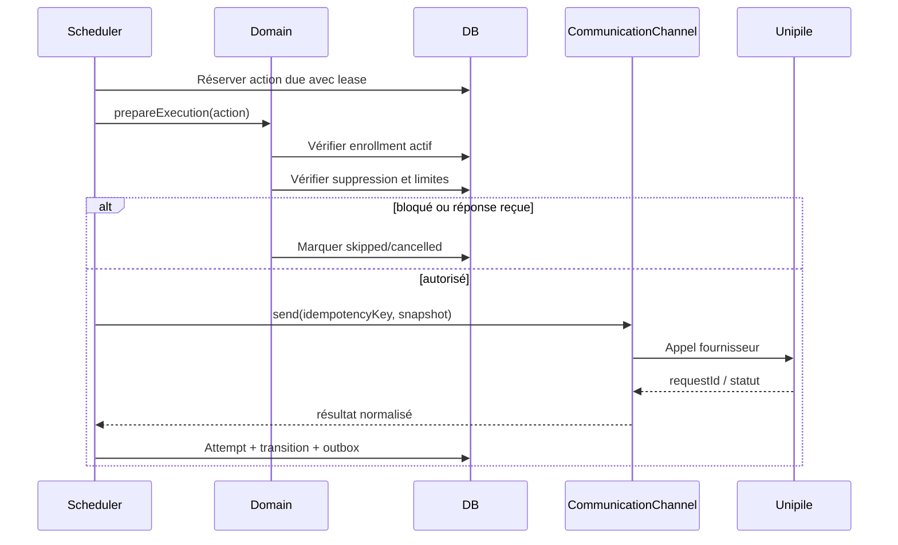
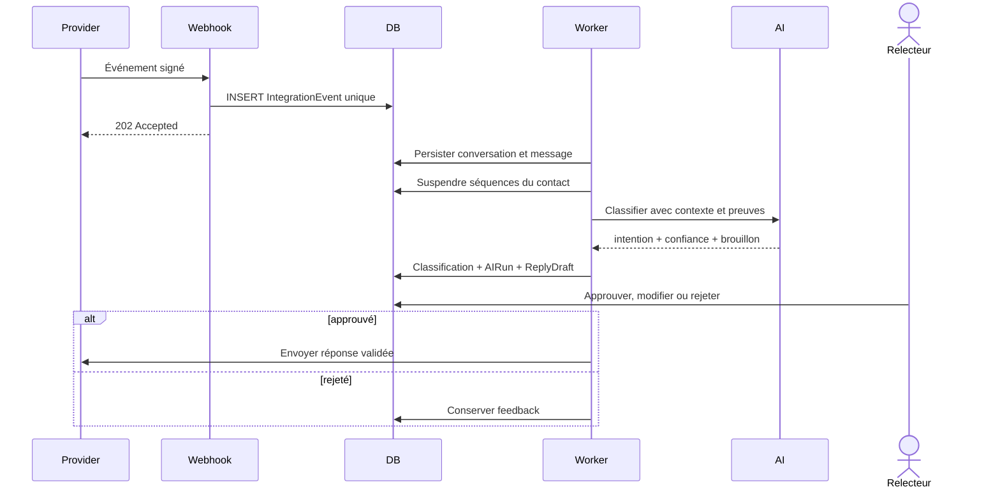

# Flux critiques

## 1. Création et activation d’une campagne

Activation refusée si une version manque, si la séquence n’est pas approuvée,
ou si aucun compte expéditeur compatible n’est sain.

## 2. Exécution d’une étape outbound

Le contenu envoyé est le snapshot approuvé. Un retry réutilise la même clé
d’idempotence et ne régénère pas silencieusement le message.

## 3. Réponse entrante

La suspension précède l’appel IA : une panne de modèle ne doit jamais laisser
partir la relance suivante.

## 4. Déduplication et fusion

1. normaliser les identités observées ;
2. chercher une identité certaine dans le workspace ;
3. fusionner automatiquement uniquement sur correspondance certaine ;
4. créer un `MergeCandidate` pour les correspondances probables ;
5. déplacer les relations dans une transaction ;
6. conserver un snapshot et un journal réversible ;
7. réévaluer les enrollments actifs et suppressions.

## 5. Réservation de rendez-vous

L’IA peut proposer des créneaux via `CalendarProvider`, mais la confirmation
crée d’abord le rendez-vous externe, puis `Meeting` et l’historique de pipeline.
Un événement calendrier idempotent réconcilie annulation ou déplacement.

## 6. Politique de retry

| Type d’erreur | Réponse |
|---|---|
| validation métier | pas de retry, action terminale |
| suppression/restriction | annulation, audit |
| timeout/429/5xx fournisseur | backoff exponentiel borné |
| credential invalide | pause du compte et alerte |
| payload fournisseur inconnu | dead-letter inspectable |
| crash worker | lease expirée puis reprise |

Un job peut être exécuté plusieurs fois ; chaque effet externe doit rester
idempotent.
