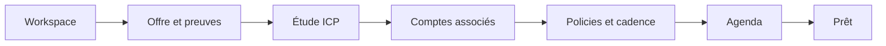
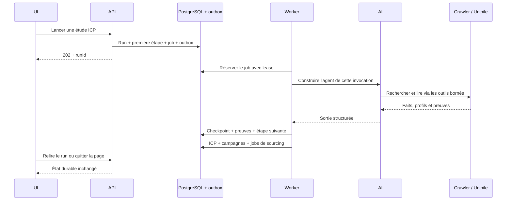
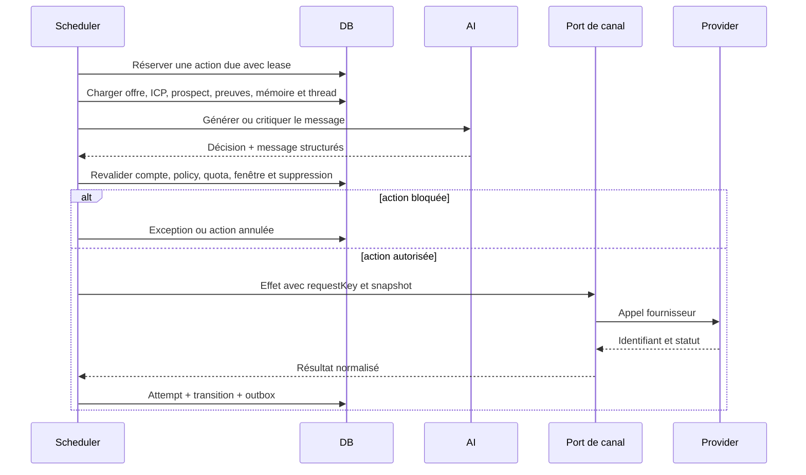
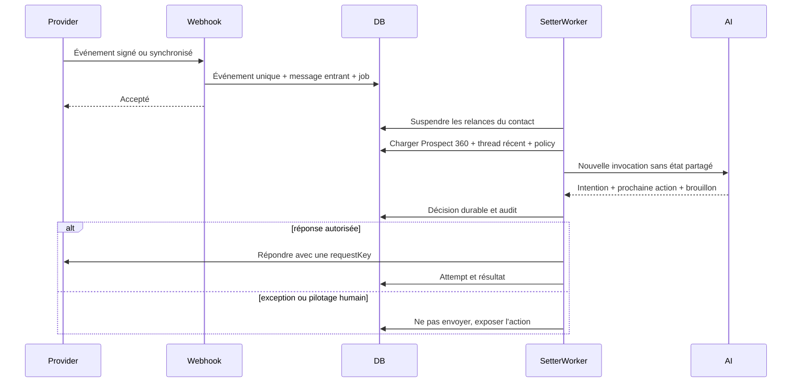
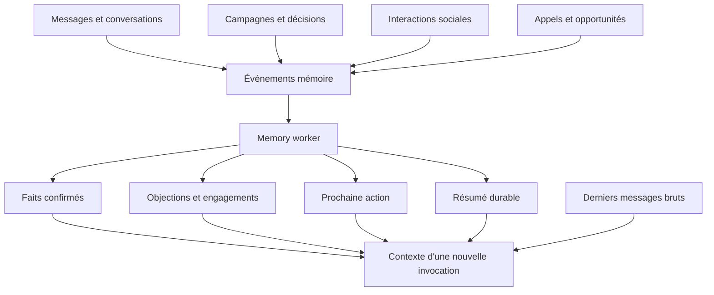
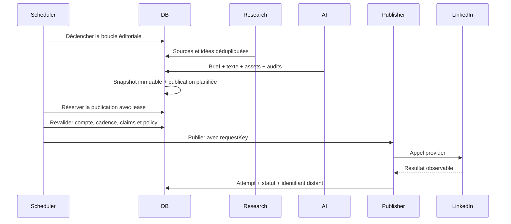
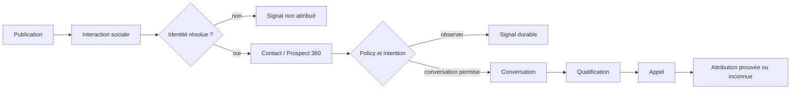
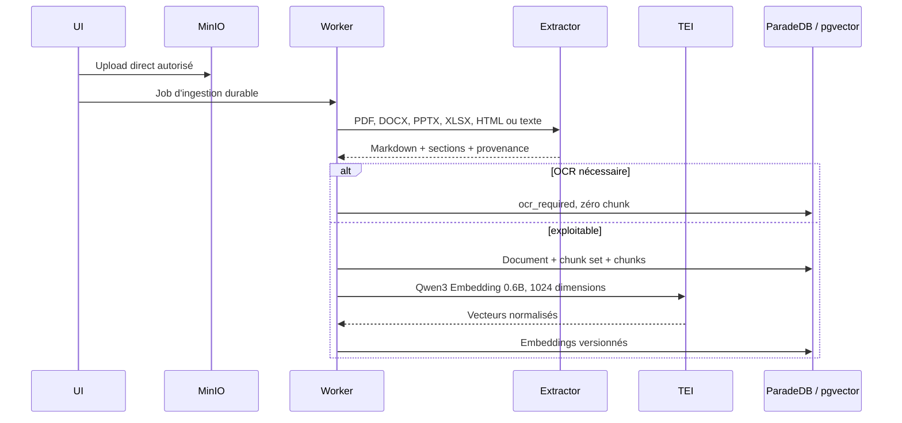

# Flux critiques Noosphere

> Statut : **AS-IS**, vérifié le 24 août 2026.
> Les critères observables de bout en bout sont définis dans
> [`PRODUCT_TRUTH_CONTRACTS.md`](./PRODUCT_TRUTH_CONTRACTS.md).

Noosphere possède deux moteurs, Outbound et Content Inbound, qui partagent le
CRM, les conversations, les appels, la connaissance et la mémoire Prospect 360.
Les écrans déclenchent ou consultent des commandes durables ; fermer une page,
un drawer ou un navigateur n'annule jamais un job.

## 1. Première mise en service

La configuration peut être complétée progressivement. Une capacité n'est
activée que lorsque ses prérequis sont sains : une campagne LinkedIn exige un
compte LinkedIn, une publication exige une stratégie et un compte capable de
publier, un Setter exige une conversation et une policy autorisant l'action.

## 2. Étude ICP vers campagnes Outbound

L'agent n'est jamais la mémoire du run. Chaque invocation reconstruit son
contexte depuis PostgreSQL, les documents autorisés et les checkpoints.

## 3. Sourcing et exécution d'une campagne

Le chemin normal est autonome. Une validation humaine n'est pas un prérequis ;
elle reste une commande explicite lorsque l'utilisateur reprend la main. Les
exceptions sont locales : opt-out, risque juridique ou sécurité, demande de
prix/négociation, compte dégradé, quota ou résultat provider ambigu.

## 4. Réponse entrante et Setter IA

Cliquer sur **Setter IA** crée une commande durable. Fermer le panneau ne tue
ni le job ni le processus worker. Une conversation hors campagne reste en
pilotage humain, sauf commande explicite du Setter pour ce thread.

## 5. Mémoire Prospect 360

La mémoire est centrale par prospect et séparée de toute instance d'agent. Les
faits sensibles gardent leur provenance. Les synthèses sont versionnées et
peuvent être remplacées ; l'historique brut reste la source de vérité.

## 6. Content Inbound LinkedIn

Le calendrier affiche le contenu complet du snapshot qui sera publié. Modifier
la cadence replanifie les publications non parties, y compris lors d'un
changement de fuseau horaire.

## 7. Engagement social vers conversation et appel

Une réaction seule ne déclenche jamais automatiquement un message direct. La
proximité temporelle n'est pas présentée comme une causalité.

## 8. Documents et recherche hybride

Une recherche normale applique d'abord les permissions et métadonnées, puis
combine BM25 ParadeDB et candidats vectoriels, fusionne par RRF et reranke avec
BGE. Si l'embedding est indisponible, le mode lexical dégradé reste explicite.

## 9. Rendez-vous et attribution

L'IA peut proposer des créneaux via `CalendarProvider`. La confirmation crée
le rendez-vous externe puis sa projection locale. Les événements calendrier
réconcilient déplacement et annulation de manière idempotente. L'origine
`inbound`, `outbound`, `mixed` ou `unknown` est distincte du fait qu'une
conversation soit dans ou hors campagne.

## 10. Reprise et erreurs

| Situation | Comportement |
|---|---|
| fermeture de page ou drawer | aucune mutation du job ; l'UI relit l'état durable |
| crash worker | lease expirée puis reprise idempotente |
| validation métier | état terminal ou exception, sans retry aveugle |
| timeout, 429 ou 5xx provider | backoff borné |
| credential invalide | compte dégradé et effets suspendus |
| résultat provider inconnu | tentative à réconcilier, jamais doublée volontairement |
| OCR nécessaire | document conservé, zéro chunk et raison actionnable |
| TEI embedding indisponible | recherche lexicale dégradée ; backfill repris plus tard |

Un job peut être livré plusieurs fois. Chaque effet externe possède donc une
clé d'idempotence stable et chaque transition durable écrit son événement
outbox dans la même transaction.
