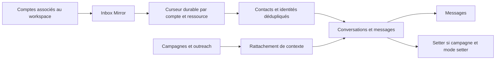

# Miroir de messagerie multi-comptes

## But

`Messages` doit refléter tous les threads des comptes LinkedIn, email et
WhatsApp associés au workspace, indépendamment de leur origine. Ce besoin est
différent du sourcing et de l’envoi d’une campagne.

## Invariants

- La source de vérité des comptes à synchroniser est `connected_accounts`
  filtrée par `workspace_id`, `provider=unipile` et `status=connected`.
- Le miroir n’interroge jamais la liste globale des comptes de l’instance
  Unipile pour décider ce qui appartient au workspace.
- LinkedIn et WhatsApp utilisent la collection globale de messages du compte ;
  l’email utilise la collection des emails groupée par thread.
- Le curseur, le high-water mark, l’état du backfill et les erreurs sont
  persistés dans `inbox_sync_states`. Un redémarrage reprend au dernier curseur.
- Le backfill historique n’engendre jamais de réponse Setter.
- Une nouvelle réponse entrante peut déclencher le Setter uniquement lorsque
  la conversation est rattachée à une campagne et en mode `setter`.
- Un message sortant absent des journaux d’envoi de la plateforme est considéré
  comme une reprise humaine : le mode passe à `human` et les réponses IA en
  attente sont annulées.
- Une conversation sans campagne est créée avec `origin=outside_campaign` et
  `automation_mode=human`.
- Les écritures et lectures restent tenant-scoped, paginées et dédupliquées par
  identifiant provider.

## Résilience

Le webhook reste le chemin temps réel pour les événements reconnus. Le polling
par curseur est le mécanisme de rattrapage et la garantie de complétude, car un
abonnement webhook ne fournit pas l’historique initial. Une indisponibilité du
provider met uniquement le compte concerné en erreur ; les conversations déjà
miroitées restent accessibles.
