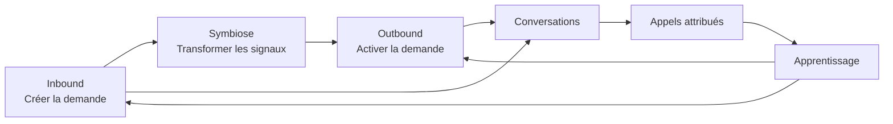
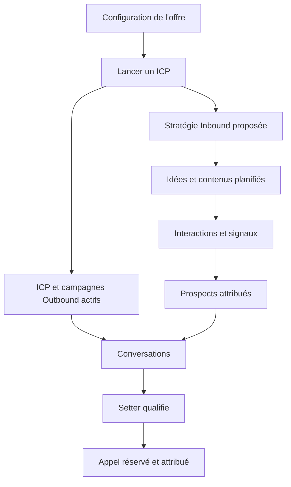
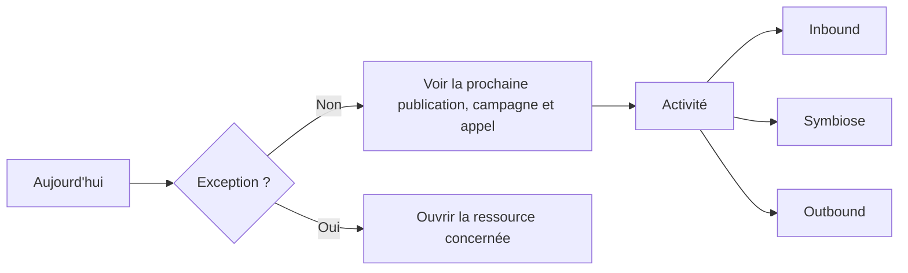
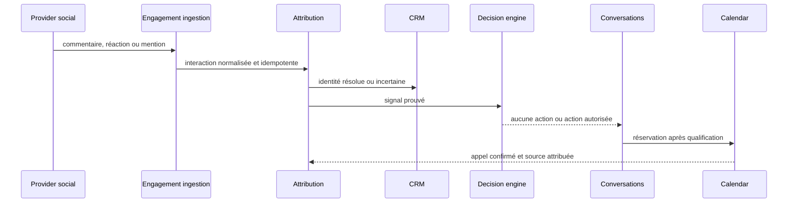
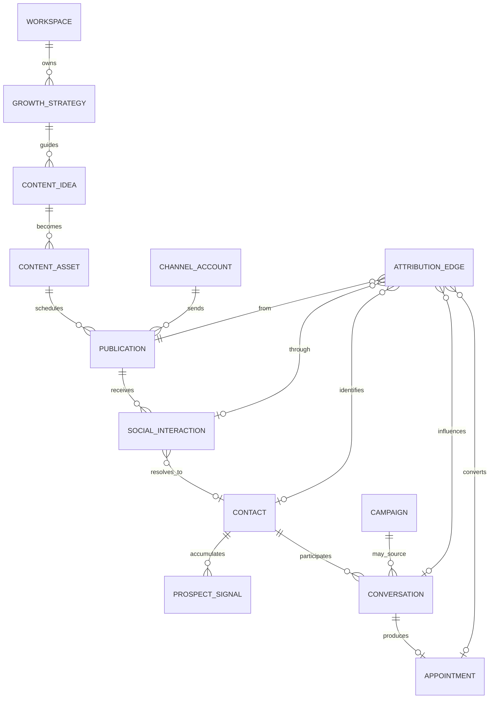

# Noosphere — architecture produit et expérience Inbound ↔ Outbound

> Statut : architecture et maquettes statiques à valider. Aucun code de
> production ni comportement provider n'est livré par ce package.

## 1. Phrase produit

Noosphere transforme une offre et un ICP en demande créée, prospects activés,
conversations qualifiées et rendez-vous attribués, sans demander à
l'utilisateur de piloter chaque étape.

La preuve produit ultime reste :

> « J'ai donné mon offre à Noosphere ; les contenus et campagnes tournent, et
> je vois les conversations et les appels qu'ils ont générés. »

## 2. Diagnostic AS-IS

Le socle Outbound possède déjà les objets et surfaces nécessaires : offre, ICP,
campagnes, prospects, threads multicanaux, calendrier, pipeline, policies et
jobs durables. La navigation actuelle simplifiée demeure cependant centrée sur
la prospection. Ajouter une seconde sidebar Inbound reproduirait le problème
historique : deux produits côte à côte et un utilisateur chargé de reconstruire
leur relation.

La cible conserve le monolithe modulaire, les ports provider, PostgreSQL, les
workers et les règles de sécurité. Elle change le modèle mental et ajoute les
contextes Content Inbound et Attribution sans dupliquer CRM ou Conversations.

## 3. Modèle mental : le Noosphere Axis

Le contrôle à trois positions est une **lentille de lecture** :

| Lens | Question répondue | Objets dominants | Action primaire |
|---|---|---|---|
| Inbound | Que publions-nous et quelle demande créons-nous ? | stratégie, idées, assets, publications, interactions | créer une idée |
| Symbiose | Quels contenus produisent des signaux exploitables ? | signaux, identités, attribution, handoffs | ouvrir le signal prioritaire |
| Outbound | Quels ICP et campagnes activent le marché ? | ICP, entreprises, prospects, campagnes, séquences | lancer un ICP |

Changer de lens n'a aucun effet métier. Les actions de pause, cadence,
publication et envoi sont explicites et séparées.

## 4. Information architecture

### Navigation principale partagée

1. **Aujourd'hui** — santé des deux moteurs et attention requise ;
2. **Activité** — surface pilotée par le Noosphere Axis ;
3. **Prospects** — identités et qualification, quelle que soit leur origine ;
4. **Conversations** — LinkedIn, email et WhatsApp, campagne ou hors campagne ;
5. **Appels** — rendez-vous et attribution au contenu/campagne.

Configuration reste dans le menu workspace/utilisateur et regroupe offre,
ICP, comptes, autonomie, agenda et connaissance. Desktop et mobile utilisent
les cinq mêmes destinations, dans le même ordre.

### Routes cibles

| Route | Surface | Compatibilité |
|---|---|---|
| `/w/:workspace` | Aujourd'hui | remplace le cockpit centré Outbound |
| `/w/:workspace/activity?lens=…` | Activité | nouvelle surface canonique |
| `/w/:workspace/prospects` | Prospects | conservée |
| `/w/:workspace/inbox` | Conversations | conservée |
| `/w/:workspace/appointments` | Appels | conservée |
| `/w/:workspace/settings` | Configuration | conservée |
| `/campaigns` | redirection vers `activity?lens=outbound` | filtres historiques conservés |
| `/content/*` | redirection vers `activity?lens=inbound` | nouvelles routes contextuelles |
| `/pipeline` | vue avancée depuis Appels | non primaire |

## 5. Parcours critiques

### 5.1 Premier résultat

### 5.2 Consultation quotidienne

### 5.3 Engagement vers revenu

## 6. Inventaire des écrans

| Écran | Route | But | États obligatoires | P |
|---|---|---|---|---|
| Aujourd'hui | `/w/:workspace` | comprendre la santé en moins de 10 secondes | vide, loading, erreur, succès, stale | P0 |
| Activité Inbound | `/activity?lens=inbound` | gérer stratégie, idées et publications | vide, loading, erreur, succès | P0 |
| Activité Symbiose | `/activity?lens=symbiosis` | convertir signaux en conversations attribuées | vide, loading, erreur, succès | P0 |
| Activité Outbound | `/activity?lens=outbound` | lancer un ICP et suivre les campagnes | vide, loading, erreur, succès | P0 |
| Prospects | `/prospects` | voir origine, preuve et prochaine action | vide, loading, erreur, succès | P0 |
| Conversations | `/inbox` | lire/répondre sur tous les comptes | vide, loading, erreur, succès, reconnect | P0 |
| Appels | `/appointments` | prendre les appels et comprendre leur source | vide, loading, erreur, succès | P0 |
| Configuration | `/settings` | corriger le prochain prérequis | vide, loading, erreur, succès | P0 |

Les détails contenu, campagne, prospect et attribution utilisent une route ou
un drawer sérialisé dans l'URL. Ils ne deviennent pas des destinations
principales supplémentaires.

## 7. Contrats de composants

### `NoosphereAxis`

- Entrées : `lens`, compteurs par moteur, santé, URL courante.
- Sortie : navigation GET vers la même ressource avec un autre `lens`.
- Interdit : mutation, pause, changement de policy ou de budget.
- Accessibilité : `role=tablist`, trois boutons, labels visibles, flèches
  clavier, `aria-selected`, focus contrasté.

### `EngineStatusBar`

- affiche Inbound et Outbound indépendamment : actif, ralenti, suspendu,
  dégradé ;
- donne la prochaine action et sa date ;
- ne fusionne jamais deux erreurs provider en une erreur globale.

### `AttributionJourney`

- montre source → interaction → identité → conversation → appel ;
- distingue preuve, inférence et attribution inconnue ;
- ouvre chaque preuve résoluble ;
- n'invente jamais un lien causal à partir de la seule proximité temporelle.

### `AttentionList`

- contient seulement les éléments nécessitant réellement une intervention ;
- trie par risque puis ancienneté ;
- chaque ligne possède une action de récupération unique.

## 8. Modèle de domaine cible

### Contextes

| Contexte | Responsabilité | Réutilisé depuis Outbound |
|---|---|---|
| Strategy | offre, ICP, claims et voix | oui |
| Content Inbound | idées, briefs, assets et publications | nouveau |
| Engagement | interactions provider normalisées | nouveau |
| Attribution | relations prouvées entre touchpoints et outcomes | nouveau |
| Campaigns | activation Outbound | oui |
| CRM | entreprises, contacts, signaux et suppression | oui |
| Conversations | threads, messages et Setter | oui |
| Pipeline | appels et opportunités | oui |
| Operations | jobs, santé, audit et attention | oui |

### Invariants

1. Une lens n'est pas persistée comme policy métier.
2. Une publication capture stratégie, contenu, compte et policy versionnés.
3. Une interaction provider est idempotente par compte et référence externe.
4. Une identité incertaine ne fusionne jamais automatiquement deux contacts.
5. Une réaction seule ne déclenche jamais un message.
6. Une attribution causale doit contenir une preuve ou rester `unknown`.
7. Toute réponse humaine arrête les actions Setter concurrentes.
8. Un appel est réservé une seule fois et conserve toutes ses sources.

## 9. Projections et API

| Méthode | Endpoint | Usage | Mutation métier |
|---|---|---|---|
| GET | `/api/v1/workspace/growth-overview?lens=` | Aujourd'hui et santé | non |
| GET | `/api/v1/activity?lens=&cursor=` | feed Inbound/Symbiose/Outbound | non |
| GET | `/api/v1/content/calendar` | calendrier et statuts | non |
| POST | `/api/v1/content/ideas` | idée manuelle | oui, idempotency key |
| POST | `/api/v1/content/assets/:id/schedule` | planifier | oui, policy gate |
| GET | `/api/v1/attribution/journeys` | conversions et preuves | non |
| GET | `/api/v1/prospects?origin=` | CRM partagé | non |
| GET | `/api/v1/conversations?origin=` | inbox partagée | non |
| GET | `/api/v1/appointments?origin=` | appels attribués | non |

Les projections sont workspace-scoped côté serveur. `lens` est un enum de
présentation et n'est accepté par aucun endpoint de commande.

## 10. Product Truth Contracts

### PTC-1 — Changer de lens sans toucher au moteur

- Départ : un crawl Outbound et une publication Inbound sont en cours.
- Action : ouvrir successivement Inbound, Symbiose puis Outbound.
- Résultat observable : les données visibles changent ; les deux operation IDs,
  leurs leases et prochaines actions restent identiques.
- Échecs : job annulé, relancé, dupliqué, disparu ou compteur réinitialisé.
- Interdits : mocks de jobs, modification SQL, état local fabriqué.
- E2E futur : scénario navigateur + base réelle + workers actifs.

### PTC-2 — LinkedIn Content Inbound vers un signal exploitable

- Départ : offre, ICP et compte LinkedIn sains.
- Action : une publication est planifiée puis reçoit une interaction réelle.
- Résultat observable : publication provider résoluble, interaction unique,
  identité qualifiée ou incertaine, signal CRM et attribution affichée.
- Première continuation : aucune action, conversation assistée ou activation
  Outbound explicitement justifiée par la policy.
- Échecs : faux post, commentaire manquant, doublon, attribution inventée,
  DM déclenché par un simple like.

### PTC-3 — Offre vers appel attribué

- Départ : workspace prêt et agenda connecté.
- Action : lancer un ICP.
- Résultat observable : moteurs actifs, conversations visibles et rendez-vous
  confirmé avec source Inbound, Outbound, mixte ou inconnue.
- Échecs : intervention cachée, job perdu en navigation, rendez-vous dupliqué,
  source obligatoire inventée.

## 11. Migration par tranches après validation visuelle

1. introduire `NoosphereAxis` et les routes de lens sans comportement métier ;
2. construire les projections Aujourd'hui et Activité depuis les données
   Outbound existantes ;
3. migrer campagnes vers la lens Outbound ;
4. ajouter stratégie, idées, assets et publication LinkedIn ;
5. ajouter Engagement et Attribution ;
6. enrichir Prospects, Conversations et Appels avec `origin` ;
7. seulement alors redécouper et publier les issues.

## 12. Guardian UX et architecture

- aucune nouvelle destination primaire sans retirer ou fusionner une autre ;
- mobile et desktop partagent cinq destinations et le même ordre ; le libellé
  compact `Messages` représente `Conversations` sur les écrans étroits ;
- chaque écran P0 possède empty/loading/error/success ;
- le bloc `:root` des maquettes est byte-identical ;
- toute action d'exécution contient un verbe explicite et une conséquence ;
- le Noosphere Axis ne peut importer ni appeler une commande application ;
- un KPI sans décision associée est supprimé ;
- aucune preuve produit n'est revendiquée avant exécution des PTC ;
- le backlog gelé ne peut être publié avant validation de la galerie HTML.

## 13. Système visuel et accessibilité

- direction V1 : interface claire, navigation bleu nuit et accent lime ;
- mode sombre complet : volontairement hors V1 pour ne pas doubler la surface
  de validation avant d'avoir stabilisé le produit ;
- ratio `text-primary` sur blanc : `17.83:1` ;
- ratio `text-secondary` sur blanc : `7.89:1` ;
- ratio `text-muted` sur blanc : `5.41:1` ;
- ratio `accent-fg` sur accent : `12.69:1` ;
- ratio blanc sur navigation : `18.75:1` ;
- aucun état n'est indiqué par la couleur seule : label, icône ou texte visible
  accompagne succès, attention et erreur ;
- le focus clavier utilise un contour lime de trois pixels ;
- la réduction de mouvement doit désactiver les animations décoratives ;
- la largeur mobile de référence est `390px`, sans défilement horizontal de la
  page. Les pipelines internes peuvent défiler dans leur propre conteneur.

## 14. Artefacts de revue

La galerie est située dans [`design/noosphere/`](../../design/noosphere/).
Les fichiers sont des contrats statiques, pas des composants réutilisables ni
du code de production.
