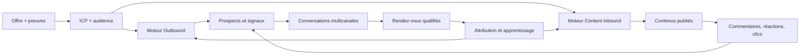
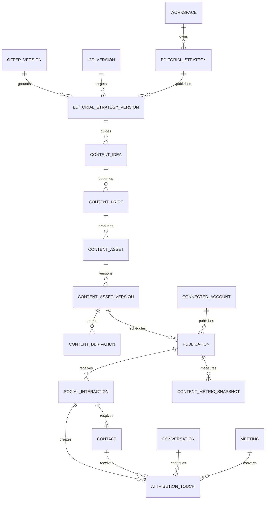
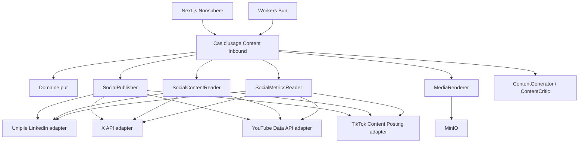

# Noosphere — architecture produit Outbound + Content Inbound

Date de décision : 2026-08-20
Statut : remplacé pour l'expérience et la navigation par
[`NOOSPHERE_EXPERIENCE_ARCHITECTURE.md`](./NOOSPHERE_EXPERIENCE_ARCHITECTURE.md).
Ce document reste la référence détaillée pour les agrégats Content Inbound,
les ports provider et les contraintes par canal.
Baseline analysée : `b8efbf8424ebc1c5c6f86f48a0a68d70d63a6652`

## 1. Décision produit

`Ignition Outbound` devient **Noosphere**. Noosphere est le système GTM interne
d'IgnitionAI, structurellement multi-workspace, composé de deux moteurs qui
partagent les mêmes offres, ICP, connaissances, comptes, contacts,
conversations, rendez-vous et mesures :

- **Outbound** : transformer un ICP en prospects, conversations et rendez-vous ;
- **Content Inbound** : transformer une stratégie en contenus, engagement,
  signaux d'intention, conversations et rendez-vous.

Le renommage du dépôt GitHub et des identifiants techniques n'est pas effectué
en une seule opération. Le produit, le shell et la documentation adoptent
Noosphere en premier. Le nom de dépôt peut être migré dans un lot séparé avec
redirections, inventaire des URLs de déploiement, secrets CI et runbooks.

## 2. Promesse canonique

```text
Je décris ce que je vends et à qui.
Noosphere trouve les acheteurs et crée l'attention.
Je prends les rendez-vous qualifiés.
```



## 3. Glossaire non ambigu

Le code existant emploie déjà `inbound` pour les messages reçus. Les termes
suivants sont obligatoires dans les nouveaux contrats :

| Terme | Sens |
|---|---|
| `Reply Intake` | réception et normalisation d'un message entrant LinkedIn, email ou WhatsApp |
| `Content Inbound` | stratégie, création, publication et mesure de contenus organiques |
| `Social Interaction` | commentaire, réponse, réaction, mention ou clic observable sur un contenu |
| `Engagement Signal` | signal d'intention durable dérivé d'une interaction avec provenance et date |
| `Publication` | snapshot immuable d'un contenu destiné à un compte et un canal |
| `Content Asset` | idée, brief, texte, image, document ou vidéo versionné avant publication |

Les noms génériques `InboundMessageReceived` existants restent valides. Les
nouveaux événements de contenu utilisent le préfixe `Content` ou `Social`.

## 4. Parcours critiques

### 4.1 Outbound — parcours existant

```text
Lancer un ICP → campagnes autonomes → conversations → rendez-vous
```

Le moteur Outbound reste propriétaire du sourcing de prospects, de
l'enrichissement, des séquences, des messages directs et du Setter.

### 4.2 Content Inbound LinkedIn — première tranche

```text
Offre + ICP + voix
  → stratégie éditoriale
  → idées sourcées
  → brief
  → post rédigé et critiqué
  → publication planifiée et idempotente
  → commentaires et métriques synchronisés
  → signaux d'intention rattachés aux contacts
  → conversation ou campagne Outbound
  → rendez-vous attribué au contenu
```

Le chemin normal peut être autonome après publication d'une stratégie et
activation explicite du mode automatique du canal. Les exceptions restent
localisées : source absente, claim interdit, compte dégradé, conflit de
calendrier, risque juridique, contenu dupliqué ou échec fournisseur.

### 4.3 Extension multicanale

Un brief canonique peut produire plusieurs variantes, mais chaque variante est
un objet éditorial propre au canal. Noosphere ne copie jamais littéralement un
post LinkedIn vers X, YouTube Shorts ou TikTok.

## 5. Contextes bornés

| Contexte | Responsabilité | Réutilisation |
|---|---|---|
| Workspace | tenant, membres, rôles, politiques | existant |
| GTM Strategy | offre, ICP, claims, audience, voix | étendu avec stratégie éditoriale |
| Knowledge | sources, preuves, fraîcheur, retrieval | existant |
| Outbound | sourcing, campagnes, actions directes | existant |
| Content Studio | idées, briefs, versions, variantes et assets | nouveau |
| Publishing | calendrier, compte, capacité, publication et retry | nouveau |
| Social Engagement | posts observés, commentaires, réactions, mentions | nouveau |
| CRM & Inbox | contacts, entreprises, conversations, signaux | étendu |
| Attribution | contenu → interaction → prospect → call → revenu | étendu |

La frontière importante est `Publishing`. Le modèle IA produit une intention
de contenu structurée ; seul le cas d'usage applicatif appelle un
`SocialPublisher` après la policy déterministe.

## 6. Modèle de domaine cible

### Agrégats nouveaux

- `EditorialStrategy`
  - conteneur modifiable ;
  - une publication crée `EditorialStrategyVersion` immuable ;
  - référence une offre, une audience/ICP, des piliers, une voix, une cadence,
    des CTA et une policy par canal.
- `ContentIdea`
  - hypothèse de contenu avec angle, source, cible, priorité, expiration et
    statut ;
  - une idée sans preuve peut produire une opinion explicite, jamais un fait.
- `ContentBrief`
  - objectif, audience, problème, preuve, angle, format, CTA et contraintes ;
  - snapshot des entrées utilisées par la génération.
- `ContentAsset`
  - texte, carousel, document, image, script ou vidéo ;
  - possède des versions immuables et des dérivations entre canaux.
- `Publication`
  - canal, compte, version d'asset, date prévue, policy et clé d'idempotence ;
  - états `draft → ready → scheduled → publishing → published` ;
  - branches terminales `blocked`, `failed`, `cancelled`.
- `SocialInteraction`
  - événement fournisseur normalisé avec auteur, contenu, type, date et
    identifiant idempotent ;
  - la donnée brute est référencée, pas recopiée dans les logs.
- `ContentMetricSnapshot`
  - métriques cumulatives datées et provenance fournisseur ;
  - les deltas analytiques sont calculés de façon déterministe.
- `AttributionTouch`
  - lien durable entre contenu, interaction, contact, conversation, campagne,
    rendez-vous ou opportunité ;
  - conserve le modèle d'attribution utilisé.

### Invariants

1. Toute donnée appartient exactement à un workspace.
2. Une publication référence une version immuable de stratégie, brief et asset.
3. Une clé logique ne peut publier un contenu qu'une fois sur un compte.
4. Un modèle ne reçoit jamais un token social et n'appelle jamais un provider.
5. Tout fait éditorial doit résoudre une preuve autorisée ou être marqué opinion.
6. Une variante est validée contre les contraintes réelles de son canal.
7. Une policy de canal est revérifiée immédiatement avant publication.
8. Un compte dégradé bloque seulement ses publications.
9. Une interaction fournisseur est ingérée de manière idempotente.
10. Une réaction seule ne déclenche jamais un message direct automatique.
11. Un engagement devient un prospect uniquement avec identité, provenance,
    base de traitement et score explicites.
12. L'attribution distingue contenu, interaction, conversation et rendez-vous ;
    une corrélation n'est jamais présentée comme une causalité certaine.
13. Les analytics sont calculés sur les faits, jamais inventés par le modèle.
14. Les suppressions Outbound restent opposables aux activations issues du
    contenu.

## 7. Données

Le schéma reste dans PostgreSQL. MinIO conserve les médias et rendus lourds.
La queue PostgreSQL, l'outbox et les leases existants restent les primitives
de durabilité.



Tables proposées :

- `editorial_strategies`, `editorial_strategy_versions`, `content_pillars` ;
- `content_ideas`, `content_idea_sources`, `content_briefs` ;
- `content_assets`, `content_asset_versions`, `content_derivations` ;
- `social_account_capabilities`, `publications`, `publication_attempts` ;
- `social_interactions`, `content_metric_snapshots`, `attribution_touches` ;
- `content_experiments` seulement après un premier volume mesurable.

Les payloads spécifiques à une plateforme restent dans un champ JSONB borné
de l'adaptateur. Le modèle canonique ne dépend pas des schémas LinkedIn, X,
YouTube ou TikTok.

## 8. Ports et adaptateurs



### Contrat de capacité

Chaque compte expose des capacités lues, jamais supposées :

```text
publishText, publishImage, publishDocument, publishVideo,
scheduleNative, listOwnPosts, readComments, replyToComments,
readMentions, readMetrics, deletePost, updatePost
```

Une fonctionnalité UI n'est activée que si le compte sélectionné annonce la
capacité correspondante. Un connecteur incomplet dégrade le canal sans bloquer
les autres.

### Choix par canal

| Canal | Adaptateur V1 | Motif |
|---|---|---|
| LinkedIn | Unipile existant | comptes déjà connectés ; publication, posts, commentaires et réactions exposés |
| X | API X officielle | posts, médias et métriques documentés ; coûts/quota à qualifier avant activation |
| YouTube Shorts | YouTube Data API + Analytics API | upload resumable, statut de traitement, commentaires et métriques owner |
| TikTok Shorts | Content Posting API | upload brouillon ou Direct Post ; accès applicatif et audit à qualifier |

LinkedIn officiel reste une option d'adaptateur futur. Son accès Community
Management comporte des permissions restreintes ; le domaine ne doit pas en
dépendre.

## 9. Pipeline IA éditorial

```text
StrategyProjector
  → IdeaResearcher
  → BriefWriter
  → ChannelWriter
  → EvidenceAuditor
  → EditorialCritic
  → PolicyGuard
  → PublicationScheduler
```

Entrées obligatoires du `ChannelWriter` :

- offre complète et claims autorisés ;
- ICP/audience et niveau de conscience ;
- stratégie éditoriale publiée et voix ;
- sources et preuves résolubles ;
- historique récent pour éviter répétition et contradiction ;
- objectif de la publication ;
- contraintes du canal et du compte.

Le `EditorialCritic` est indépendant de la première génération. Il rejette les
hooks génériques, les faux chiffres, les phrases interchangeables, les CTA sans
rapport et la copie littérale entre canaux.

Kimi K3 reste le modèle de réflexion par défaut. Les tâches bornées peuvent
utiliser un modèle moins coûteux, mais chaque rôle, modèle, prompt et policy est
versionné dans `ai_runs`.

## 10. API cible

| Méthode | Route | Usage |
|---|---|---|
| GET/PUT | `/api/v1/content/strategy` | lire ou modifier le brouillon éditorial |
| POST | `/api/v1/content/strategy/publish` | créer une version immuable |
| GET/POST | `/api/v1/content/ideas` | lister ou capturer une idée |
| POST | `/api/v1/content/ideas/discover` | lancer une recherche sourcée idempotente |
| POST | `/api/v1/content/ideas/:id/brief` | créer un brief |
| POST | `/api/v1/content/briefs/:id/generate` | générer les variantes demandées |
| GET | `/api/v1/content/calendar` | lire le calendrier filtré |
| POST | `/api/v1/content/publications` | planifier une publication |
| POST | `/api/v1/content/publications/:id/publish` | demander une publication immédiate |
| POST | `/api/v1/content/publications/:id/cancel` | annuler avant exécution |
| GET | `/api/v1/content/publications/:id/interactions` | lire les interactions normalisées |
| POST | `/api/v1/content/interactions/:id/reply` | répondre manuellement ou via Setter |
| GET | `/api/v1/content/analytics` | métriques, attribution et conversion |
| GET | `/api/v1/social-accounts/:id/capabilities` | capacités et santé réelles du compte |

Toutes les mutations utilisent une `requestKey`. Le workspace est résolu par
la session et la route, jamais accepté depuis le corps.

## 11. Information architecture et UX

Navigation cible :

```text
Aujourd'hui
Outbound
  ├─ ICP et campagnes
  ├─ Prospects
  └─ Rendez-vous
Inbound
  ├─ Stratégie
  ├─ Idées
  ├─ Calendrier
  └─ Performance
Conversations
Configuration
```

L'utilisateur ne voit pas les agrégats techniques dans le chemin normal.
Chaque page répond à une question :

| Surface | Question |
|---|---|
| Aujourd'hui | Que fait Noosphere et quelles exceptions exigent mon attention ? |
| Outbound | Quels ICP travaillent et quels appels arrivent ? |
| Inbound / Stratégie | À qui parle-t-on, de quoi et pourquoi ? |
| Inbound / Idées | Quelles idées sont prêtes, sourcées ou à abandonner ? |
| Inbound / Calendrier | Qu'est-ce qui sera publié, où et dans quel état ? |
| Inbound / Performance | Quels contenus créent des conversations et des calls ? |
| Conversations | Qui nous écrit, quel que soit le canal ? |

États obligatoires sur chaque surface P0 : loading, vide, partiel, provider
indisponible, compte expiré, budget atteint, erreur récupérable et succès.

## 12. Product Truth Contracts

### PTC-OUT-001 — Outbound

- **Départ** : offre et comptes prêts, aucun ICP actif.
- **Action** : lancer une étude ICP.
- **Résultat observable** : campagnes actives, prospects sourcés, messages
  visibles et rendez-vous durablement enregistrés.
- **Interdits comme preuve** : tests unitaires seuls, HTTP 200, prospect injecté
  manuellement, provider mocké, modification directe en base.
- **E2E requis** : canary réel borné avec provider, webhook, redémarrage et
  réservation/annulation d'un rendez-vous.

### PTC-IN-LI-001 — LinkedIn Content Inbound

- **Départ** : offre, ICP, stratégie éditoriale publiée et compte LinkedIn sain.
- **Action** : activer une cadence ou planifier une idée.
- **Résultat observable** : un post unique est publié, sa référence provider est
  visible, un commentaire de test est synchronisé, une réponse est envoyable,
  l'interaction crée un signal durable et un rendez-vous éventuel est attribué.
- **Première continuation** : l'idée suivante est planifiée ou l'engagement
  qualifié rejoint le CRM.
- **Interdits comme preuve** : capture d'écran, post copié manuellement, métrique
  fabriquée, commentaire injecté en base, simple appel provider isolé.
- **E2E requis** : compte réel dédié, post canary explicitement marqué, lecture
  d'un commentaire réel, déduplication après redémarrage et suppression du
  contenu canary si la policy le permet.

### PTC-SHORTS-001 — Shorts multicanal

- **Départ** : brief et template vidéo publiés, comptes YouTube/TikTok sains.
- **Action** : demander une dérivation short.
- **Résultat observable** : rendu vertical déterministe, upload privé/brouillon,
  validation provider, publication et métriques synchronisées.
- **Interdits comme preuve** : fichier local non uploadé, vidéo créée à la main,
  statut provider simulé.

## 13. Sécurité, conformité et gouvernance

- Les tokens sociaux restent chiffrés côté infrastructure.
- Les médias entrants sont contrôlés par type, taille, durée et antivirus avant
  stockage.
- Les droits d'utilisation et la provenance des médias sont conservés.
- Une policy peut interdire une marque, une personne, un client, un claim ou un
  sujet sensible.
- Les contenus supprimés côté provider sont réconciliés sans réapparition.
- Les commentaires d'opt-out et demandes humaines bloquent toute activation
  Outbound implicite.
- Les quotas, coûts et scopes réels sont visibles par compte.
- Le mode automatique est activé par canal et stratégie, pas globalement.
- Une action humaine sur un post ou commentaire suspend l'action IA concurrente.

## 14. Déploiement progressif

1. **Fondations Noosphere** : identité, navigation, modèle Content Inbound,
   capacités provider et instrumentation.
2. **LinkedIn tracer bullet** : stratégie → post → commentaire → signal → call.
3. **LinkedIn autopilot** : radar d'idées, cadence, réponses et apprentissage.
4. **X** : texte, threads, médias, mentions, métriques et attribution.
5. **Vertical video** : brand kit, scripts, rendu 9:16 et validation média.
6. **YouTube Shorts** : upload, traitement, commentaires et analytics.
7. **TikTok Shorts** : draft/direct post, statut, interactions disponibles et
   analytics selon accès approuvé.
8. **Optimisation cross-channel** : repurposing, attribution et expériences.

Chaque phase se termine par son Product Truth Contract. Les contrôles internes
verts n'autorisent pas à déclarer le canal fonctionnel sans canary réel.

## 15. Sources fournisseurs vérifiées le 2026-08-20

- Unipile — création de posts LinkedIn :
  https://developer.unipile.com/v2.0/docs/linkedin-create-posts
- Unipile — commentaires LinkedIn :
  https://developer.unipile.com/v2.0/docs/linkedin-manage-post-comments
- LinkedIn — Posts API et permissions :
  https://learn.microsoft.com/en-us/linkedin/marketing/community-management/shares/posts-api
- LinkedIn — Comments API et permissions restreintes :
  https://learn.microsoft.com/en-us/linkedin/marketing/community-management/shares/comments-api
- X — API et métriques : https://docs.x.com/x-api/overview et
  https://docs.x.com/x-api/fundamentals/metrics
- YouTube — upload et analytics :
  https://developers.google.com/youtube/v3/guides/implementation/videos et
  https://developers.google.com/youtube/analytics/metrics
- TikTok — Content Posting API :
  https://developers.tiktok.com/products/content-posting-api
