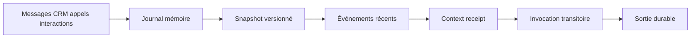

```mermaid
flowchart LR
  Run[Research run] --> Evidence[Preuves résolubles]
  Evidence --> ICP[ICP publié]
  ICP --> Plan[Prospecting plan]
  Plan --> Campaign[Campagne active]
  Campaign --> Candidate[Prospect sourcé et enrichi]
  Candidate --> Decision[Décision durable]
  Decision --> Action[Outreach action]
  Action --> Attempt[Tentative provider]
  Attempt --> Reply[Réponse entrante]
  Reply --> Qualification[Qualification Setter]
  Qualification --> Booking[Booking confirmé]
```

```mermaid
flowchart LR
  Strategy[Stratégie publiée] --> Idea[Idée sourcée]
  Idea --> Brief[Brief]
  Brief --> Asset[Asset versionné]
  Asset --> Audit[Audit preuve et critique]
  Audit --> Publication[Publication planifiée]
  Publication --> Attempt[Tentative idempotente]
  Attempt --> External[Post LinkedIn réconcilié]
  External --> Interaction[Interaction synchronisée]
  Interaction --> Attribution[Touch d'attribution]
  Attribution --> Conversation[Conversation ou signal CRM]
```

```mermaid
flowchart LR
  Account[Compte associé] --> Cursor[Curseur durable]
  Cursor --> Thread[Conversation]
  Thread --> Message[Messages dédupliqués]
  Message --> Command[Commande manuelle ou Setter]
  Command --> Job[Job durable]
  Job --> Context[Prospect 360 receipt]
  Context --> Draft[Sortie structurée]
  Draft --> Policy[Policy déterministe]
  Policy --> Attempt[Tentative provider]
  Attempt --> Mirror[Miroir mis à jour]
```

# Contrats Product Truth de Noosphere

Date : 2026-08-24
Statut : critères observables de vérité produit.

Un contrat Product Truth relie une promesse utilisateur à des faits durables et
à une preuve de bout en bout. Un healthcheck, un mock, un bouton cliquable ou un
job `completed` ne suffisent pas lorsque le résultat attendu appartient à un
provider externe.

## PTC-01 — ICP vers campagne et appel

### Promesse

> Je lance une étude ICP ; Noosphere crée les campagnes utiles, contacte les
> bons prospects dans ses policies et me livre des appels qualifiés.

### Chaîne de faits

### Invariants

- aucune affirmation non hypothétique sans preuve ;
- aucun prospect sans rattachement à un ICP et explication de score ;
- aucun effet sans suppression/quota/fenêtre/compte sain revalidés ;
- `accepted` n'est pas `delivered` ;
- une réponse entrante invalide les relances incompatibles ;
- le booking provider confirmé, et non la proposition de créneau, constitue le
  résultat final.

### Preuve de canary

Un run réel borné doit produire : IDs résolubles de chaque fait, au moins un
profil sourcé, une tentative réelle unique, une réponse ingérée sans doublon et
un booking réconcilié. Si aucun prospect ne répond, le canary prouve la chaîne
jusqu'à la livraison mais ne prétend pas prouver un appel.

## PTC-02 — Content Inbound LinkedIn

### Promesse

> Noosphere transforme mon offre, mon ICP et ma marque en publications LinkedIn
> vivantes, puis me montre les interactions et les conversations qu'elles
> génèrent.

### Chaîne de faits

### Invariants

- la stratégie active, la marque, la cadence et le compte sont explicites ;
- chaque idée déclarée sourcée résout vers ses sources ;
- claims interdits ou sans preuve bloquent l'asset concerné ;
- texte, image et document/carrousel sont des versions attachées au snapshot ;
- timezone et cadence replanifient les publications non exécutées seulement ;
- chaque tentative possède request key, lease et réconciliation ;
- une réaction est un signal, jamais un consentement au démarchage ;
- le post complet et ses médias restent consultables depuis le calendrier.

### Preuve de canary

Un post LinkedIn explicitement autorisé doit être publié une seule fois, relu
via le provider, affiché avec son contenu complet, puis recevoir ou synchroniser
au moins une interaction réelle. Sans interaction, l'attribution n'est pas
déclarée prouvée.

## PTC-03 — Inbox et Setter

### Promesse

> Je vois tous les messages de mes comptes associés et je peux répondre moi-même,
> améliorer mon texte ou laisser le Setter répondre dans les règles.

### Chaîne de faits

### Invariants

- seuls les comptes associés au workspace sont synchronisés ;
- campagne/hors campagne et canal restent visibles ;
- hors campagne reste manuel par défaut ;
- « améliorer » ne produit aucun effet externe ;
- fermer le panel ne modifie ni le job ni son lease ;
- recliquer avec la même request key ne crée pas de deuxième envoi ;
- toute reprise humaine stoppe l'automatisation pendante ;
- le message n'est affiché comme envoyé qu'après fait provider résoluble.

### Preuve de canary

Le test couvre un thread réel sur chaque canal activé, fermeture/réouverture du
drawer pendant le job, absence de doublon, reprise du même statut, puis un
message réel borné qui réapparaît dans la synchronisation.

## PTC-04 — Prospect 360 et contexte agentique

### Promesse

> L'IA comprend la relation complète sans oublier les engagements ni répéter
> les objections, même après un redémarrage.

### Chaîne de faits

### Invariants

- aucun état prospect mutable dans un singleton, gateway ou session CLI ;
- snapshot et delta sont reconstruits depuis les faits durables ;
- le receipt conserve watermark, versions, sources et renderer ;
- fait, hypothèse, recommandation et décision ne sont jamais confondus ;
- la mémoire ne décide pas de l'envoi ;
- anonymisation et `privacyEpoch` invalident tout contexte ancien.

### Preuve de canary

Une conversation longue traverse redémarrage API/worker, changement de page et
nouvelle commande. Le nouveau receipt doit référencer le snapshot attendu,
conserver objections/engagements et ne produire ni répétition interdite ni
effet lorsque la mémoire est stale ou indisponible.

## Règle de déclaration

Chaque capacité est étiquetée séparément :

- `implemented` : chemin présent et tests automatiques ciblés ;
- `locally_validated` : preuve locale sur dépendances réelles ou corpus daté ;
- `canary_validated` : effet provider réel, borné et réconcilié ;
- `production_validated` : observation prolongée, reprise, backup et capacité
  sur le VPS cible.

Une capacité ne monte jamais d'un niveau par simple déduction. Le rapport de
validation doit nommer date, environnement, workspace, limites, IDs de preuve
et ce qui n'a pas été observé.
