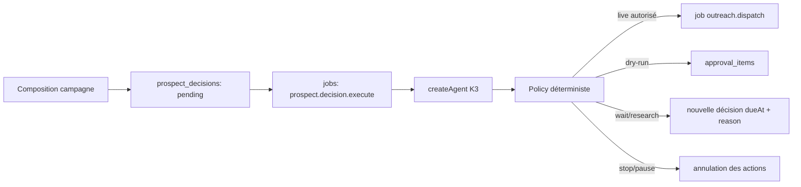

# Décisions prospect durables

`prospect_decisions` est le registre métier au-dessus de la queue technique
`jobs`. Il exprime « réexaminer ce contact à cette date, pour cette raison » et
conserve observation, action proposée, policy appliquée, résultat, erreur et
correlation ID. Les leases restent volontairement dans `jobs`; dupliquer ces
colonnes aurait créé deux autorités concurrentes.

La migration additive `0062_durable_prospect_decisions.sql` ajoute la priorité
aux jobs, l’unicité composite nécessaire à la FK et la table tenant-scoped.
Les clés uniques `(workspace_id,idempotency_key)` et `(workspace_id,job_id)`
empêchent les doubles occurrences. Les FKs composites interdisent de relier
un contact, une campagne, une action ou un job d’un autre workspace.

Le scheduler verrouille la clé logique par advisory lock. La queue réclame par
`FOR UPDATE SKIP LOCKED`, renouvelle le lease, reprend les leases expirés,
réessaie avec borne et met en dead letter à épuisement. Le classement donne la
priorité dans un workspace mais alterne les rangs de workspaces afin d’éviter
la monopolisation.

Les campagnes historiques ayant déjà un job `outreach.dispatch` restent
compatibles. Les nouvelles actions passent par une décision. Cette migration
progressive évite de réécrire ou perdre les jobs existants.
