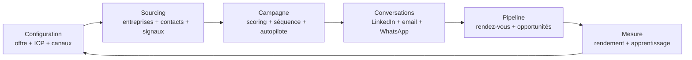
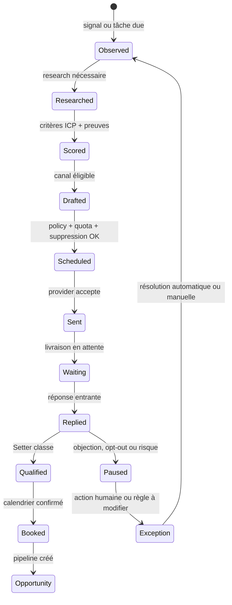
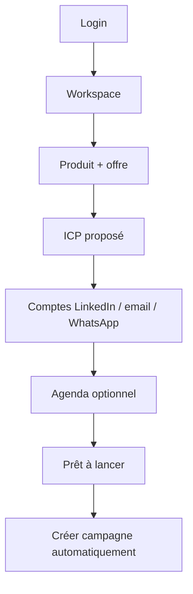

# Ignition Outbound — refonte produit, architecture et UX

> Statut : proposition de design à valider avant implémentation du front.
> Périmètre : toute l’application interne IgnitionAI, avec une trajectoire
> multi-workspace SaaS. Ce document décrit la cible et ne modifie pas encore
> les composants Next.js.

## 1. Résumé exécutif

Le produit possède déjà un socle robuste : monolithe modulaire TypeScript/Bun,
PostgreSQL transactionnel, workers durables, outbox, Unipile, calendrier et
agents Kimi. Le problème principal est maintenant l’expérience opérateur, pas
le nombre de fonctionnalités.

L’interface actuelle expose trop de concepts au même niveau : stratégie, ICP,
offres, connaissance, AI Studio, messaging, analytics, inbox, campagnes,
prospects, pipeline, intégrations et paramètres. Cela force l’utilisateur à
reconstruire mentalement le système alors qu’il veut simplement savoir quoi
faire ensuite.

La cible est une application de pilotage en cinq surfaces :

1. **À traiter** — ce qui nécessite une décision ou signale un risque ;
2. **Campagnes** — l’objet de travail principal, avec prospects, séquence,
   conversations et rendement au même endroit ;
3. **Prospects** — le CRM global, y compris les contacts hors campagne ;
4. **Conversations** — inbox multicanale filtrable et actionnable ;
5. **Pipeline** — rendez-vous, opportunités et revenu.

La stratégie, les offres, l’ICP, les canaux, le calendrier, les modèles et la
connaissance deviennent une configuration guidée, accessible depuis une seule
surface **Configuration**. Les consoles de diagnostic restent réservées aux
rôles opérateur/admin.

Le chemin normal est automatique. L’humain ne valide pas chaque étape : il
observe, suspend une campagne, modifie une règle ou traite une exception. Une
exception est rare, explicite, datée et réversible.

## 2. Audit AS-IS

### 2.1 Ce qui est solide

- Le monolithe modulaire respecte le contrat d’import :
  `interface → application → domain`, adaptateurs isolés dans
  `infrastructure`.
- Les jobs PostgreSQL sont durables : lease, reprise, retry, dead-letter,
  idempotence et équité entre workspaces.
- Les réponses entrantes suspendent les séquences avant l’appel IA.
- Les canaux LinkedIn, email et WhatsApp sont derrière un port fournisseur.
- Les filtres de l’inbox sont déjà portés par l’URL : canal, campagne/hors
  campagne, période, lecture et recherche.
- Les campagnes et prospects exposent déjà l’explication IA, les signaux et le
  dernier message.
- `bun run check:architecture` et `bun run check:prototype` passent sur le
  snapshot audité.

### 2.2 Frictions observées

| Zone | Constat | Impact utilisateur | Cible |
|---|---|---|---|
| Navigation | 15+ entrées primaires et trois niveaux de réglages | surcharge cognitive, perte du chemin | 5 destinations + Configuration |
| Campagne | prospects, plan, séquence et exécution sont répartis sur plusieurs routes | difficile de comprendre l’état réel | campagne = surface canonique |
| Messages | “Messages & automatisation” et “Messagerie” se chevauchent | ambiguïté entre stratégie et inbox | Automatisation dans la campagne, Conversations pour les threads |
| Stratégie | ICP, offres, connaissance et AI Studio sont visibles trop tôt | l’utilisateur configure avant d’obtenir un résultat | setup guidé, détails à la demande |
| Exceptions | approbations et doublons ressemblent à des tâches normales | l’automatisation paraît bloquée | file “À traiter” avec priorité et raison |
| États asynchrones | jobs longs et reconnect/retry peu visibles depuis toutes les routes | impression de perte quand on quitte une page | exécution persistante + barre d’état globale |
| Terminologie | “AI Studio”, “policy”, “plan”, “strategy” sont techniques | distance avec le métier | “Automatisation”, “Règles”, “Campagne”, “Configuration” |
| Mobile | shell desktop riche, navigation longue | parcours difficile sous 768px | cinq destinations identiques en bas |
| Documents | Docling est présent par défaut alors que les documents sont optionnels | coût RAM et latence disproportionnés | extraction légère différée, OCR/tableaux en option |

### 2.3 Contradictions à résoudre

1. Le document produit historique parle encore d’approbation humaine, alors que
   la décision D-003 prévoit un autopilote sans validation dans le chemin
   normal. La cible doit afficher l’automatisation comme état par défaut et
   réserver l’approbation aux exceptions sensibles.
2. F-052 apparaît à la fois “non commencé” et “livré” selon la section lue.
   L’onboarding doit devenir une seule source d’état calculée par le backend.
3. D-006 fait de l’inbox globale une vue opérationnelle, tandis que D-004 la
   reportait. La cible garde D-006 : inbox globale oui, mais la campagne reste
   la vue la plus riche.
4. Une correction de doublon probable ne doit pas interrompre toutes les
   campagnes. Elle devient une suggestion de résolution, avec blocage uniquement
   lorsqu’une identité est ambiguë avant envoi.
5. Le bouton “Réévaluer” ou “Améliorer avec l’IA” doit toujours indiquer s’il
   s’agit d’un brouillon, d’une décision persistée, d’un envoi ou d’un dry-run.

## 3. Architecture cible

### 3.1 Modules métier

On conserve le monolithe modulaire et on regroupe les surfaces par boucle
opérateur :



Les contextes de code restent :

```text
packages/domain/
  workspace/
  strategy/              # offre, ICP, preuves, versions
  prospect-intelligence/ # sociétés, contacts, signaux, enrichissement
  campaigns/             # campagne, séquence, population, règles
  outreach/              # actions, quotas, suppressions, canaux
  conversations/         # threads, messages, classification, setter
  pipeline/              # opportunités, meetings, étapes
  operations/            # jobs, attention items, audit, health
  knowledge/             # claims internes, sources, évaluations
```

### 3.2 Projections UI

Les pages ne doivent pas reconstruire le métier à partir de cinq endpoints
indépendants. L’API conserve les commandes et expose des projections dédiées :

| Projection | Usage | Contenu minimal |
|---|---|---|
| `workspace_operational_summary` | À traiter | compteurs, exceptions, jobs en cours, dernière activité |
| `campaign_workspace_view` | Campagnes | état, ICP, canaux, population, séquence, métriques, dernier run |
| `campaign_contact_queue` | détail campagne | prospects, score, touch, next action, signal, thread résumé |
| `prospect_360_view` | fiche prospect | identité, entreprise, ICP, preuves, canaux, conversation, prochaine décision |
| `conversation_workspace_view` | Conversations | threads, unread, canal, campagne, intention, prochaine action |
| `pipeline_workspace_view` | Pipeline | opportunité, stage, valeur, meeting, owner, source campagne |
| `setup_readiness_view` | Configuration | prérequis, santé comptes, version active, manquants, prochaine action |

Chaque projection est tenant-scoped, paginée, cacheable après mesure et
consommable en Server Component. Les mutations restent des commandes
idempotentes et retournent l’état projeté ou un `operationId` suivi par la barre
d’état globale.

### 3.3 Cycle agentique visible dans le produit



L’UI ne montre pas les noms de classes LangChain ni le nom de modèle par
défaut. Elle montre : “en recherche”, “enrichissement”, “message préparé”,
“en attente de réponse”, “arrêté par une règle”. Le détail technique
(modèle, prompt, policy version, correlation ID) est disponible dans un
drawer “Détails d’exécution”.

### 3.4 Docling : décision de conception

La baseline locale est suffisante pour prendre une décision pragmatique : une
conversion PDF de 15 pages a atteint environ 2,7 Gio de RAM et 41,5 secondes,
avec un pic de 2,38 Gio encore observé sous contention. Les documents internes
sont utiles mais optionnels pour l’ICP ; ils ne doivent pas imposer cette charge
à chaque déploiement.

Proposition V1 :

- retirer Docling du chemin obligatoire et de `compose.production.yml` ;
- conserver le port `DocumentTextExtractor` et les contrats de documents ;
- utiliser une extraction texte légère pour PDF/HTML/Markdown/Office sans OCR
  par défaut ;
- traiter OCR, tableaux complexes et scans dans un worker optionnel activé par
  une capacité explicite ;
- afficher un résultat “texte partiel” plutôt que bloquer un run ICP ;
- ne jamais présenter un document non extrait comme preuve disponible.

Cette décision ne supprime ni S3/MinIO ni les claims de connaissance. Elle
réduit le coût de base et garde une voie d’évolution lorsque la demande métier
justifie un parseur lourd.

## 4. Information architecture cible

### 4.1 Navigation desktop

```text
À traiter
Campagnes
Prospects
Conversations
Pipeline

Configuration
  Produit & offre
  ICP & segments
  Canaux & comptes
  Automatisation
  Agenda
  Connaissance

Administration (rôle owner/admin/operator)
  Équipe et accès
  Santé / journaux
  Évaluations IA
```

`Configuration` est un item unique qui ouvre une navigation secondaire. Les
routes historiques restent compatibles par redirection ou breadcrumb, mais ne
sont plus des entrées primaires.

### 4.2 Navigation mobile

Barre fixe à cinq destinations, dans le même ordre que le desktop :

```text
À traiter · Campagnes · Prospects · Conversations · Pipeline
```

Les filtres et actions secondaires sont dans un `Sheet`. Les pages ne doivent
pas introduire un ordre mobile différent du desktop.

### 4.3 Règle de profondeur

- une action quotidienne doit être atteignable en deux clics maximum ;
- quitter une page ne perd jamais un run, une campagne ou une sélection ;
- les drawers utilisent l’URL (`?prospect=`, `?conversation=`, `?run=`) ;
- retour navigateur restaure les filtres et le scroll logique ;
- le job actif apparaît dans le shell, pas seulement dans la page qui l’a lancé.

## 5. Inventaire des écrans P0

| Écran | Question à laquelle il répond | Action primaire | États obligatoires |
|---|---|---|---|
| À traiter | “Qu’est-ce qui demande mon attention ?” | résoudre / suspendre | plein, vide, erreur, reconnect |
| Campagnes | “Où en sont mes campagnes ?” | ouvrir / lancer / mettre en pause | plein, aucune campagne, run en cours, compte dégradé |
| Détail campagne | “Qui est contacté et pourquoi ?” | filtrer ou modifier l’automatisation | population vide, sourcing, envoi, pause, quota |
| Prospects | “Quels contacts sont exploitables ?” | filtrer / ouvrir | hors campagne, non joignable, enrichissement |
| Prospect 360 | “Quelle est la prochaine meilleure action ?” | laisser l’IA agir ou écrire | identité partielle, conflit de données, opt-out |
| Conversations | “Qui a répondu et quelle est la suite ?” | répondre / laisser le Setter | aucun thread, erreur provider, hors campagne |
| Pipeline | “Quels rendez-vous deviennent du revenu ?” | déplacer une opportunité | vide, stage bloqué, calendrier indisponible |
| Configuration | “Suis-je prêt à lancer ?” | corriger le prochain prérequis | checklist, onboarding incomplet, compte expiré |
| Rapport ICP | “Quel marché est réellement prospectable ?” | lancer une campagne | run en cours, preuve manquante, couverture faible |

Les maquettes P0 sont dans [`design/`](../../design/), avec un index navigable.

## 6. Design system cible

### 6.1 Direction

Interface B2B dense, calme et lisible. Le design existant est conservé et
resserré : fond ivoire, surfaces blanches, sidebar navy, accent lime utilisé
uniquement pour l’action et l’état positif. Aucun gradient décoratif,
glassmorphism ou style “AI violet”.

| Token | Valeur |
|---|---|
| `canvas` | `#F5F5F1` |
| `surface` | `#FFFFFF` |
| `ink` | `#111827` |
| `muted` | `#687386` |
| `line` | `#DFE3E8` |
| `navy` | `#000E38` |
| `navy-soft` | `#0A192F` |
| `signal` | `#C8F169` |
| `blue` | `#315EFB` |
| `success` | `#15803D` |
| `warning` | `#B45309` |
| `danger` | `#B42318` |

Typographie : Inter pour l’interface, JetBrains Mono uniquement pour IDs,
timestamps, quotas et correlation IDs. Base 14px, corps 14–16px, titres 28–32px.
Contraste WCAG AA minimum. Lucide reste l’iconographie unique.

### 6.2 Composants obligatoires

- `AppShell` avec cinq destinations, skip link et état de workspace ;
- `AttentionItem` avec cause, sévérité, âge, impact et action ;
- `CampaignStatus` avec état textuel + couleur + pause/reprise ;
- `AutomationTimeline` source → enrichir → scorer → rédiger → envoyer →
  relancer → qualifier → réserver ;
- `ProspectRow` réutilisé dans Campagne, Prospects et Conversations ;
- `ConversationSplitView` liste, thread, contexte prospect ;
- `EvidenceList` avec source, date, hash et niveau de confiance ;
- `OperationBanner` pour run actif, reconnexion, retry et résultat partiel ;
- `FilterBar` dont tous les paramètres sont sérialisés dans l’URL ;
- `EmptyState`, `LoadingSkeleton`, `ErrorState`, `PermissionState` pour chaque
  projection.

### 6.3 Règles de composition

- maximum quatre KPI visibles avant la liste d’actions ;
- une seule action primaire par zone ;
- statut avant métrique ;
- tableau sur desktop, cartes compactes sur mobile ;
- un drawer conserve le contexte au lieu de pousser vers une page inutile ;
- aucun bouton asynchrone ne change silencieusement d’état : feedback inline,
  `aria-live` et retry explicite ;
- les couleurs ne portent jamais seules une information ;
- les listes longues utilisent pagination ou virtualisation mesurée ;
- les actions destructives demandent confirmation, les pauses sont réversibles.

## 7. Parcours critiques

### 7.1 Premier lancement



Le setup ne demande jamais de remplir sept pages avant de montrer la valeur.
Chaque écran montre le nombre de prérequis restants et propose “continuer plus
tard”. Une campagne ne démarre automatiquement que lorsque les règles
d’éligibilité sont satisfaites.

### 7.2 Campagne quotidienne

1. L’utilisateur arrive sur **À traiter** et voit les exceptions, pas un mur de
   graphiques.
2. Il ouvre une campagne et voit la timeline d’automatisation, la population
   et les prochains envois.
3. Un clic sur un prospect ouvre un drawer 360 sans perdre les filtres.
4. Un clic sur une conversation ouvre le thread et le contexte ICP.
5. Le Setter prépare ou envoie automatiquement selon la policy ; l’utilisateur
   peut écrire manuellement ou suspendre.
6. Les rendez-vous qualifiés passent au Pipeline.

### 7.3 Relancer une étude ICP

Le rapport est un document lisible, pas un formulaire de validation. L’action
primaire est “Créer une campagne”. Si le résultat est insuffisant, “Relancer
l’étude” ouvre le brief prérempli avec la raison de relance et une option de
nouvelle profondeur.

## 8. Plan de migration UI

### Lot A — shell et projections

- créer `/w/[workspaceSlug]/home` ou rediriger la racine vers `/inbox` renommée
  **À traiter** ;
- réduire `AppShell` à cinq destinations ;
- ajouter `OperationBanner` global et raccourcis clavier ;
- faire de `workspace_operational_summary` la première requête SSR.

### Lot B — campagne canonique

- fusionner l’information de plan, campagne et séquence dans le détail ;
- intégrer timeline, queue prospects et conversation drawer ;
- conserver les anciennes routes avec redirection et `?tab=`.

### Lot C — CRM et conversations

- réutiliser `ProspectRow` dans les trois surfaces ;
- stabiliser `Prospect 360` et `ConversationSplitView` ;
- afficher systématiquement campagne/hors campagne, canal et prochaine action.

### Lot D — configuration guidée

- transformer offre/ICP/connaissance/canaux/agenda en checklist ;
- déplacer AI Studio, imports, doublons, suppressions et console sous
  Configuration/Administration ;
- remplacer les états contradictoires par `setup_readiness_view`.

### Lot E — performance et documents

- introduire `DocumentTextExtractor` léger derrière le port existant ;
- retirer Docling du compose par défaut après tests d’équivalence texte ;
- mesurer les projections SSR et la charge crawler séparément ;
- ne pas ajouter Redis ou microservices avant un seuil observé.

## 9. Critères d’acceptation UX

- Un nouvel opérateur identifie la prochaine action en moins de 10 secondes.
- Depuis une campagne, il ouvre un prospect puis sa conversation sans perdre le
  filtre ni l’URL.
- Quitter le navigateur et revenir affiche le run et son état réel, sans
  relancer une recherche ni afficher un faux “en cours”.
- Toute conversation indique canal, campagne/hors campagne, dernière activité,
  prochaine action et responsable de l’automatisation.
- Une campagne peut être suspendue en un clic et reprise sans perdre les
  enrollments ni les idempotency keys.
- Les erreurs de provider sont localisées : elles n’effacent pas le thread et
  ne bloquent pas les autres campagnes.
- Les écrans P0 passent 390px, 768px, 1024px et 1440px sans scroll horizontal.
- Les états loading/empty/error/partial/reconnect sont testés sur chaque
  projection.
- Les faits affichés comme preuves possèdent une source résoluble ; une
  hypothèse est explicitement marquée.
- Aucun envoi réel n’est déclenché par un bouton de prévisualisation,
  d’amélioration IA ou de dry-run.

## 10. Questions de validation

1. Confirme-t-on **À traiter** comme page d’accueil après connexion ?
2. Confirme-t-on que la configuration devient une seule entrée secondaire,
   plutôt que Produit/ICP/Offres/Connaissance/Canaux/Agenda séparés ?
3. Confirme-t-on le retrait de Docling du déploiement standard, avec extraction
   légère par défaut et OCR/tableaux en capacité optionnelle ?
