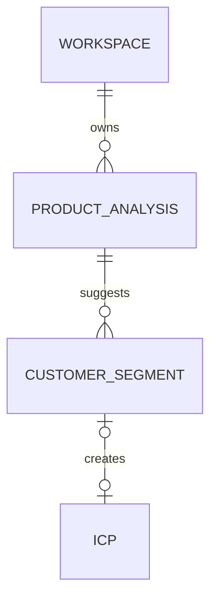

# F-009 — Détecter les ICP d’un produit

## Résultat utilisateur

À partir de l’URL ou d’une courte description d’un produit, l’utilisateur
obtient une liste simple de segments clients possibles. Il peut les retenir,
les retirer, les renommer ou en ajouter avant de choisir lesquels approfondir.

## Décision produit

La première version ne construit pas immédiatement un ICP complet.

Elle répond d’abord à une seule question :

> Quels types d’organisations pourraient acheter ce produit ?

Exemple de résultat observé dans Explee :

- cabinets d’avocats ;
- directions juridiques internes ;
- études notariales ;
- éditeurs juridiques ;
- cabinets de conseil ;
- équipes conformité de PME.

Ces éléments sont des **segments suggérés**, pas encore des ICP opérationnels.

## Parcours V1

### 1. Décrire le produit

Une seule entrée est obligatoire :

- URL du site produit ; ou
- description courte du produit.

Le nom du produit et sa catégorie peuvent être corrigés avant l’analyse.

### 2. Détecter les segments

L’analyse retourne entre trois et dix segments, sous forme de liste.

Chaque segment contient seulement :

- un nom ;
- une justification en une phrase ;
- un statut sélectionné ou écarté.

Les résultats restent des suggestions. Aucun segment n’est publié ni utilisé
pour rechercher des prospects sans validation.

### 3. Corriger la liste

L’utilisateur peut :

- sélectionner ou désélectionner un segment ;
- renommer un segment ;
- supprimer un segment ;
- ajouter un segment manuellement ;
- relancer l’analyse.

### 4. Approfondir

L’utilisateur choisit un ou plusieurs segments retenus et crée ensuite un ICP
opérationnel pour chacun.

L’approfondissement ajoute :

- géographie ;
- taille d’entreprise ;
- personas et rôles ;
- problèmes ;
- signaux d’intention ;
- critères d’inclusion et d’exclusion.

Cette étape utilise F-011. Elle ne doit pas alourdir le premier écran.

## Écran de référence

**Route** : `/w/[workspaceSlug]/strategy/product-reading`

Prototype : [`product-reading.html`](../../../prototype/product-reading.html)

```text
┌────────────────────────────────────────────────────────────────────┐
│ Trouver votre ICP                                                  │
│ Décrivez le produit, nous suggérons les organisations à cibler.    │
├───────────────────────────┬────────────────────────────────────────┤
│ Produit analysé           │ Segments détectés                  6/6 │
│                           │                                        │
│ URL                       │ [✓] Cabinets d’avocats                 │
│ [https://…             ]  │ [✓] Directions juridiques internes    │
│                           │ [✓] Études notariales                  │
│ [Analyser le produit]     │ [✓] Éditeurs juridiques               │
│                           │ [✓] Cabinets de conseil                │
│ Analyse terminée          │ [✓] Équipes conformité de PME         │
│                           │                                        │
│                           │ [+ Ajouter un segment]                 │
│                           │                      [Approfondir →]    │
└───────────────────────────┴────────────────────────────────────────┘
```

## Permissions

| Rôle | Consulter | Analyser | Modifier | Approfondir |
|---|---:|---:|---:|---:|
| owner | oui | oui | oui | oui |
| admin | oui | oui | oui | oui |
| operator | oui | oui | oui | oui |
| reviewer | oui | non | non | non |
| viewer | oui | non | non | non |

## Règles métier

1. Une analyse appartient exactement à un workspace.
2. Une analyse ne déclenche jamais une recherche de prospects.
3. Un segment suggéré doit être confirmé par un utilisateur.
4. Un segment écarté reste visible dans l’historique de l’analyse.
5. Relancer l’analyse ne supprime pas les corrections précédentes.
6. Un segment retenu devient un ICP brouillon, jamais une version publiée.
7. L’utilisateur doit pouvoir continuer même si l’analyse échoue, en ajoutant
   ses segments manuellement.

## Critères d’acceptation

- l’utilisateur peut lancer l’analyse avec une URL ou une description ;
- le résultat affiche entre trois et dix segments lisibles sans ouvrir de
  panneau supplémentaire ;
- les six segments de l’exemple tiennent sur un écran desktop ;
- chaque segment peut être sélectionné ou écarté en un clic ;
- l’utilisateur peut ajouter un segment absent ;
- le compteur de sélection se met à jour immédiatement ;
- le bouton d’approfondissement est désactivé si aucun segment n’est retenu ;
- approfondir crée un ICP brouillon par segment choisi ;
- aucun segment ne lance automatiquement sourcing ou prospection ;
- l’écran reste utilisable à 375, 768, 1024 et 1440 px.

## États

| État | Présentation |
|---|---|
| initial | URL/description et CTA d’analyse |
| analyse | skeleton de trois segments et progression |
| résultat | liste sélectionnable et compteur |
| vide | ajout manuel mis en avant |
| erreur | explication, nouvel essai et ajout manuel |
| modifié | badge « Modifié » et possibilité de relancer |
| prêt | CTA « Approfondir les segments » |

## Contrats applicatifs

### Use cases

- `CreateProductAnalysis`
- `DetectCustomerSegments`
- `SelectCustomerSegment`
- `RenameCustomerSegment`
- `AddCustomerSegment`
- `RemoveCustomerSegment`
- `CreateICPDraftsFromSegments`

### API

| Méthode | Route | Usage |
|---|---|---|
| POST | `/api/v1/product-analyses` | créer et lancer une analyse |
| GET | `/api/v1/product-analyses/:id` | lire le résultat |
| PATCH | `/api/v1/product-analyses/:id/segments/:segmentId` | modifier la sélection ou le nom |
| POST | `/api/v1/product-analyses/:id/segments` | ajouter un segment |
| POST | `/api/v1/product-analyses/:id/actions/create-icps` | créer les ICP brouillons |

### Modèle minimal



## Frontière IA

Le prototype utilise des résultats simulés. Plus tard,
`ProductUnderstandingService` retournera uniquement :

```text
product_name
product_summary
segments[{ name, rationale }]
```

Le modèle ne publie pas d’ICP, ne crée pas de prospects et ne déclenche aucun
message.

## Hors périmètre du premier écran

- preuves et citations par champ ;
- crawl avancé ;
- personas détaillés ;
- scoring et pondérations ;
- analyse concurrentielle ;
- TAM ;
- sourcing de contacts ;
- génération de messages ;
- publication automatique.

## Définition de sortie

La feature est démontrable lorsqu’un utilisateur peut analyser un produit,
retrouver les six segments de référence, corriger la liste puis ouvrir
l’approfondissement des segments retenus.
