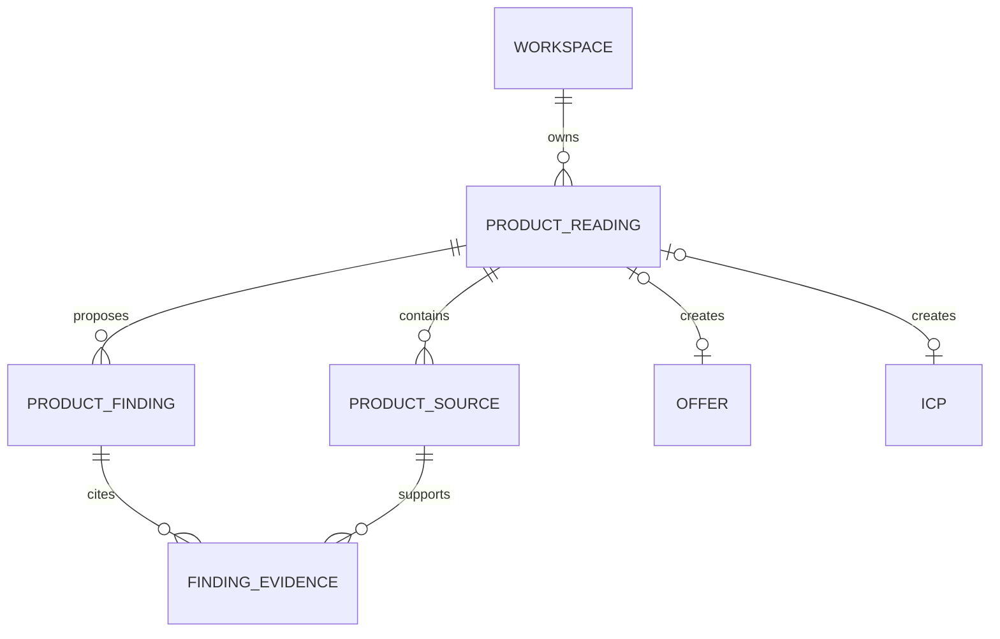

# F-009 — Lecture produit et construction de l’ICP

## Résultat utilisateur

À partir d’un site, d’un document ou d’une description, l’utilisateur obtient
une offre et un ICP structurés, sourcés et révisables, sans publier une
hypothèse comme un fait.

## Pourquoi commencer ici

Toutes les décisions suivantes dépendent de cette lecture :

- quels problèmes et résultats vendre ;
- quelles entreprises et personas rechercher ;
- quels signaux indiquent une intention ;
- quels claims peuvent être utilisés ;
- quelles exclusions protègent la campagne ;
- quelles informations manquent avant de prospecter.

La lecture produit ne déclenche aucune découverte de prospect ni aucun message.

## Acteurs et permissions

| Acteur | Consulter | Lancer une lecture | Modifier les drafts | Publier |
|---|---:|---:|---:|---:|
| owner | oui | oui | oui | oui |
| admin | oui | oui | oui | oui |
| operator | oui | oui | oui | non |
| reviewer | oui | non | non | non |
| viewer | oui | non | non | non |

## Entrées acceptées

L’utilisateur fournit au moins une source :

1. URL du site produit ;
2. texte libre ou pitch ;
3. document commercial, brochure ou présentation ;
4. source déjà présente dans la connaissance du workspace.

Pour une URL, l’utilisateur voit et sélectionne les pages proposées avant la
lecture. Le système ne parcourt pas un domaine entier silencieusement.

## Parcours principal

### Étape 1 — Ajouter le produit

- nom du produit ou service ;
- catégorie : service, SaaS, licence, formation ou autre ;
- site, texte et/ou documents ;
- marché et langue supposés, modifiables.

**Sortie** : une `ProductReading` en brouillon avec ses `ProductSource`.

### Étape 2 — Contrôler les sources

- pages et documents détectés ;
- statut d’accès et date de capture ;
- aperçu du contenu ;
- inclusion ou exclusion explicite ;
- avertissement pour contenu inaccessible, ancien ou contradictoire.

**Sortie** : un corpus borné, enregistré avec provenance.

### Étape 3 — Lire le produit

La lecture produit produit des propositions structurées :

- problème résolu ;
- catégories d’offre et modes de vente ;
- proposition de valeur ;
- capacités et cas d’usage ;
- différenciateurs ;
- résultats ou claims ;
- preuves disponibles ;
- objections et contraintes ;
- prix uniquement s’ils sont présents dans les sources ;
- marchés, secteurs et géographies mentionnés.

Chaque proposition possède :

- son statut `fact`, `hypothesis`, `conflict` ou `missing` ;
- une ou plusieurs citations de source ;
- une confiance ;
- une explication courte ;
- une décision humaine.

**Sortie** : un `Offer` brouillon. Aucun champ n’est publié automatiquement.

### Étape 4 — Construire l’ICP

À partir de l’offre revue, le système propose :

- type d’entreprise ;
- taille, géographie et secteurs ;
- maturité, technologies et contraintes ;
- persona, rôle, ancienneté et pouvoir de décision ;
- problèmes et résultats recherchés ;
- signaux d’intention ;
- critères d’inclusion ;
- exclusions ;
- données manquantes à confirmer ;
- poids initiaux des critères.

Chaque critère indique s’il provient :

- directement d’une source ;
- d’une déduction à valider ;
- d’une règle ajoutée par l’utilisateur.

**Sortie** : un `ICP` brouillon lié à l’Offer draft.

### Étape 5 — Revoir et publier

L’écran de revue affiche côte à côte :

- la fiche produit ;
- le profil entreprise ;
- les personas ;
- les signaux ;
- les exclusions ;
- les preuves et hypothèses ;
- les conflits et champs manquants.

L’utilisateur peut :

- accepter, modifier ou rejeter chaque proposition ;
- ajouter une preuve ou une note ;
- laisser un élément manquant ;
- enregistrer sans publier ;
- publier l’offre et l’ICP séparément.

Une fois les deux versions publiées, l’utilisateur peut lancer la découverte.

## Règles métier et invariants

1. Une `ProductReading` appartient exactement à un workspace.
2. Une source conserve URL ou référence, date de capture, empreinte et statut.
3. Un contenu externe n’est jamais traité comme une instruction système.
4. Une proposition sans source reste une hypothèse explicite.
5. Un prix ou une preuve client ne peut pas être créé par déduction.
6. Un conflit entre sources bloque la publication du champ concerné.
7. La lecture ne modifie jamais une OfferVersion ou ICPVersion publiée.
8. Relancer une lecture crée une révision ; elle n’écrase pas la précédente.
9. Publier l’offre et l’ICP reste une décision humaine.
10. Aucune lecture ne déclenche sourcing, enrichissement, enrollment ou envoi.

## Critères d’acceptation

- étant donné une URL valide, l’utilisateur sélectionne les pages à inclure
  avant la lecture ;
- étant donné plusieurs sources, chaque proposition permet de retrouver son
  passage d’origine ;
- lorsqu’aucune preuve ne soutient une proposition, elle est marquée
  `hypothesis` et non `fact` ;
- lorsqu’un prix n’apparaît pas dans les sources, le champ reste manquant ;
- lorsque deux sources se contredisent, le conflit est visible et empêche la
  publication du champ ;
- l’utilisateur peut corriger une proposition sans altérer la source capturée ;
- une OfferVersion et une ICPVersion publiées sont immuables ;
- relancer la lecture conserve les décisions et versions précédentes ;
- un operator peut préparer les drafts mais seul un admin ou owner publie ;
- deux workspaces utilisant la même URL ne partagent aucune donnée métier.

## États d’interface

| État | Comportement |
|---|---|
| initial | trois entrées visibles : URL, texte, document |
| sources détectées | sélection et aperçu avant lancement |
| lecture en cours | progression par source, annulation possible |
| résultat partiel | propositions disponibles et sources en erreur visibles |
| source inaccessible | correction URL, nouvel essai ou retrait |
| contradiction | comparaison des passages et décision requise |
| hypothèse | badge distinct, confirmation ou rejet |
| brouillon sauvegardé | reprise depuis l’étape exacte |
| prêt à publier | préflight avec éléments bloquants et avertissements |
| publié | liens vers OfferVersion, ICPVersion et découverte |

## Contrats applicatifs

### Use cases

- `CreateProductReading`
- `AddProductSource`
- `InspectProductSources`
- `SelectProductSources`
- `StartProductReading`
- `CompleteProductReading`
- `ReviewProductFinding`
- `CreateOfferDraftFromReading`
- `CreateICPDraftFromReading`
- `PublishOfferVersion`
- `PublishICPVersion`

### API à spécifier

| Méthode | Route | Usage |
|---|---|---|
| POST | `/api/v1/product-readings` | créer la lecture |
| POST | `/api/v1/product-readings/:id/sources` | ajouter URL, texte ou document |
| POST | `/api/v1/product-readings/:id/actions/inspect` | détecter les sources |
| POST | `/api/v1/product-readings/:id/actions/start` | lancer la lecture |
| GET | `/api/v1/product-readings/:id` | état et résultats |
| PATCH | `/api/v1/product-readings/:id/findings/:findingId` | décider ou corriger |
| POST | `/api/v1/product-readings/:id/actions/create-drafts` | créer Offer et ICP drafts |

Les actions `inspect`, `start` et `create-drafts` sont idempotentes.

### Événements

- `ProductReadingCreated`
- `ProductSourcesInspected`
- `ProductReadingStarted`
- `ProductReadingCompleted`
- `ProductReadingNeedsReview`
- `OfferDraftCreatedFromReading`
- `ICPDraftCreatedFromReading`

## Modèle conceptuel

`ProductSource` peut ensuite être promu en `KnowledgeSource`, mais la première
slice ne dépend pas du moteur de connaissance ni du RAG.

## Frontière IA

Le workflow, les états, la revue et les objets produits ne dépendent pas d’un
fournisseur de modèle.

### Prototype et premier développement

- sources et résultats réalistes simulés ;
- édition et validation complètes ;
- création d’Offer et ICP drafts ;
- aucune génération réelle nécessaire pour valider l’UX.

### Branchement ultérieur

Un `ProductUnderstandingService` implémente :

- entrée : sources sélectionnées et schéma de sortie versionné ;
- sortie : findings structurés, citations, confiance et données manquantes ;
- interdiction : écrire directement dans une version publiée.

## Analytics de la feature

- lecture créée ;
- source ajoutée, retenue ou rejetée ;
- lecture terminée, partielle ou échouée ;
- proposition acceptée, modifiée ou rejetée ;
- temps jusqu’au premier draft ;
- taux de propositions sans preuve ;
- taux de correction humaine ;
- offre publiée ;
- ICP publié ;
- passage de l’ICP à la découverte.

## Hors périmètre

- crawl illimité ;
- analyse des concurrents ;
- calcul de TAM ;
- génération de séquences ou messages ;
- découverte de prospects ;
- enrichissement de contacts ;
- publication automatique ;
- apprentissage automatique à partir des corrections ;
- RAG ou ParadeDB.

## Définition de sortie

La feature est démontrable lorsqu’un utilisateur peut partir du site
IgnitionAI, revoir les éléments sourcés, corriger les hypothèses et publier une
offre ainsi qu’un ICP cohérents, sans lancer de prospection.

Le résultat de référence est défini dans
[`IGNITIONAI-PRODUCT-READING.md`](../fixtures/IGNITIONAI-PRODUCT-READING.md).
